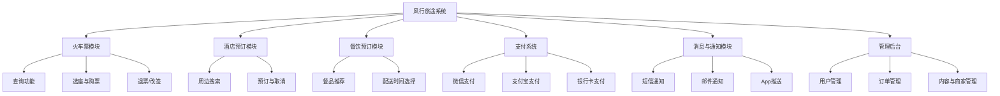
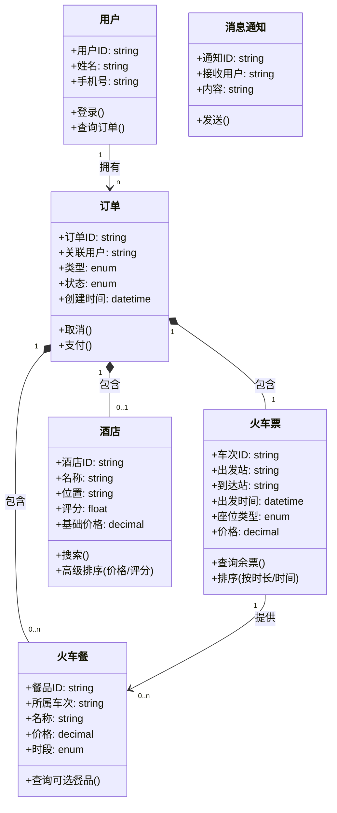
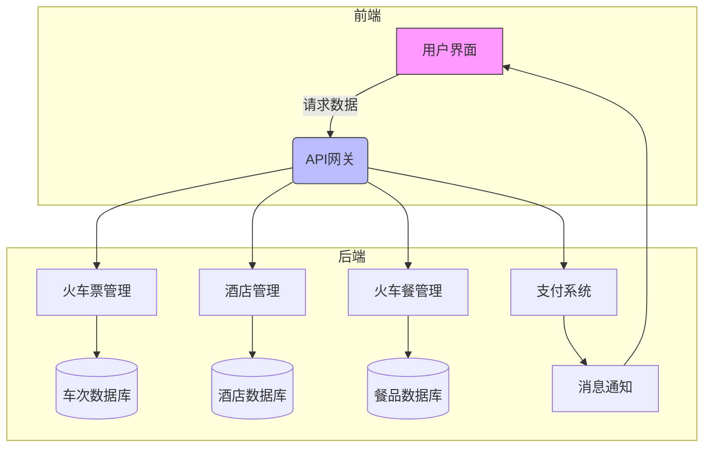
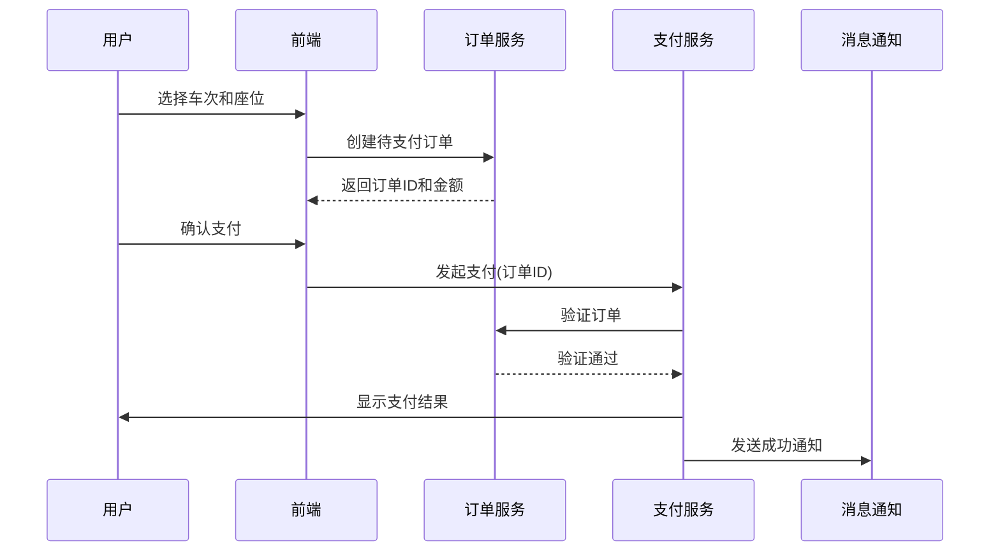

# 软件概要设计说明书

>1. 《软件概要设计说明书》(SDD)概要设计说明书又可称系统设计说明书，这里所说的系统是指程序系统。编制的目的是说明对程序系统的设计考虑，包括程序系统的基本处理流程、程序系统的组织结构、模块划分、功能分配、接口设计、运行设计、安全设计、数据结构设计和出错处理设计等，为程序的详细设计提供基础。
>2. 本课程及本实验不涉及、不强调、不关注的部分可省略，但不允许删除已有条目。
>3. 最终文档请删除所有灰色字体和斜体等说明部分。

[Toc]

## 1 引言

### 1.1 编写目的

编写这份概要设计说明书的主要目的是明确本项目——风行旅途开发过程中的系统架构，使得开发人员对项目的大致结构和初始规定有一个大致的共性的理解。系统详细设计说明书的设计内容会建立在此概要设计内容的基础之上，为后期进一步详细的项目设计提供大致框架。

本概要设计说明书主要面向项目开发过程中的开发成员。

### 1.2 背景

待开发的软件系统为风行旅途线上购票订票订餐一站式旅游服务平台，此项目由团队核心成员提出，由团队全体成员共同设计开发测试，最终面向广大旅游用户群体，平台的最终部署将建立在网络服务器上。

### 1.3 定义

| 英文              | 首字母缩写 | 中文解释        | 描述                                 |
| :---------------- | :--------- | :-------------- | :----------------------------------- |
| `carriages`       | CR         | 车厢信息表      | 存储列车车厢类型、座位数量等信息     |
| `city`            | CT         | 城市表          | 记录系统支持的城市名称               |
| `user`            | UR         | 用户信息表      | 存储用户联系方式和基本信息           |
| `food`            | FD         | 火车餐品表      | 记录车次关联的餐食信息               |
| `order`           | OR         | 订单明细表      | 存储餐食订购的具体条目               |
| `food_orders`     | FO         | 餐食订单表      | 用户餐食订单的支付关联记录           |
| `hotel_orders`    | HO         | 酒店订单表      | 用户酒店预订的支付关联记录           |
| `notifications`   | NT         | 消息通知表      | 系统向用户发送的消息记录             |
| `payment_records` | PR         | 支付记录表      | 所有支付交易的流水记录               |
| `seats`           | ST         | 座位信息表      | 具体车厢座位的类型和状态             |
| `station_city`    | SC         | 车站-城市关联表 | 车站与所属城市的映射关系             |
| `tickets_orders`  | TO         | 车票订单表      | 用户火车票订单的支付关联记录         |
| `车次`            | TR         | 车次信息表      | 列车班次的基础信息（中英文混合命名） |
| `account`         | AC         | 账户表          | 用户登录凭证和个人证件信息           |

### 1.4参考设计

参考文件有：

- 《软件开发计划书》
- 《软件需求规格说明书》
- 《“风行旅途”需求描述文档》

## 2 系统需求概述

### 2.1需求规定

要求项目具有基本的网络购票、根据用户选择的地点智能推荐合适的旅馆并提供线上预订旅馆的服务，用户也应该能够在已购车次的列车上订购车餐；具有所有交易消费订单的缴费功能，需求完成、订单完成等特定事件完成后的消息提示功能。

同时平台应该能够支持多用户多平台的同时操作，支持并发执行各种操作流程，同时不应该出现关键节点时高峰期带来的平台崩溃和明显延迟，对于一些常见异常情况比如订单已支付但是尚未成功锁定相应车次座位时平台出现崩溃的恢复机制等等，用户的个人信息、交易信息需要安全存储。

### 2.2业务目标

开发完成一站式订票购票订购酒店车餐的旅行服务软件，为旅客提供方面快捷的旅行服务，在市场上占有一定市场份额。

### 2.3运行环境

- **操作系统**：Windows 10及以上版本、macOS 10.14及以上版本、Android 8.0及以上版本、iOS 12.0及以上版本。
- **数据库管理系统**：MySQL 8.0及以上版本，用于存储用户信息、订单信息等。
- **网络通信软件**：支持RESTful API的Web框架，如Spring Boot、Express.js等，进行系统间的数据交互。
- **支付系统集成软件**：集成第三方支付SDK（如支付宝、微信支付）进行支付操作。
- **处理器利用率**：系统应优化资源利用，处理器使用率不应超过85%，以确保系统性能。
- **内存使用**：内存使用率应控制在70%以内，避免过高的内存占用导致系统性能下降。
- **存储利用率**：建议系统的存储利用率不超过75%，以避免因存储空间不足导致数据丢失或系统崩溃。
- **网络连接**：系统需支持至少100Mbps的网络带宽，保证数据的快速传输。
- **数据传输速率**：在正常情况下，用户数据传输速率应不低于10KB/s。
- **响应时间**：系统的响应时间应控制在3秒以内，确保良好的用户体验。
- **数据传输安全**：所有敏感数据（如支付信息、个人信息等）应通过SSL/TLS协议加密传输。

#### 2.3.1设备 

- 满足硬件资源利用率需求的计算机
- 网络服务器

#### 2.3.2支持软件

- **操作系统**：Windows 10及以上版本、macOS 10.14及以上版本、Android 8.0及以上版本、iOS 12.0及以上版本。
- **编译程序**：Javac、Vue
- **数据库管理系统**：MySQL 8.0及以上版本，用于存储用户信息、订单信息等。
- **网络通信软件**：支持RESTful API的Web框架，如Spring Boot、Express.js等，进行系统间的数据交互。
- **支付系统集成软件**：集成第三方支付SDK（如支付宝、微信支付）进行支付操作。
- **测试支持软件**：IntelliJ IDEA、Apifox

### 2.4设计约束

- 预算限制：除了购买租用服务器的费用开销，应不存在其余开销；
- 时间限制：应该6月8日之前将项目完成开发测试完成；
- 法律限制：软件开发设计时应充分考虑用户的个人信息、财产的安全性保障，同时对于信息传输应确保足够的保密性；
- 系统架构：应采用微服务架构，以支持系统的扩展性和灵活性。各个模块应松耦合，能够独立开发、部署和维护。
- 编程语言：推荐使用Java（Spring Boot）和JavaScript（React/Node.js）进行前后端开发，以支持高效的开发和维护。
- 数据库：推荐使用MySQL数据库存储用户和订单数据，Redis可用于缓存和提高查询性能。
- 数据标准：系统需遵循标准的数据存储格式，并确保与其他系统的数据交换符合相关规范。

### 2.5功能需求

系统功能结构图如下：

系统处理流程如下：

### 2.6非功能需求

- 系统应支持至少500 - 1000名用户同时在线进行操作，确保在高并发情况下系统响应速度和稳定性，避免出现卡顿、崩溃等问题。 
- 在系统界面设置“帮助中心”入口，提供常见问题解答、操作指南等文档，方便用户自助查询。以图文并茂的形式展示火车购票、酒店预订、火车餐购买等操作流程，帮助新用户快速上手。 
- 定期录制系统使用教程视频，发布在系统官网和社交媒体平台上，方便用户随时观看学习。对于系统的重大功能更新，及时制作更新说明文档和视频教程，引导用户了解新功能的使用方法。 
- 在正常使用情况下，用户可能会因为误操作导致订单错误或其他问题。例如，在选择车次、酒店预订日期时可能选错时间。系统应设置二次确认弹窗等提示机制，在关键操作前提醒用户确认信息，减少误操作概率。在极端情况下，如网络不稳定时用户频繁点击操作按钮，系统应进行操作频率限制，并给出友好提示，告知用户操作过于频繁，请稍后重试。 
- 在订单提交、支付等关键环节，人为错误可能造成严重影响。对于订单提交错误，系统应在错误发生时立即弹出红色醒目的提示框，告知用户错误原因，如“订单信息填写不完整，请检查后重新提交”，提示框持续显示3 - 5秒。对于支付错误，除了显示错误提示外，应及时冻结支付操作，避免用户重复支付，并引导用户联系客服解决。
- 在系统界面上，对于重要操作按钮（如提交订单、支付按钮）采用醒目的颜色进行区分，使其易于识别。当用户完成重要操作（如成功预订车票、酒店）时，系统发出简短的提示音，让用户及时知晓操作结果。同时，在消息通知区域设置红点提示，提醒用户查看新消息。 
- 系统可能需要与更多第三方服务进行集成。除了现有的与铁路、酒店、餐饮数据供应商的对接，未来可能会接入旅游攻略平台、地图导航服务等。这要求系统具备统一的接口规范，能够快速、稳定地与各类第三方服务进行交互。在集成过程中，要确保数据安全和传输稳定，同时明确数据使用权限和责任边界。
- 随着用户数量的增加，通过缓存优化、数据库查询优化、代码优化等手段，确保系统响应时间在可接受范围内。例如，对频繁访问的车次、酒店信息等进行更高效的缓存管理，减少数据库查询次数；优化算法，提高排序和搜索功能的执行效率。
- 根据用户使用习惯和市场趋势，调整页面布局、按钮设计等。简化操作步骤，使火车购票、酒店预订流程更加便捷；增加个性化推荐功能，根据用户历史订单和浏览记录，为用户推荐符合其需求的车次、酒店和火车餐品。 

### 2.7系统总体架构

系统数据结构设计图

```mermaid
classDiagram
direction LR
class carriages {
   binary(16) train_number  /* eg. G5151 */
   varchar(50) dep_station  /* 出发站 */
   varchar(50) dep_city  /* 出发城市 */
   varchar(50) arr_station  /* 到达站 */
   varchar(50) arr_city  /* 到达城市 */
   datetime arr_time  /* 到达时间 */
   time wait_time  /* 等候时间 */
   int all_number  /* how many tickets or seats on the carriage */
   int first_number  /* how many first class tickets or seats on the carriage */
   int second_number
   int business_number
   int no_seat_number
   tinyint(1) del
   binary(16) id
}
class city {
   varchar(50) city_name
   tinyint(1) del
   binary(16) id
}
class user {
   binary(16) user_id
   varchar(100) contact_name
   varchar(20) contact_phone
   varchar(100) contact_email
   timestamp created_at
   tinyint(1) del
   binary(16) contact_id
}
class food {
   binary(16) trains_id  /* which train this food belongs to */
   varchar(50) food_name
   varchar(10) food_type
   decimal(10,2) price
   tinyint(1) lunch  /* 是否是午餐 */
   tinyint(1) dinner
   varchar(255) pic_url
   tinyint(1) del
   binary(16) id
}
class order {
   binary(16) order_id
   binary(16) food_id
   int food_number
   binary(16) id
}
class food_orders {
   binary(16) pay_id
   binary(16) user_id
   tinyint(1) del
   binary(16) id
}
class hotel_orders {
   binary(16) pay_id
   binary(16) user_id
   binary(16) reservation_id
   tinyint(1) del
   binary(16) id
}
class notifications {
   binary(16) user_id  /* 接收用户ID */
   binary(16) order_id  /* 关联订单ID */
   varchar(20) message_type  /* 消息类型 */
   text content  /* 消息内容 */
   varchar(20) channel  /* 发送渠道 */
   tinyint(1) is_read  /* 是否已读 */
   varchar(20) send_status  /* 发送状态 */
   datetime send_time  /* 发送时间 */
   datetime created_time  /* 创建时间 */
   tinyint(1) del
   binary(16) message_id  /* 消息ID */
}
class payment_records {
   binary(16) order_id  /* 关联订单ID */
   binary(16) user_id  /* 支付用户ID */
   varchar(20) pay_type  /* 购买对象类型 */
   decimal(10,2) amount  /* 支付金额 */
   varchar(20) method  /* 支付方式 */
   varchar(20) status  /* 支付状态 */
   datetime created_time  /* 发起支付时间 */
   datetime updated_time  /* 最后更新时间 */
   tinyint(1) del
   binary(16) payment_id  /* 支付ID */
}
class seats {
   binary(16) train_number
   int coach  /* 车厢号 */
   varchar(10) seat_type
   decimal(10,2) price
   binary(8) flags  /* 座位状态 */
   int version  /* 乐观锁 */
   tinyint(1) del
   binary(16) id
}
class station_city {
   varchar(50) station_name
   binary(16) city_id
   tinyint(1) del
   binary(16) id
}
class tickets_orders {
   binary(16) pay_id
   binary(16) user_id
   binary(16) contacts_id
   binary(16) train_id  /* 车次编号 */
   binary(16) seat_id
   tinyint(1) del
   binary(16) id
}
class 车次 {
   varchar(10) train_number
   varchar(50) dep_station
   varchar(50) dep_city
   varchar(50) arr_station
   varchar(50) arr_city
   datetime dep_time
   datetime arr_time
   tinyint(1) del
   binary(16) id
}
class account {
   varchar(50) username
   varchar(255) password
   varchar(20) id_card
   varchar(20) phone
   varchar(100) email
   timestamp created_at
   tinyint(1) del
   binary(16) id
}

user  -->  account : user_id
order  -->  food : food_id
food_orders  -->  account : user_id
hotel_orders  -->  account : user_id
notifications  -->  account : user_id
payment_records  -->  account : user_id
station_city  -->  city : city_id
tickets_orders  -->  seats : seat_id
tickets_orders  -->  account : user_id

```

类图

1. **用户类**
   - **功能**：系统使用者核心实体
   - **关键属性**：手机号（登录凭证）
   - **核心方法**：`查询订单()`可查看历史/当前订单
2. **火车票类**
   - **业务规则**：
     - 通过`排序(按时长/时间)`实现需求文档中的"旅途时长排序"功能
     - `座位类型`枚举值应包含：商务座/一等座/二等座等
   - **关联**：与火车餐是1对多关系（一个车次提供多种餐食）
3. **酒店类**
   - **高级功能**：
     - `高级排序()`实现需求中的"按价格/评分排序"
     - `评分`字段用于推荐算法
4. **订单类**
   - **设计要点**：
     - `类型`枚举值：火车票/酒店/火车餐
     - `状态`枚举值：待支付/已完成/已取消
   - **组合关系**：强依赖关联的火车票或酒店
5. **火车餐类**
   - **约束条件**：
     - 通过`所属车次`关联购票验证（满足"仅购票用户可订餐"需求）
     - `时段`枚举值：午餐/晚餐

| 关系类型  | 连接类          | 说明                     | 对应需求     |
| :-------- | :-------------- | :----------------------- | :----------- |
| 1对多关联 | 用户 → 订单     | 用户可创建多个订单       | 历史订单查询 |
| 组合关系  | 订单 → 火车票   | 订单必须包含车票信息     | 购票核心流程 |
| 弱关联    | 订单 → 酒店     | 订单可能包含酒店（0..1） | 酒店独立预订 |
| 聚合关系  | 订单 → 火车餐   | 订单可包含多个餐食       | 订餐依赖购票 |
| 提供关系  | 火车票 → 火车餐 | 车次确定可选餐品         | 餐品车次绑定 |

1. **火车购票需求**
   - 通过`火车票`类的`查询余票()`和`排序()`实现查询与排序
   - 座位选择通过`座位类型`枚举体现不同价格
2. **酒店预订需求**
   - `高级排序()`方法直接满足价格/评分排序需求
   - 酒店搜索通过`搜索()`方法实现
3. **火车餐约束**
   - 通过`订单`与`火车票`的组合关系强制校验购票状态
4. **扩展性考虑**
   - `消息通知`类可扩展支持短信/邮件等通知方式
   - `订单.类型`枚举支持未来新增其他服务类型

系统各模块关系图

1. **用户界面 (前端)**
   - **功能**：提供可视化操作界面
   - **交互内容**：
     - 车次查询表单
     - 酒店搜索地图
     - 订单支付页面
   - **特色设计**：紫色填充标识终端用户入口
2. **API网关**
   - **关键作用**：
     - 请求路由（蓝色填充表示核心枢纽）
     - 身份验证
     - 流量控制
   - **对接系统**：所有后端微服务的统一入口
3. **火车票管理**
   - **核心能力**：
     - 余票实时查询
     - 座位锁定/释放
     - 支持按时长/时间排序
   - **数据依赖**：持续同步车次数据库
4. **酒店管理**
   - **特色功能**：
     - 价格评分动态排序
     - 地理位置检索
   - **数据隔离**：独立酒店数据库保障性能
5. **火车餐管理**
   - **业务约束**：
     - 餐品库存管理
     - 车次-餐品绑定验证
   - **数据关系**：依赖车次数据做关联校验

| 流向路径                | 数据类型示例                   | 业务场景                   |
| :---------------------- | :----------------------------- | :------------------------- |
| 用户界面 → API网关      | JSON格式查询条件               | 用户提交出发地/目的地/日期 |
| API网关 → 火车票管理    | 车次筛选参数                   | 获取可预订车次列表         |
| 火车票管理 → 车次数据库 | SQL查询语句                    | 实时余票检查               |
| 支付系统 → 消息通知     | {订单ID, 支付状态, 用户手机号} | 支付结果短信通知           |
| 消息通知 → 用户界面     | WebSocket推送                  | 页面实时显示通知小红点     |

1. **数据隔离**
   - 车次/酒店/餐品数据库物理分离，避免连锁故障
2. **关键路径**
   - 支付系统与消息通知采用异步队列解耦
3. **扩展性**
   - API网关支持横向扩展应对春运高峰流量
4. **审计要求**
   - 所有经由API网关的请求留存日志

系统关键交互过程说明

1. **用户选择车次和座位**
   - **用户行为**：在界面选择车次、座位类型（如一等座/二等座）
   - **系统响应**：前端实时显示座位余量和价格
   - **数据校验**：前端会先本地校验所选座位是否可用（避免无效请求）
2. **创建待支付订单**
   - **关键操作**：
     - 订单服务锁定座位（防止超卖）
     - 生成唯一订单ID和15分钟支付倒计时
   - **返回数据**：包含订单总金额、车次详情、座位号
3. **用户确认支付**
   - **安全措施**：前端需二次确认支付金额
   - **防重复提交**：按钮在请求发出后禁用
4. **支付流程**
   - **订单验证**：支付服务会检查：
     - 订单是否未过期
     - 座位是否仍被锁定
     - 金额是否匹配
   - **原子操作**：验证通过后同步完成：
     - 标记订单为"已支付"
     - 永久占用座位
     - 记录财务流水
5. **结果通知**
   - **用户端反馈**：
     - 页面跳转至订单详情
     - 显示电子票二维码
   - **消息通知**：
     - 短信内容包含车次、座位、出发时间
     - 邮件附带PDF版电子票据

| 异常场景           | 系统处理方式            | 用户感知表现                 |
| :----------------- | :---------------------- | :--------------------------- |
| 座位已被他人锁定   | 订单服务返回错误码409   | 提示"座位已售出，请重新选择" |
| 支付超时（15分钟） | 订单服务自动释放座位    | 页面弹出"订单超时"提示框     |
| 银行卡余额不足     | 支付服务返回3次重试机会 | 显示"支付失败，请换卡或重试" |
| 网络中断           | 前端本地缓存订单数据    | 恢复连接后自动继续支付流程   |

1. **消息通知系统**
   - 支付成功后触发：
     - 短信通知（优先级高）
     - 站内消息（用于订单详情页展示）
     - 邮件通知（附加电子发票）
2. **数据一致性保障**
   - 采用Saga事务模式：
     - 若支付成功但通知失败，系统会每5分钟重试通知
     - 若支付失败，订单服务会自动释放座位资源
3. **安全审计**
   - 关键操作日志：
     - 座位锁定/释放记录（含操作时间戳）
     - 支付验证请求参数全量留存

## 3 系统接口设计

### 3.2接口设计

#### 3.2.1用户接口

在本系统中，用户接口的设计不仅考虑到功能的全面性，还注重用户操作的流畅性与界面友好性。具体而言，以下为扩展后的模块设计：

##### 1. 购票模块：
- **查询界面**：
  - 用户可以按不同的过滤条件选择车次，除了基本的出发城市、到达城市、出发日期外，还可以筛选出发时间、车厢类型等高级条件。
  - 查询结果支持按时间、价格、到达时间等排序，并且支持批量查询，显示多日的车次信息。
  - 系统会自动提醒用户当前车次的热门程度和剩余票量，帮助用户做出更好的决策。
  
- **车次选择**：
  - 用户可以在车次选择界面查看每个车次的详细信息，包括出发站、到达站、预计发车时间、到达时间、停站情况等。
  - 支持列出历史同线路的乘车记录，便于用户快速选择合适的车次。

- **座位选择**：
  - 座位选择界面可以显示不同车厢的座位布局，包括商务座、一等座、二等座、软卧、硬卧等。
  - 用户可以直接点击座位进行选择，并实时显示座位的价格信息，系统提供座位的可选状态（如“已售出”或“已预订”）。

- **支付界面**：
  - 系统会根据用户选择的支付方式，提供相应的支付接口（如微信支付、支付宝支付、银行卡支付等）。
  - 用户在支付过程中，如果支付失败，系统会自动提供重新支付的机会，并提供客服联系方式。

- **订单管理**：
  - 用户可以在订单管理页面查看当前和历史订单的状态，并可对未付款的订单进行修改、取消操作。
  - 系统自动同步订单状态（如“支付成功”、“已发车”等），并提供实时的订单信息更新。

##### 2. 酒店预订模块：
- **搜索界面**：
  - 用户可以根据目的地、日期、价格、星级、酒店品牌等多重条件进行搜索。
  - 系统会智能推荐目的地附近的热门景点或餐饮商家，帮助用户更好地选择酒店。

- **酒店详情**：
  - 除了常规的酒店信息展示外，还会显示酒店内的设施、周边交通和景点，以及其他用户的评价。
  - 系统会通过图文并茂的形式展示酒店的房型、床型、装修风格等，提升用户选择的信心。

- **房间预订**：
  - 用户可以根据需要选择是否加入额外服务，如早餐、机场接送等，并在预订页面进行确认。
  - 预订流程简化为三步：选择日期、选择房型、填写入住人信息，提升用户操作效率。

- **订单管理**：
  - 系统不仅显示历史订单，还允许用户在入住前直接进行修改，如更改入住日期、房型，或取消预订。
  - 对于酒店订单的变动，系统会提供实时的消息推送和短信通知。

##### 3. 火车餐购买模块：
- **餐品选择**：
  - 系统展示可选餐品的详细菜单和营养成分，让用户可以根据个人口味和饮食需求选择餐品。
  - 用户可以选择单独餐品，也可以选择套餐，套餐中包含多个不同的餐品，满足不同用户需求。

- **订餐确认**：
  - 在确认订餐后，用户可以直接进入支付界面，通过支付宝、微信等多种方式支付餐费。
  - 支付后，用户可以看到餐品的配送进度，并接收关于餐品配送的实时更新通知。

##### 4. 消息通知模块：
- **系统通知**：
  - 系统将通过多渠道（短信、推送通知、邮件等）向用户推送操作确认、票务状态、酒店预订信息等。
  - 除了系统自动发送通知外，用户还可以自定义接收的通知类型与渠道，以便更加个性化的服务体验。

#### 3.2.2 与其他软件、硬件接口
本系统还需要与多个外部系统及硬件进行接口对接，确保系统功能全面且高效。以下为扩展后的接口设计内容：

##### 1. 与外部支付系统接口：
- **支付请求接口**：
  - 系统会向支付平台发送订单信息，包括订单编号、支付金额、用户信息等，并提供支付方式选择。
  - 系统需要支持多种支付方式的无缝切换，用户可在一个界面选择支付方式进行支付。

- **支付结果回调接口**：
  - 支付平台返回支付结果后，系统需要根据支付成功与否更新订单状态，并同步通知用户。
  - 在支付失败的情况下，系统会提供重试机制，并确保支付状态的准确性。

##### 2. 与外部信息服务接口：
- **车次查询接口**：
  - 系统会定期从火车时刻查询平台同步数据，确保车次信息准确无误。
  - 支持批量查询多日车次信息，并根据用户需求进行筛选和推荐。

- **票务查询接口**：
  - 票务查询接口支持实时查询余票信息，当用户选择的车次没有足够的票时，系统会提示用户其他可选车次。

##### 3. 与外部短信/邮件服务接口：
- **短信发送接口**：
  - 系统将与短信平台对接，确保用户在完成购票、预定、支付等操作后及时收到通知。
  - 短信内容支持个性化定制，如定制用户名、订单编号等信息，提高通知的有效性。

- **邮件发送接口**：
  - 系统通过邮件平台自动发送订单确认、退改签等通知邮件。
  - 邮件内容除了订单详细信息外，还会附带相关的用户操作指引或客服联系方式。

##### 4. 与酒店预订平台接口：
- **酒店信息查询接口**：
  - 系统支持向外部酒店预订平台查询实时酒店价格、房型以及可用性。
  - 系统会将获取到的酒店信息展示给用户，并支持用户进行在线预订。

- **预订接口**：
  - 系统会提交用户的预订请求，包含入住日期、退房日期、用户信息等，完成酒店的在线预订。

##### 5. 与外部物流系统接口：
- **物流信息接口**：
  - 若系统提供餐饮配送等服务，物流接口将负责配送订单的生成、追踪与状态更新。
  - 配送信息将实时同步给用户，包括预计配送时间、配送状态等，确保用户了解物流情况。

### 3.3 系统数据结构设计

#### 3.3.1 逻辑结构设计要点

1. 用户数据结构

   * 名称：用户信息表
   * 标识符：**Users**
   * 数据项
     * 用户 ID（ID）：系统自动生成的唯一标识，用于识别每个用户。定义为 16 位整数类型，是用户信息表的主键，在其他与用户相关的表中作为外键关联，以建立用户与订单、消息等数据的关系。
     * 用户名（username）：用户注册时设定的名称，用于登录和显示。定义为字符串类型，长度限制为 50 字符，确保用户名不为空以及不重复，保证了在用户登录或查找用户时能准确匹配。
     * 密码（password）：用户登录密码，经过加密存储。字符串类型，长度根据加密算法确定，一般加密后的长度在 256 字符之间，保障密码安全性。
     * 身份证号码（id_card）：该字段用于存储用户的身份证号码，VARCHAR(20) 足以容纳 18 位的身份证号码及可能的其他相关字符。NOT NULL 保证了每个用户都必须提供身份证号码。
     * 手机号（phone）：用户绑定的手机号码，用于接收消息通知。字符串类型，长度为 11 位，符合国内手机号码的格式规范，是消息通知模块发送短信的关键依据。
     * 邮箱（email）：该字段存储用户的电子邮件地址，VARCHAR(100) 能满足大多数电子邮件地址的长度需求。NOT NULL 要求用户必须提供电子邮件地址，UNIQUE 则保证了系统中每个邮箱地址都是唯一的，这在用户找回密码、接收通知等场景中非常重要。
     * 创建时间（create_at）：该字段记录用户的创建时间，TIMESTAMP 数据类型会存储日期和时间信息。DEFAULT CURRENT_TIMESTAMP 表示如果在插入记录时没有指定该字段的值，系统会自动使用当前的时间作为默认值。

   

2. 车次数据结构

   * 名称：城市信息表
   * 标识符：**City**
   * 数据项：
     * id：BINARY(16) 类型的主键，用于唯一标识每个城市。
     * city_name：VARCHAR(50) 类型，存储城市名称，不能为空
   * 名称：车站信息表
   * 标识符：**Station**
   * 数据项：
     * id：BINARY(16) 类型的主键，唯一标识每个车站。
     * station_name：VARCHAR(50) 类型，存储车站名称，不能为空。
     * city_id：BINARY(16) 类型，关联 City 表的 id，表示该车站所在的城市。

   

   * 名称：车次信息表
   * 标识符：**TrainNumbers**
   * 数据项：
     * id：BINARY(16) 类型的主键，唯一标识每个车次。
     * train_number：VARCHAR(10) 类型，存储车次编号，如 G5151。
     * dep_station 和 arr_station：VARCHAR(50) 类型，分别存储出发站和到达站的名称。
     * dep_city 和 arr_city：VARCHAR(50) 类型，分别存储出发城市和到达城市的名称。
     * dep_time 和 arr_time：DATETIME 类型，分别存储出发时间和到达时间。

   

   * 名称：车厢信息表
   * 标识符：**Carriages**
   * 数据项：
     * id：BINARY(16) 类型的主键，唯一标识每个车厢。
     * train_number：BINARY(16) 类型，关联车次的 id，表示该车厢所属的车次。
     * dep_station、dep_city、arr_station、arr_city、arr_time：与 TrainNumbers 表中的含义类似，存储车厢对应的出发站、出发城市、到达站、到达城市和到达时间。
     * wait_time：TIME 类型，存储等候时间。
     * all_number、first_number、second_number、business_number、no_seat_number：INT(10) 类型，分别存储车厢的总座位数、一等座数量、二等座数量、商务座数量和无座数量。

   

   * 名称：座位信息表
   * 标识符：**Seats**
   * 数据项：
     * id：BINARY(16) 类型的主键，唯一标识每个座位。
     * train_number：BINARY(16) 类型，关联车次的 id，表示该座位所属的车次。
     * coach：INT(10) 类型，存储车厢号。
     * seat_type：VARCHAR(10) 类型，存储座位类型，如一等座、二等座等。
     * price：DECIMAL(10, 2) 类型，存储座位价格。
     * flags：BINARY(8) 类型，用于存储座位状态。

   

   * 名称：食物信息表
   * 标识符：**Food**
   * 数据项：
     * id：BINARY(16) 类型的主键，唯一标识每种食物。
     * trains_id：BINARY(16) 类型，关联车次的 id，表示该食物所属的车次。
     * food_name：VARCHAR(50) 类型，存储食物名称。
     * food_type：VARCHAR(10) 类型，存储食物类型。
     * price：DECIMAL(10, 2) 类型，存储食物价格。
     * lunch 和 dinner：BOOLEAN 类型，分别表示该食物是否为午餐或晚餐，默认为 0。
     * pic_url：VARCHAR(255) 类型，存储食物的图片 URL。

   

3. 酒店数据结构

   * 名称：酒店信息表
   * 标识符：**Hotel**
   * 数据项：
     * id：BINARY(16) 类型的主键，用于唯一标识每个酒店。
     * name：VARCHAR(50) 类型，存储酒店名称，不能为空。
     * address：VARCHAR(50) 类型，存储酒店地址，不能为空。
     * rating：DECIMAL(2, 1) 类型，存储酒店的评分，保留一位小数。
     * description：VARCHAR(255) 类型，存储酒店的描述信息。
     * pic_url：VARCHAR(255) 类型，存储酒店的图片 URL。

   

   * 名称：酒店房间信息表
   * 标识符：**Room**
   * 数据项：
     * id：BINARY(16) 类型的主键，唯一标识每个房间。
     * hotel_id：BINARY(16) 类型，外键关联 Hotel 表的 id，表示该房间所属的酒店。
     * room_type：VARCHAR(50) 类型，存储房间类型，如标准间、豪华套房等。
     * price：DECIMAL(10, 2) 类型，存储房间的价格。
     * room_date：DATE 类型，存储房间的日期信息，可能用于表示该日期房间的状态。
     * availability：BOOLEAN 类型，默认值为 TRUE，表示房间是否可用。

   

   * 名称：用户预订信息表

   * 标识符：**Reservation**

   * 数据项：

     * id：BINARY(16) 类型的主键，唯一标识每个预订记录。
     * user_id：BINARY(16) 类型，可能关联用户表的 id，表示进行预订的用户。
     * hotel_id：BINARY(16) 类型，外键关联 Hotel 表的 id，表示预订的酒店。
     * room_id：BINARY(16) 类型，外键关联 Room 表的 id，表示预订的房间。
     * checkin_date：DATE 类型，存储入住日期。
     * checkout_date：DATE 类型，存储退房日期。
     * status：VARCHAR(50) 类型，默认值为 'Booked'，表示预订的状态，如已预订、已取消等。
     * booking_time：TIMESTAMP 类型，默认值为当前时间，记录预订的时间。

     

4. 订单数据结构

   * 名称：支付信息记录表
   * 标识符：**payment_records**
   * 数据项：
     * payment_id：BINARY(16) 类型的主键，唯一标识每笔支付记录。
     * order_id：BINARY(16) 类型，关联相应的订单，确保支付与订单的对应关系。
     * user_id：BINARY(16) 类型，标识支付的用户。
     * pay_type：VARCHAR(20) 类型，记录购买对象的类型，如车票、酒店等。
     * amount：DECIMAL(10, 2) 类型，记录支付金额，保留两位小数。
     * method：VARCHAR(20) 类型，记录支付方式，如微信支付、支付宝支付等。
     * status：VARCHAR(20) 类型，默认值为 '待支付'，记录支付状态。
     * created_time：DATETIME 类型，默认值为当前时间，记录发起支付的时间。
     * updated_time：DATETIME 类型，默认值为当前时间，且在记录更新时自动更新，记录最后更新时间。

   

   * 名称：车票订单信息记录表
   * 标识符：**tickets_orders**
   * 数据项：
     * id：BINARY(16) 类型的主键，唯一标识每张车票订单。
     * pay_id：BINARY(16) 类型，关联支付记录的 payment_id。
     * user_id：BINARY(16) 类型，标识下单的用户。
     * contacts_id：BINARY(16) 类型，关联联系人信息（虽然未给出 contacts 表，但推测可能用于存储乘车人信息）。
     * train_id：BINARY(16) 类型，关联车次信息，记录订单对应的车次。
     * seat_id：BINARY(16) 类型，关联座位信息，记录订单对应的座位。

   

   * 名称：酒店订单信息记录表

   * 标识符：**hotel_orders**

   * 数据项：

     * id：BINARY(16) 类型的主键，唯一标识每个酒店订单。
     * pay_id：BINARY(16) 类型，关联支付记录的 payment_id。
     * user_id：BINARY(16) 类型，标识下单的用户。
     * reservation_id：BINARY(16) 类型，关联酒店预订记录，记录订单对应的酒店预订。

     

   * 名称：食物订单信息记录表

   * 标识符：**food_orders**

   * 数据项：

     * id：BINARY(16) 类型的主键，唯一标识每个食物订单。
     * pay_id：BINARY(16) 类型，关联支付记录的 payment_id。
     * user_id：BINARY(16) 类型，标识下单的用户。

     

5. 消息数据结构

   * 名称：消息记录表
   * 标识符：**nofications**
   * 数据项：
     * message_id：BINARY(16) 类型的主键，自增，唯一标识每条消息。
     * user_id：BINARY(16) 类型，标识接收消息的用户。
     * order_id：BINARY(16) 类型，可关联订单，部分消息可能与订单相关。
     * message_type：VARCHAR(20) 类型，记录消息的类型，如订单通知、系统公告等。
     * content：TEXT 类型，存储消息的具体内容。
     * channel：VARCHAR(20) 类 型，默认值为 '站内信'，记录消息的发送渠道。
       ' 站内信 '`，记录消息的发送渠道。
     * is_read：BOOLEAN 类型，默认值为 FALSE，记录用户是否已读该消息。
     * send_status：VARCHAR(20) 类型，默认值为 '待发送'，记录消息的发送状态。
     * send_time：DATETIME 类型，记录消息的发送时间。
     * created_time：DATETIME 类型，默认值为当前时间，记录消息的创建时间。

#### 3.3.2 物理结构设计要点

##### 1. 用户信息表（Users）

1. 存储要求
   - **用户 ID（ID）**：16 位整数类型，存储为固定长度，确保唯一性和快速查找。
   - **用户名（username）**：VARCHAR (50)，以变长字符串存储，节省空间，最大长度为 50 字符。
   - **密码（password）**：字符串类型，长度根据加密算法确定，一般加密后的长度在 256 字符之间，存储为固定长度或变长字符串，取决于加密算法的输出。
   - **身份证号码（id_card）**：VARCHAR (20)，存储为变长字符串，最大长度 20 字符。
   - **手机号（phone）**：字符串类型，长度 11 位，存储为固定长度，方便快速比对。
   - **邮箱（email）**：VARCHAR (100)，以变长字符串存储，最大长度 100 字符。
   - **创建时间（create_at）**：TIMESTAMP 类型，存储日期和时间信息，占用固定字节数。
2. 访问方法
   - 通过用户 ID 进行快速定位，用于获取用户详细信息。
   - 根据用户名和密码进行联合查询，用于用户登录验证。
   - 利用邮箱进行查找，用于找回密码或发送通知等操作。
3. 存取单位：以记录为存取单位，每次操作针对一条用户记录。
4. 存取的物理关系
   - **索引**：对用户 ID 建立主键索引，对用户名、邮箱建立唯一索引，提高查找效率。
   - **设备**：存储在数据库服务器的磁盘上，使用高速磁盘设备（如 SSD）提高读写性能。
   - **存储区域**：划分专门的用户数据存储区域，便于管理和维护。
5. 设计考虑
   - 为确保密码安全，采用强加密算法（如 bcrypt、argon2 等）对密码进行加密存储。
   - 对身份证号码、手机号进行格式验证，确保数据的准确性和有效性。
6. 保密条件：对密码、身份证号码等敏感信息进行加密存储，严格控制数据库访问权限，只有授权人员可以访问用户信息。

##### 2. 城市信息表（City）

1. 存储要求
   - **id**：BINARY (16)，存储为固定长度的 16 字节，确保唯一性。
   - **city_name**：VARCHAR (50)，以变长字符串存储，最大长度 50 字符。
2. 访问方法：通过城市 ID 进行快速查询，获取城市名称等信息；也可通过城市名称进行模糊查询。
3. 存取单位：以记录为存取单位。
4. 存取的物理关系
   - **索引**：对 id 建立主键索引，对 city_name 建立普通索引，方便按名称查询。
   - **设备**：存储在数据库服务器磁盘，建议使用高速存储设备。
   - **存储区域**：划分城市数据存储区域。
5. 设计考虑：确保城市名称的唯一性，避免重复数据。
6. 保密条件：城市信息一般不涉及敏感信息，但需保证数据的准确性和完整性，防止数据被非法篡改。

##### 3. 车站信息表（Station）

1. 存储要求
   - **id**：BINARY (16)，固定长度 16 字节。
   - **station_name**：VARCHAR (50)，变长字符串，最大长度 50 字符。
   - **city_id**：BINARY (16)，固定长度 16 字节。
2. 访问方法：通过车站 ID 获取详细信息；通过 city_id 查询特定城市下的所有车站。
3. 存取单位：以记录为单位存取。
4. 存取的物理关系
   - **索引**：id 为主键索引，city_id 建立普通索引，方便关联查询。
   - **设备**：存储在数据库服务器磁盘。
   - **存储区域**：与城市信息表存储区域关联，便于管理。
5. 设计考虑：确保 station_name 在所属城市内的唯一性，避免混淆。
6. 保密条件：车站信息通常不敏感，重点在于数据的一致性和准确性。

##### 4. 车次信息表（TrainNumbers）

1. 存储要求
   - **id**：BINARY (16)，16 字节固定长度。
   - **train_number**：VARCHAR (10)，变长字符串，最大长度 10 字符。
   - **dep_station、arr_station**：VARCHAR (50)，变长字符串，最大长度 50 字符。
   - **dep_city、arr_city**：VARCHAR (50)，变长字符串，最大长度 50 字符。
   - **dep_time、arr_time**：DATETIME，存储日期和时间，占用固定字节数。
2. 访问方法：通过车次 ID 快速定位车次；根据出发站、到达站、出发时间等条件组合查询车次。
3. 存取单位：以记录为存取单位。
4. 存取的物理关系
   - **索引**：id 建立主键索引，对常用查询字段（如 dep_station、arr_station、dep_time 等）建立复合索引，提高查询效率。
   - **设备**：存储在数据库服务器磁盘。
   - **存储区域**：单独划分车次数据存储区域。
5. 设计考虑：确保车次编号的唯一性，合理设计索引以优化查询性能。
6. 保密条件：车次信息不涉及敏感信息，重点保证数据的实时性和准确性。

##### 5. 车厢信息表（Carriages）

1. 存储要求
   - **id**：BINARY (16)，16 字节固定长度。
   - **train_number**：BINARY (16)，16 字节固定长度。
   - **dep_station、dep_city、arr_station、arr_city、arr_time**：同 TrainNumbers 表对应字段。
   - **wait_time**：TIME，存储时间信息，占用固定字节数。
   - **all_number、first_number、second_number、business_number、no_seat_number**：INT (10)，存储座位数量，占用固定字节数。
2. **访问方法**：通过车厢 ID 获取详细信息；通过 train_number 查询特定车次的所有车厢信息。
3. **存取单位**：以记录为存取单位。
4. 存取的物理关系
   - **索引**：id 建立主键索引，train_number 建立普通索引，方便关联查询。
   - **设备**：存储在数据库服务器磁盘。
   - **存储区域**：与车次信息表存储区域关联。
5. **设计考虑**：合理设计座位数量字段，便于管理和统计。
6. **保密条件**：车厢信息不敏感，确保数据的准确性和一致性。

##### 6. 座位信息表（Seats）

1. 存储要求
   - **id**：BINARY (16)，16 字节固定长度。
   - **train_number**：BINARY (16)，16 字节固定长度。
   - **coach**：INT (10)，存储车厢号，占用固定字节数。
   - **seat_type**：VARCHAR (10)，变长字符串，最大长度 10 字符。
   - **price**：DECIMAL (10, 2)，存储座位价格，占用固定字节数。
   - **flags**：BINARY (8)，8 字节固定长度，存储座位状态。
2. **访问方法**：通过座位 ID 获取信息；根据 train_number、coach 等条件查询特定车厢内的座位情况。
3. **存取单位**：以记录为存取单位。
4. 存取的物理关系
   - **索引**：id 建立主键索引，train_number、coach 建立复合索引，提高查询效率。
   - **设备**：存储在数据库服务器磁盘。
   - **存储区域**：与车厢信息表存储区域关联。
5. **设计考虑**：优化 flags 字段的存储方式，确保能准确表示座位状态。
6. **保密条件**：座位信息不敏感，重点在于数据的实时性和准确性。

##### 7. 食物信息表（Food）

1. 存储要求
   - **id**：BINARY (16)，16 字节固定长度。
   - **trains_id**：BINARY (16)，16 字节固定长度。
   - **food_name**：VARCHAR (50)，变长字符串，最大长度 50 字符。
   - **food_type**：VARCHAR (10)，变长字符串，最大长度 10 字符。
   - **price**：DECIMAL (10, 2)，固定字节数存储价格。
   - **lunch、dinner**：BOOLEAN，存储为 1 字节，分别表示是否为午餐或晚餐。
   - **pic_url**：VARCHAR (255)，变长字符串，最大长度 255 字符。
2. **访问方法**：通过食物 ID 获取详细信息；根据 trains_id 查询特定车次的食物信息。
3. **存取单位**：以记录为存取单位。
4. 存取的物理关系
   - **索引**：id 建立主键索引，trains_id 建立普通索引，方便关联查询。
   - **设备**：存储在数据库服务器磁盘。
   - **存储区域**：与车次信息表存储区域关联。
5. **设计考虑**：确保食物名称的唯一性，合理设计图片 URL 存储方式。
6. **保密条件**：食物信息不敏感，保证数据的准确性和完整性。

##### 8. 酒店信息表（Hotel）

1. 存储要求
   - **id**：BINARY (16)，16 字节固定长度。
   - **name**：VARCHAR (50)，变长字符串，最大长度 50 字符。
   - **address**：VARCHAR (50)，变长字符串，最大长度 50 字符。
   - **rating**：DECIMAL (2, 1)，存储评分，占用固定字节数。
   - **description**：VARCHAR (255)，变长字符串，最大长度 255 字符。
   - **pic_url**：VARCHAR (255)，变长字符串，最大长度 255 字符。
2. **访问方法**：通过酒店 ID 获取详细信息；根据酒店名称、地址等条件进行查询。
3. **存取单位**：以记录为存取单位。
4. 存取的物理关系
   - **索引**：id 建立主键索引，对常用查询字段（如 name、address）建立索引，提高查询效率。
   - **设备**：存储在数据库服务器磁盘。
   - **存储区域**：划分酒店数据存储区域。
5. **设计考虑**：合理设计评分字段，确保描述信息和图片 URL 的存储稳定性。
6. **保密条件**：酒店信息不敏感，重点保证数据的准确性和吸引力。

##### 9. 酒店房间信息表（Room）

1. 存储要求
   - **id**：BINARY (16)，16 字节固定长度。
   - **hotel_id**：BINARY (16)，16 字节固定长度。
   - **room_type**：VARCHAR (50)，变长字符串，最大长度 50 字符。
   - **price**：DECIMAL (10, 2)，固定字节数存储价格。
   - **room_date**：DATE，存储日期信息，占用固定字节数。
   - **availability**：BOOLEAN，存储为 1 字节，表示房间是否可用。
2. **访问方法**：通过房间 ID 获取详细信息；根据 hotel_id 查询特定酒店的房间情况。
3. **存取单位**：以记录为存取单位。
4. 存取的物理关系
   - **索引**：id 建立主键索引，hotel_id 建立普通索引，方便关联查询。
   - **设备**：存储在数据库服务器磁盘。
   - **存储区域**：与酒店信息表存储区域关联。
5. **设计考虑**：合理设计 room_date 和 availability 字段，确保能准确反映房间状态。
6. **保密条件**：房间信息不敏感，重点在于数据的实时性和准确性。

##### 10. 用户预订信息表（Reservation）

1. 存储要求
   - **id**：BINARY (16)，16 字节固定长度。
   - **user_id**：BINARY (16)，16 字节固定长度。
   - **hotel_id**：BINARY (16)，16 字节固定长度。
   - **room_id**：BINARY (16)，16 字节固定长度。
   - **checkin_date、checkout_date**：DATE，存储日期信息，占用固定字节数。
   - **status**：VARCHAR (50)，变长字符串，最大长度 50 字符。
   - **booking_time**：TIMESTAMP，存储日期和时间，占用固定字节数。
2. **访问方法**：通过预订 ID 获取详细信息；根据 user_id 查询用户的所有预订记录；根据 hotel_id、room_id 等条件查询特定酒店房间的预订情况。
3. **存取单位**：以记录为存取单位。
4. 存取的物理关系
   - **索引**：id 建立主键索引，对常用查询字段（如 user_id、hotel_id、room_id 等）建立索引，提高查询效率。
   - **设备**：存储在数据库服务器磁盘。
   - **存储区域**：与酒店和用户数据存储区域关联。
5. **设计考虑**：合理设计状态字段，确保预订时间和日期信息的准确性。
6. **保密条件**：预订信息涉及用户隐私，对敏感信息进行加密存储，严格控制访问权限。

##### 11. 支付信息记录表（payment_records）

1. 存储要求
   - **payment_id**：BINARY (16)，16 字节固定长度。
   - **order_id**：BINARY (16)，16 字节固定长度。
   - **user_id**：BINARY (16)，16 字节固定长度。
   - **pay_type**：VARCHAR (20)，变长字符串，最大长度 20 字符。
   - **amount**：DECIMAL (10, 2)，固定字节数存储金额。
   - **method**：VARCHAR (20)，变长字符串，最大长度 20 字符。
   - **status**：VARCHAR (20)，变长字符串，最大长度 20 字符。
   - **created_time、updated_time**：DATETIME，存储日期和时间，占用固定字节数。
2. **访问方法**：通过支付 ID 获取详细信息；根据 user_id 查询用户的支付记录；根据 order_id 查询订单的支付情况。
3. **存取单位**：以记录为存取单位。
4. 存取的物理关系
   - **索引**：payment_id 建立主键索引，对常用查询字段（如 user_id、order_id 等）建立索引，提高查询效率。
   - **设备**：存储在数据库服务器磁盘。
   - **存储区域**：划分支付数据存储区域。
5. **设计考虑**：合理设计时间字段，确保金额和状态信息的准确性。
6. **保密条件**：支付信息敏感，对金额、支付方式等信息进行加密存储，严格控制访问权限。

##### 12. 车票订单信息记录表（tickets_orders）

1. 存储要求
   - **id**：BINARY (16)，16 字节固定长度。
   - **pay_id**：BINARY (16)，16 字节固定长度。
   - **user_id**：BINARY (16)，16 字节固定长度。
   - **contacts_id**：BINARY (16)，16 字节固定长度。
   - **train_id**：BINARY (16)，16 字节固定长度。
   - **seat_id**：BINARY (16)，16 字节固定长度。
2. **访问方法**：通过订单 ID 获取详细信息；根据 user_id 查询用户的车票订单；根据 train_id、seat_id 等条件查询特定车次座位的订单情况。
3. **存取单位**：以记录为存取单位。
4. 存取的物理关系
   - **索引**：id 建立主键索引，对常用查询字段（如 user_id、train_id 等）建立索引，提高查询效率。
   - **设备**：存储在数据库服务器磁盘。
   - **存储区域**：与车次、座位和用户数据存储区域关联。
5. **设计考虑**：确保订单信息的完整性和准确性。
6. **保密条件**：车票订单涉及个人出行信息，对敏感信息加密存储，严格控制访问权限。

##### 13. 酒店订单信息记录表（hotel_orders）

1. 存储要求
   - **id**：BINARY (16)，16 字节固定长度。
   - **pay_id**：BINARY (16)，16 字节固定长度。
   - **user_id**：BINARY (16)，16 字节固定长度。
   - **reservation_id**：BINARY (16)，16 字节固定长度。
2. **访问方法**：通过订单 ID 获取详细信息；根据 user_id 查询用户的酒店订单；根据 reservation_id 查询特定预订的订单情况。
3. **存取单位**：以记录为存取单位。
4. 存取的物理关系
   - **索引**：id 建立主键索引，对常用查询字段（如 user_id、reservation_id 等）建立索引，提高查询效率。
   - **设备**：存储在数据库服务器磁盘。
   - **存储区域**：与酒店预订和用户数据存储区域关联。
5. **设计考虑**：确保订单与预订信息的准确关联。
6. **保密条件**：酒店订单涉及个人住宿信息，对敏感信息加密存储，严格控制访问权限。

##### 14. 食物订单信息记录表（food_orders）

1. 存储要求：
   * **id**：BINARY (16)，以固定长度的 16 字节进行存储，保证唯一性且便于快速查找。
   * **pay_id**：BINARY (16)，固定 16 字节存储，用于关联支付记录，建立订单与支付的联系。
   * **user_id**：BINARY (16)，同样以 16 字节固定长度存储，标识下单用户，方便按用户查询订单。
2. 访问方法：
   * 依据订单 ID 可精准定位特定的食物订单，获取订单详情。
   * 通过用户 ID 能查询该用户的所有食物订单记录，用于用户查看自己的消费情况。
   * 借助支付 ID 可关联支付记录，确认订单的支付状态。
3. 存取单位：以每条订单记录作为存取单位，对订单信息进行插入、查询、更新和删除操作。
4. 存取的物理关系：
   * 索引：对订单 ID 建立主键索引，保证查询的高效性；对用户 ID 和支付 ID 建立普通索引，加快关联查询速度。
   * 设备：存于数据库服务器的磁盘，建议使用高性能磁盘，如 SSD，以提升读写性能。
   * 存储区域：和支付记录、用户信息等相关数据存于同一存储区域，方便数据关联和管理。
5. 设计考虑：
   * 确保订单 ID 的唯一性，防止数据冲突。
   * 对用户 ID 和支付 ID 进行有效性检查，保证关联的准确性。
6. 保密条件：食物订单信息包含用户的消费行为，虽敏感程度相对较低，但仍需对用户 ID 等信息进行保护，限制对数据库的访问权限，避免数据泄露。

##### 15. 消息记录表（notifications）

1. 存储要求
   * **message_id**：BINARY (16)，自增且固定 16 字节存储，作为消息的唯一标识。
   * **user_id**：BINARY (16)，16 字节固定长度，明确消息的接收用户。
   * **order_id**：BINARY (16)，16 字节存储，用于关联相关订单，部分消息可能与订单状态有关。
   * **message_type**：VARCHAR (20)，以变长字符串形式存储，最大长度 20 字符，记录消息类型。
   * **content**：TEXT 类型，可存储大量文本信息，用于保存消息的具体内容。
   * **channel**：VARCHAR (20)，变长字符串，最大 20 字符，默认值为 ' 站内信 '，表示消息的发送渠道。
   * **is_read**：BOOLEAN 类型，占用 1 字节，记录用户是否已读消息。
   * **send_status**：VARCHAR (20)，变长字符串，最大 20 字符，默认值为 ' 待发送 '，表明消息的发送状态。
   * **send_time**：DATETIME 类型，存储消息的发送时间，占用固定字节数。
   * **created_time**：DATETIME 类型，默认值为当前时间，记录消息的创建时间。

2. 访问方法
   * 通过消息 ID 可快速获取特定消息的详细内容。
   * 根据用户 ID 查询该用户接收的所有消息，便于用户查看自己的消息列表。
   * 依据订单 ID 查找与特定订单相关的消息，跟踪订单状态变化通知。

3. 存取单位：以每条消息记录为存取单位，实现消息的创建、查询、标记已读等操作。

4. 存取的物理关系
   * 索引：对消息 ID 建立主键索引；对用户 ID、订单 ID 建立普通索引，提高查询效率。
   * 设备：存储在数据库服务器磁盘，使用高速磁盘保证消息的快速读写。
   * 存储区域：和用户信息、订单信息等相关数据存储在同一区域，方便数据关联和管理。

5. 设计考虑
   * 保证消息 ID 的唯一性，防止消息混淆。
   * 对消息类型、发送渠道、发送状态等字段进行合理的枚举或规范，便于管理和查询。

6. 保密条件：消息内容可能包含敏感信息，如订单详情、系统通知等，需要对消息内容进行加密存储，严格控制数据库访问权限，确保只有接收用户和授权人员可以查看消息。

#### 3.3.3 数据结构与程序关系

1. 用户信息表（Users）与程序的关系

   - **用户注册程序**：接收用户输入的用户名、密码、身份证号码、手机号、邮箱等信息，对数据进行合法性校验，如检查用户名是否重复、密码强度是否符合要求、身份证号码和手机号格式是否正确等。校验通过后，生成唯一的用户 ID，将数据插入到用户信息表中，同时记录当前时间作为创建时间。
   - **用户登录程序**：获取用户输入的用户名和密码，在用户信息表中查询匹配的记录。通过对查询结果中的密码进行解密（若采用加密存储）或直接对比（若存储的是哈希值），验证用户身份。若验证成功，根据用户 ID 获取用户的其他信息，用于后续的系统操作和个性化展示。
   - **用户信息修改程序**：用户在系统中修改个人信息时，程序根据用户 ID 定位到用户信息表中的对应记录，更新相应的字段，如用户名、手机号、邮箱等。修改密码时，先对新密码进行加密处理，再更新到表中。
   - **消息通知程序**：当系统有消息需要通知用户时，根据用户的手机号或邮箱从用户信息表获取接收渠道信息，结合消息记录表（notifications）中的消息内容，将消息发送给用户。例如，在用户订单状态发生变化时，发送通知消息。

   

2. 城市信息表（City）与程序的关系

   - **城市数据初始化程序**：在系统初始化或数据更新时，将城市数据插入到城市信息表中。程序从数据源（如外部数据文件、其他系统接口）读取城市名称和 ID 等信息，进行必要的数据清洗和格式转换后，插入到表中。
   - **车次信息查询程序**：在车次查询功能中，当用户输入出发城市和到达城市时，程序根据城市名称从城市信息表中获取对应的城市 ID，再利用这些 ID 在车次信息表（TrainNumbers）中进行查询，筛选出符合条件的车次，提高查询效率。
   - **车站信息关联程序**：在插入或更新车站信息时，程序会根据车站所在城市名称，从城市信息表获取城市 ID，确保车站信息表（Station）中的 city_id 字段与城市信息表的 ID 准确关联，维护数据的一致性。

   

3. 车站信息表（Station）与程序的关系

   - **车站数据维护程序**：用于插入、更新和删除车站信息。程序在接收到新的车站数据或修改请求时，验证车站名称、所在城市 ID 等信息的有效性。插入新车站时，生成唯一的车站 ID 并插入表中；更新车站信息时，根据车站 ID 定位到相应记录进行修改；删除车站时，确保该车站没有关联的车次等数据（若有，先处理关联数据），再从表中删除记录。
   - **车次信息查询程序**：在查询车次时，程序利用车站名称或 ID 在车站信息表中获取车站相关信息，结合车次信息表，根据出发站和到达站筛选车次。例如，用户输入出发站和到达站名称，程序先将名称转换为对应的车站 ID，再查询车次。
   - **座位信息关联程序**：在座位信息表（Seats）中关联车次和座位时，程序会根据车次经过的车站信息，确定座位的出发站和到达站等相关信息，确保座位信息与车次、车站信息的一致性。

   

4. 车次信息表（TrainNumbers）与程序的关系

   - **车次数据更新程序**：定期或在有新的车次信息时，程序从数据源获取车次编号、出发站、到达站、出发时间、到达时间等信息，更新车次信息表。插入新车次时，生成唯一的车次 ID；更新车次信息时，根据车次 ID 定位记录进行修改，确保车次信息的准确性和实时性。
   - **车次查询程序**：用户进行车次查询时，程序根据用户输入的出发时间、出发站、到达站等条件，在车次信息表中进行查询。查询时利用索引快速定位符合条件的车次记录，将查询结果返回给用户，供用户选择车次。
   - **车厢信息关联程序**：在插入或更新车厢信息时，程序根据车次 ID 在车次信息表中获取车次的出发站、到达站、出发时间、到达时间等信息，填充到车厢信息表（Carriages）中相应字段，确保车厢信息与车次信息的一致性。
   - **车票订单程序**：当用户购买车票时，程序根据用户选择的车次 ID，从车次信息表获取车次的相关信息，如出发时间、到达时间等，填充到车票订单信息记录表（tickets_orders）中，同时更新座位信息表（Seats）的座位状态和库存。

   

5. 车厢信息表（Carriages）与程序的关系

   - **车厢数据初始化程序**：在车次数据更新时，根据车次的车厢配置信息，将车厢数据插入到车厢信息表中。程序获取车厢所属车次 ID、车厢的出发站、到达站、等候时间、座位数量等信息，生成唯一的车厢 ID 并插入表中。
   - **座位信息初始化程序**：根据车厢的座位配置，程序在座位信息表中初始化座位信息。从车厢信息表获取车厢 ID、座位数量、座位类型等信息，为每个座位生成唯一的座位 ID，插入座位信息表中，并设置初始座位状态。
   - **车票预订程序**：用户预订车票时，程序根据用户选择的车次和座位，在车厢信息表中查询对应的车厢信息，获取该车厢的座位库存情况。若有可用座位，更新车厢信息表的座位库存，并在座位信息表中标记该座位为已预订状态，同时在车票订单信息记录表中插入订单记录。

   

6. 座位信息表（Seats）与程序的关系

   - **座位状态更新程序**：在车票预订、取消预订等操作时，程序根据订单状态更新座位信息表中的座位状态。预订成功时，将座位状态（flags）标记为已预订；取消预订时，将座位状态改回未预订状态，确保座位状态与实际订单情况一致。
   - **车票查询程序**：在用户查询车票时，程序根据用户选择的车次，从座位信息表中获取该车次的座位信息，包括座位类型、价格、座位状态等，展示给用户，方便用户选择座位。
   - **车票订单关联程序**：在生成车票订单时，程序将用户选择的座位 ID 关联到车票订单信息记录表（tickets_orders）中，建立车票订单与座位的对应关系，便于后续查询和管理。

   

7. 食物信息表（Food）与程序的关系

   - **食物数据更新程序**：定期或在有新的食物供应信息时，程序从供应商或内部管理系统获取食物名称、食物类型、价格、所属车次、是否为午餐或晚餐、图片 URL 等信息，更新食物信息表。插入新食物时，生成唯一的食物 ID；更新食物信息时，根据食物 ID 定位记录进行修改。
   - **火车餐预订程序**：用户预订火车餐时，程序根据用户选择的车次，从食物信息表中获取该车次的食物信息，展示给用户选择。用户选择食物后，程序在食物订单信息记录表（food_orders）中插入订单记录，并在食物订单明细（food_order_items）中记录所选食物的 ID 和数量。
   - **食物订单查询程序**：用户查询火车餐订单时，程序根据用户 ID 或订单 ID，从食物订单信息记录表和食物订单明细中获取订单信息，同时从食物信息表中获取食物的详细信息，展示给用户，方便用户查看订单详情。

   

8. 酒店信息表（Hotel）与程序的关系

   - **酒店数据维护程序**：用于插入、更新和删除酒店信息。程序接收酒店的名称、地址、评分、描述、图片 URL 等信息，验证数据的有效性后，插入或更新酒店信息表。插入新酒店时，生成唯一的酒店 ID；删除酒店时，确保该酒店没有关联的订单等数据（若有，先处理关联数据），再从表中删除记录。
   - **酒店搜索程序**：用户进行酒店搜索时，程序根据用户输入的关键词（如酒店名称、地址）或筛选条件（如评分、价格范围），在酒店信息表中进行查询。利用索引快速定位符合条件的酒店记录，将查询结果返回给用户，供用户选择酒店。
   - **酒店预订程序**：当用户预订酒店时，程序根据用户选择的酒店 ID，从酒店信息表获取酒店的相关信息，如酒店名称、地址等，填充到用户预订信息表（Reservation）和酒店订单信息记录表（hotel_orders）中。

   

9. 酒店房间信息表（Room）与程序的关系

   - **房间数据初始化程序**：在酒店数据更新时，根据酒店的房间配置信息，将房间数据插入到酒店房间信息表中。程序获取房间所属酒店 ID、房间类型、价格、房间日期、可用性等信息，生成唯一的房间 ID 并插入表中。
   - **酒店预订程序**：用户预订酒店房间时，程序根据用户选择的酒店和入住日期，在酒店房间信息表中查询符合条件的房间信息。若有可用房间，更新房间信息表的可用性状态为已预订，并在用户预订信息表和酒店订单信息记录表中插入订单记录。
   - **酒店订单查询程序**：用户查询酒店订单时，程序根据用户 ID 或订单 ID，从酒店订单信息记录表和用户预订信息表中获取订单信息，同时从酒店房间信息表中获取房间的详细信息，展示给用户，方便用户查看订单详情。

   

10. 用户预订信息表（Reservation）与程序的关系

    - **酒店预订程序**：在用户预订酒店房间时，程序生成唯一的预订 ID，将用户 ID、酒店 ID、房间 ID、入住日期、退房日期、预订状态（默认已预订）、预订时间等信息插入到用户预订信息表中，建立用户与酒店房间预订的关联。
    - **预订状态更新程序**：当用户取消预订、入住或退房等操作发生时，程序根据预订 ID 在用户预订信息表中更新预订状态。例如，取消预订时将状态改为已取消；入住时将状态改为已入住；退房时将状态改为已退房。
    - **预订查询程序**：用户查询自己的酒店预订记录时，程序根据用户 ID 在用户预订信息表中查询相关记录，结合酒店信息表和酒店房间信息表，获取酒店名称、房间类型、入住日期、退房日期等详细信息，展示给用户。

    

11. 支付信息记录表（payment_records）与程序的关系

    - **支付处理程序**：当用户进行支付操作时，程序生成唯一的支付 ID，记录订单 ID、用户 ID、支付类型、支付金额、支付方式（如微信支付、支付宝支付等）、支付状态（默认待支付）、发起支付时间等信息到支付信息记录表中。支付成功后，更新支付状态为已支付；支付失败时，更新支付状态为支付失败，并记录相关错误信息。
    - **订单状态更新程序**：根据支付状态，程序更新相应订单的状态。在车票订单、酒店订单、食物订单等模块中，当检测到支付信息记录表中的支付状态为已支付时，将对应订单的状态更新为已支付；若支付失败，根据业务逻辑处理订单，如取消订单或提示用户重新支付。
    - **支付记录查询程序**：用户或管理员查询支付记录时，程序根据用户 ID 或订单 ID 在支付信息记录表中查询相关记录，展示支付金额、支付方式、支付状态、支付时间等信息，方便用户核对支付情况和管理员进行财务统计。

    

12. 车票订单信息记录表（tickets_orders）与程序的关系

    - **车票预订程序**：用户预订车票成功后，程序生成唯一的车票订单 ID，将支付 ID、用户 ID、联系人 ID、车次 ID、座位 ID 等信息插入到车票订单信息记录表中，建立车票订单与其他相关数据的关联。
    - **车票订单查询程序**：用户查询车票订单时，程序根据用户 ID 或订单 ID 在车票订单信息记录表中查询相关记录，结合车次信息表、座位信息表等，获取车次编号、座位类型、价格、出发时间、到达时间等详细信息，展示给用户，方便用户查看车票订单详情。
    - **车票订单取消程序**：当用户取消车票订单时，程序根据订单 ID 在车票订单信息记录表中删除订单记录，同时更新座位信息表的座位状态为未预订，恢复车厢信息表的座位库存，确保数据的一致性。

    

13. 酒店订单信息记录表（hotel_orders）与程序的关系

    - **酒店预订程序**：用户预订酒店成功后，程序生成唯一的酒店订单 ID，将支付 ID、用户 ID、预订 ID 等信息插入到酒店订单信息记录表中，建立酒店订单与支付记录、用户预订信息的关联。
    - **酒店订单查询程序**：用户查询酒店订单时，程序根据用户 ID 或订单 ID 在酒店订单信息记录表中查询相关记录，结合用户预订信息表、酒店信息表、酒店房间信息表等，获取酒店名称、房间类型、入住日期、退房日期、价格等详细信息，展示给用户，方便用户查看酒店订单详情。
    - **酒店订单取消程序**：当用户取消酒店订单时，程序根据订单 ID 在酒店订单信息记录表中删除订单记录，同时更新用户预订信息表的预订状态为已取消，恢复酒店房间信息表的房间可用性，确保数据的一致性。

    

14. 食物订单信息记录表（food_orders）与程序的关系

    - **火车餐预订程序**：用户预订火车餐成功后，程序生成唯一的食物订单 ID，将支付 ID、用户 ID 等信息插入到食物订单信息记录表中，建立食物订单与支付记录、用户的关联。
    - **食物订单查询程序**：用户查询火车餐订单时，程序根据用户 ID 或订单 ID 在食物订单信息记录表中查询相关记录，结合食物订单明细、食物信息表等，获取食物名称、食物类型、价格、数量等详细信息，展示给用户，方便用户查看食物订单详情。
    - **食物订单取消程序**：当用户取消食物订单时，程序根据订单 ID 在食物订单信息记录表中删除订单记录，同时根据业务逻辑处理食物库存（若有库存管理），确保数据的一致性。

    

15. 消息记录表（notifications）与程序的关系

    - **消息发送程序**：当系统发生重要事件，如订单状态变更、系统公告发布等，程序生成唯一的消息 ID，记录用户 ID、订单 ID（若相关）、消息类型、消息内容、发送渠道（默认站内信）、发送状态（默认待发送）、创建时间等信息到消息记录表中。同时，根据发送渠道（如短信、邮件、站内信）调用相应的发送接口，将消息发送给用户，并更新发送状态和发送时间。
    - **消息查询程序**：用户登录系统后，程序根据用户 ID 在消息记录表中查询该用户的未读消息和历史消息，展示给用户。用户查看消息后，程序更新消息的已读状态为已读。
    - **消息管理程序**：管理员可通过消息管理程序在消息记录表中查询、删除或修改消息内容（在一定权限范围内）。例如，删除过期的系统公告消息，修改错误的订单通知消息等，确保消息的准确性和有效性。

## 4 系统数据库设计

本系统数据库采用 MySQL，数据类型设计兼顾了性能与扩展性，统一采用 BINARY(16) 存储主键，便于高并发、分布式下的主键管理。整体设计围绕用户购票、酒店预订、订餐及支付通知等核心业务展开，具有良好的可扩展性与一致性保障。

### 4.1 数据库总体设计
数据库名称：`swift_travel`

存储引擎：InnoDB

字符集：utf8mb4

主键设计：统一采用 UUID（BINARY(16) 压缩存储）

字段命名规范：小写字母+下划线，具有业务含义

逻辑删除字段：所有表均设置 `del TINYINT(1)` 字段标记逻辑删除

时间戳字段：重要表设置 `created_at`、`updated_time` 等记录操作时间

### 4.2 数据表设计

#### 4.2.1 用户表

用于存储系统用户的基本信息。

| 字段名    | 类型        | 描述           |
|-----------|-------------|----------------|
| id        | BINARY(16)   | 主键，用户ID    |
| username  | VARCHAR(50)  | 用户名，唯一    |
| password  | VARCHAR(255) | 密码（加密存储） |
| id_card   | VARCHAR(20)  | 身份证号        |
| phone     | VARCHAR(20)  | 手机号          |
| email     | VARCHAR(100) | 电子邮箱，唯一  |
| created_at| TIMESTAMP    | 注册时间        |
| del       | TINYINT(1)   | 删除标记（逻辑删除） |

#### 4.2.2 联系人表

记录用户常用联系人信息。

| 字段名    | 类型        | 描述           |
|-----------|-------------|----------------|
| contact_id| BINARY(16)   | 主键，联系人ID |
| user_id   | BINARY(16)   | 所属用户ID     |
| contact_name | VARCHAR(100) | 联系人姓名 |
| contact_phone| VARCHAR(20) | 联系人电话 |
| contact_email| VARCHAR(100) | 联系人邮箱 |
| created_at| TIMESTAMP    | 创建时间        |
| del       | TINYINT(1)   | 删除标记 |

#### 4.2.3 城市与车站表

**城市表（City）**

| 字段名    | 类型        | 描述           |
|-----------|-------------|----------------|
| id        | BINARY(16)   | 主键，城市ID   |
| city_name | VARCHAR(50)  | 城市名称       |
| del       | TINYINT(1)   | 删除标记       |

**车站表（Station）**

| 字段名    | 类型        | 描述           |
|-----------|-------------|----------------|
| id        | BINARY(16)   | 主键，车站ID   |
| station_name | VARCHAR(50) | 车站名称    |
| city_id   | BINARY(16)   | 所属城市ID     |
| del       | TINYINT(1)   | 删除标记       |

#### 4.2.4 车次及座位相关表

**车次表（TrainNumbers）**

| 字段名    | 类型        | 描述           |
|-----------|-------------|----------------|
| id        | BINARY(16)   | 主键，车次ID   |
| train_number | VARCHAR(10) | 车次编号    |
| dep_station  | VARCHAR(50) | 出发站      |
| dep_city     | VARCHAR(50) | 出发城市    |
| arr_station  | VARCHAR(50) | 到达站      |
| arr_city     | VARCHAR(50) | 到达城市    |
| dep_time     | DATETIME    | 出发时间    |
| arr_time     | DATETIME    | 到达时间    |
| del          | TINYINT(1)  | 删除标记    |

**车厢表（Carriages）**

| 字段名    | 类型        | 描述           |
|-----------|-------------|----------------|
| id        | BINARY(16)   | 主键，车厢ID   |
| train_number | BINARY(16) | 关联车次ID   |
| dep_station | VARCHAR(50) | 出发站       |
| dep_city    | VARCHAR(50) | 出发城市     |
| arr_station | VARCHAR(50) | 到达站       |
| arr_city    | VARCHAR(50) | 到达城市     |
| arr_time    | DATETIME    | 到达时间     |
| wait_time   | TIME        | 等待时间     |
| all_number  | INT         | 总座位数     |
| first_number| INT         | 一等座数     |
| second_number| INT        | 二等座数     |
| business_number| INT      | 商务座数     |
| no_seat_number| INT       | 无座数量     |
| del         | TINYINT(1)  | 删除标记     |

**座位表（Seats）**

| 字段名    | 类型        | 描述           |
|-----------|-------------|----------------|
| id        | BINARY(16)   | 主键，座位ID   |
| train_number | BINARY(16) | 所属车次ID   |
| coach     | INT          | 车厢号         |
| seat_type | VARCHAR(10)  | 座位类型       |
| price     | DECIMAL(10,2)| 价格           |
| flags     | BINARY(8)    | 座位状态       |
| version   | INT          | 乐观锁版本号   |
| del       | TINYINT(1)   | 删除标记       |

#### 4.2.5 酒店预订相关表

**酒店表（Hotel）**

| 字段名    | 类型        | 描述           |
|-----------|-------------|----------------|
| id        | BINARY(16)   | 主键，酒店ID   |
| name      | VARCHAR(50)  | 酒店名称       |
| address   | VARCHAR(50)  | 酒店地址       |
| rating    | DECIMAL(2,1) | 酒店评分       |
| description | VARCHAR(255) | 描述       |
| pic_url   | VARCHAR(255) | 图片URL        |
| del       | TINYINT(1)   | 删除标记       |

**房间表（Room）**

| 字段名    | 类型        | 描述           |
|-----------|-------------|----------------|
| id        | BINARY(16)   | 主键，房间ID   |
| hotel_id  | BINARY(16)   | 所属酒店ID     |
| room_type | VARCHAR(50)  | 房间类型       |
| price     | DECIMAL(10,2)| 房价           |
| room_date | DATE         | 房间日期       |
| availability | BOOLEAN   | 可用性         |
| del       | TINYINT(1)   | 删除标记       |

**预订表（Reservation）**

| 字段名    | 类型        | 描述           |
|-----------|-------------|----------------|
| id            | BINARY(16) | 主键，预订ID |
| user_id       | BINARY(16) | 用户ID        |
| hotel_id      | BINARY(16) | 酒店ID        |
| room_id       | BINARY(16) | 房间ID        |
| checkin_date  | DATE       | 入住日期      |
| checkout_date | DATE       | 离店日期      |
| status        | VARCHAR(50)| 预订状态      |
| booking_time  | TIMESTAMP  | 预订时间      |
| del           | TINYINT(1) | 删除标记      |

#### 4.2.6 食物相关表

**食品表（Food）**

| 字段名    | 类型        | 描述           |
|-----------|-------------|----------------|
| id        | BINARY(16)   | 主键，食品ID   |
| trains_id | BINARY(16)   | 所属车次ID     |
| food_name | VARCHAR(50)  | 食品名称       |
| food_type | VARCHAR(10)  | 食品类型       |
| price     | DECIMAL(10,2)| 价格           |
| lunch     | BOOLEAN      | 是否午餐       |
| dinner    | BOOLEAN      | 是否晚餐       |
| pic_url   | VARCHAR(255) | 图片URL        |
| del       | TINYINT(1)   | 删除标记       |

**食物订单及明细表（food_orders & food_order_items）**

- `food_orders`：存储食物订单基本信息
- `food_order_items`：存储每个订单中的食品项明细

#### 4.2.7 订单与支付相关表

**火车票订单表（tickets_orders）**

| 字段名    | 类型        | 描述           |
|-----------|-------------|----------------|
| id        | BINARY(16)   | 主键，订单ID   |
| pay_id    | BINARY(16)   | 支付ID         |
| user_id   | BINARY(16)   | 用户ID         |
| contacts_id | BINARY(16) | 联系人ID       |
| train_id  | BINARY(16)   | 车次ID         |
| seat_id   | BINARY(16)   | 座位ID         |
| del       | TINYINT(1)   | 删除标记       |

**酒店订单表（hotel_orders）**

| 字段名        | 类型          | 描述                  |
|---------------|---------------|-----------------------|
| id            | BINARY(16)     | 主键，订单ID          |
| pay_id        | BINARY(16)     | 支付ID                |
| user_id       | BINARY(16)     | 用户ID                |
| hotel_id      | BINARY(16)     | 酒店ID                |
| room_id       | BINARY(16)     | 房间ID                |
| checkin_date  | DATE           | 入住日期              |
| checkout_date | DATE           | 离店日期              |
| total_amount  | DECIMAL(10,2)  | 总价格                |
| order_time    | TIMESTAMP      | 下单时间              |
| status        | VARCHAR(20)    | 订单状态（如已预订、已取消） |
| del           | TINYINT(1)     | 删除标记              |

**食品订单表（food_orders）**

| 字段名        | 类型          | 描述                  |
|---------------|---------------|-----------------------|
| id            | BINARY(16)     | 主键，订单ID          |
| pay_id        | BINARY(16)     | 支付ID                |
| user_id       | BINARY(16)     | 用户ID                |
| food_total    | DECIMAL(10,2)  | 食品总金额            |
| train_id      | BINARY(16)     | 关联车次ID            |
| carriage_id   | BINARY(16)     | 关联车厢ID            |
| seat_id       | BINARY(16)     | 关联座位ID            |
| order_time    | TIMESTAMP      | 下单时间              |
| status        | VARCHAR(20)    | 订单状态（如已支付、已取消） |
| del           | TINYINT(1)     | 删除标记              |

**支付记录表（payment_records）**

| 字段名    | 类型        | 描述           |
|-----------|-------------|----------------|
| payment_id | BINARY(16)  | 主键，支付ID    |
| order_id   | BINARY(16)  | 关联订单ID      |
| user_id    | BINARY(16)  | 支付用户ID      |
| pay_type   | VARCHAR(20) | 购买对象类型    |
| amount     | DECIMAL(10,2)| 支付金额        |
| method     | VARCHAR(20) | 支付方式        |
| status     | VARCHAR(20) | 支付状态        |
| created_time | DATETIME  | 创建时间        |
| updated_time | DATETIME  | 更新时间        |
| del        | TINYINT(1)  | 删除标记        |

#### 4.2.8 消息通知表

用于系统通知消息管理。

| 字段名    | 类型        | 描述           |
|-----------|-------------|----------------|
| message_id| BINARY(16)   | 主键，消息ID   |
| user_id   | BINARY(16)   | 接收用户ID     |
| order_id  | BINARY(16)   | 关联订单ID（可空） |
| message_type | VARCHAR(20)| 消息类型      |
| content   | TEXT         | 消息内容       |
| channel   | VARCHAR(20)  | 发送渠道       |
| is_read   | BOOLEAN      | 是否已读       |
| send_status| VARCHAR(20) | 发送状态       |
| send_time | DATETIME     | 发送时间       |
| created_time| DATETIME   | 创建时间       |
| del       | TINYINT(1)   | 删除标记       |

### 4.3 数据库设计特点总结

- 采用 **UUID（BINARY(16)）** 作为主键，确保分布式场景下的数据唯一性与安全性；

- 所有表统一设置 `del` 字段，实现逻辑删除，保障数据可恢复性；

- 充分细化订单系统（票务、酒店、餐食），便于扩展和统一管理；

- 明确支付状态与消息通知流程，强化了系统的事务一致性设计；

- 预留了优化索引的空间，支持未来高并发访问和复杂查询。

## 5 运行设计

### 5.1 运行模块组合

系统运行时的模块组合主要由以下几个部分构成，各模块间通过接口相互协作，共同支撑系统的正常运行：

1. **前端展示层**
   - 用户界面模块：提供Web端和移动端的用户交互界面
   - 表单验证模块：对用户输入数据进行前端验证
   - 状态管理模块：维护前端应用状态
   - 路由控制模块：控制页面跳转和导航

2. **应用服务层**
   - 用户服务模块：处理用户注册、登录、个人信息管理
   - 订票服务模块：处理火车票查询、预订、支付、取消、改签等
   - 酒店服务模块：处理酒店查询、预订、支付、取消等
   - 餐饮服务模块：处理火车餐饮查询、预订、支付等
   - 支付服务模块：处理各类支付请求和订单生成
   - 通知服务模块：处理系统消息和通知的发送

3. **业务处理层**
   - 业务规则引擎：执行业务规则和业务流程
   - 事务处理模块：确保业务操作的原子性和一致性
   - 并发控制模块：处理高并发场景下的资源竞争

4. **数据访问层**
   - 数据持久化模块：负责数据的存储和检索
   - 缓存管理模块：管理系统缓存，提高访问速度
   - 数据同步模块：确保分布式环境下的数据一致性

5. **系统基础层**
   - 安全认证模块：处理用户身份认证和授权
   - 日志记录模块：记录系统运行日志
   - 配置管理模块：管理系统配置参数
   - 异常处理模块：统一处理系统异常

6. **外部接口层**
   - 铁路信息接口：对接铁路系统获取车次、余票信息
   - 酒店信息接口：对接酒店系统获取房型、房态信息
   - 第三方支付接口：对接支付平台完成支付功能
   - 短信/邮件接口：对接通信服务商发送通知

### 5.2 运行控制

系统运行控制采用分层控制策略，确保各模块之间松耦合、高内聚，同时保证系统的稳定性和可扩展性：

1. **请求分发控制**
   - 采用前端控制器模式处理所有用户请求
   - 请求路由模块根据URL将请求分发到对应的处理器
   - 负载均衡模块根据服务器负载情况分配请求

2. **业务流程控制**
   - 订票流程控制：实现车票查询→选择→锁定→支付→出票的完整流程
   - 酒店预订流程控制：实现酒店查询→选择→预订→支付→确认的完整流程
   - 餐饮订购流程控制：实现餐饮查询→选择→支付→配送的完整流程
   - 取消订单流程控制：处理订单取消和退款流程
   - 异常流程控制：处理各种异常情况，确保业务流程的完整性

3. **并发控制**
   - 数据库锁机制：采用行级锁和表级锁保证数据一致性
   - 乐观锁控制：使用版本号机制处理并发更新
   - 分布式锁控制：使用Redis或Zookeeper实现分布式环境下的资源锁定
   - 限流控制：对高频接口实施限流保护

4. **事务控制**
   - 本地事务：使用数据库事务确保单数据源操作的原子性
   - 分布式事务：采用两阶段提交(2PC)或TCC模式确保跨服务操作的一致性
   - 补偿事务：对于长事务采用最终一致性策略，通过补偿机制保证数据一致性

5. **异常控制**
   - 统一异常处理：集中处理系统异常，转换为友好的用户提示
   - 降级控制：当系统负载过高时，启动服务降级策略
   - 熔断控制：对不可用的外部服务实施熔断保护
   - 容错控制：实现关键服务的多副本部署，确保高可用性

6. **安全控制**
   - 认证控制：基于JWT或Session的身份认证机制
   - 授权控制：基于RBAC的权限控制系统
   - 数据加密控制：对敏感数据进行加密存储和传输
   - 防攻击控制：实施XSS、CSRF、SQL注入等安全防护措施

### 5.3 运行时间

系统各主要功能模块的运行时间性能指标如下，这些指标作为系统设计和实现的基本要求：

1. **响应时间指标**
   - 页面加载时间：首屏加载时间≤2秒，完整页面加载≤3秒
   - 数据查询响应：普通查询≤200ms，复杂查询≤500ms
   - 订单处理时间：订单提交处理≤1秒
   - API响应时间：内部API≤100ms，外部API≤300ms

2. **吞吐量指标**
   - 系统每秒处理的最大请求数(TPS)：高峰期≥1000TPS
   - 系统每秒处理的最大事务数：高峰期≥500TPS
   - 单服务节点最大并发连接数：≥2000

3. **关键业务场景性能指标**
   - 火车票查询：单次查询响应时间≤500ms
   - 火车票预订：完成预订流程≤3秒
   - 酒店预订：完成预订流程≤2秒
   - 订单支付：支付处理时间≤2秒
   - 用户登录：验证身份≤200ms

4. **批处理和后台任务**
   - 日终对账处理：≤30分钟
   - 数据备份时间：全量备份≤2小时
   - 统计报表生成：复杂报表≤5分钟

5. **高峰期性能保障**
   - 春运期间查询响应时间：≤1秒
   - 节假日预订峰值处理能力：≥正常时期的3倍
   - 突发流量处理能力：可在10分钟内动态扩容至2倍容量

6. **系统可用性指标**
   - 系统年度可用性：≥99.9%(SLA)
   - 计划内维护时间：每月≤4小时
   - 故障恢复时间：重大故障≤30分钟，一般故障≤10分钟

7. **系统容量指标**
   - 同时在线用户数：≥10万
   - 日活跃用户数：≥50万
   - 日订单处理量：≥100万

8. **数据处理时效性**
   - 实时数据更新延迟：≤5秒
   - 准实时数据更新延迟：≤1分钟
   - 非实时数据更新延迟：≤10分钟

