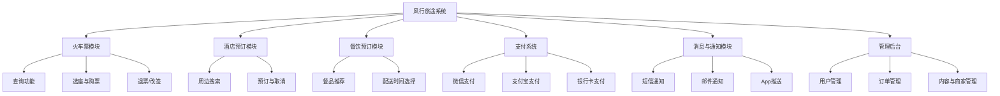
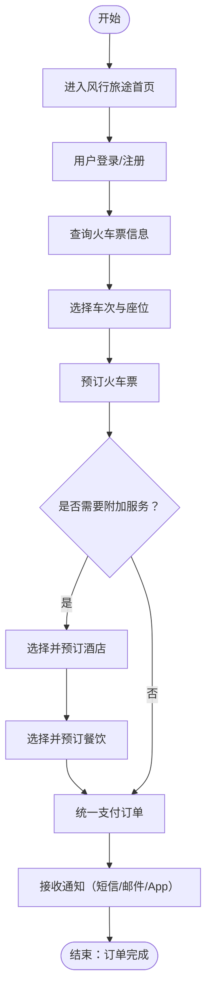
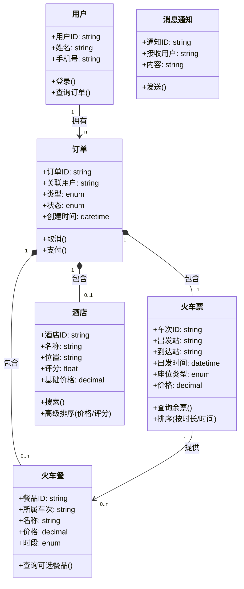
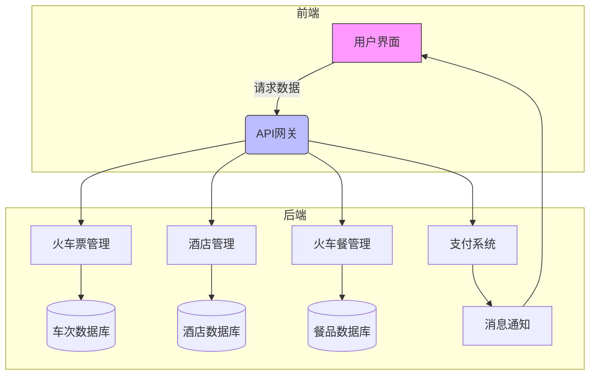
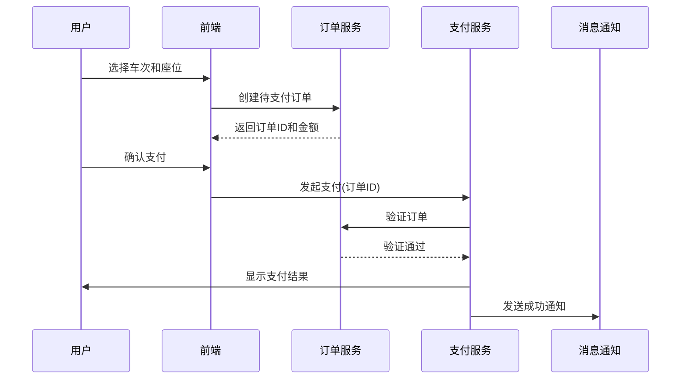

# 软件概要设计说明书

>1. 《软件概要设计说明书》(SDD)概要设计说明书又可称系统设计说明书，这里所说的系统是指程序系统。编制的目的是说明对程序系统的设计考虑，包括程序系统的基本处理流程、程序系统的组织结构、模块划分、功能分配、接口设计、运行设计、安全设计、数据结构设计和出错处理设计等，为程序的详细设计提供基础。
>2. 本课程及本实验不涉及、不强调、不关注的部分可省略，但不允许删除已有条目。
>3. 最终文档请删除所有灰色字体和斜体等说明部分。

[Toc]

## 1 引言

### 1.1 编写目的

编写这份概要设计说明书的主要目的是明确本项目——风行旅途开发过程中的系统架构，使得开发人员对项目的大致结构和初始规定有一个大致的共性的理解。系统详细设计说明书的设计内容会建立在此概要设计内容的基础之上，为后期进一步详细的项目设计提供大致框架。

本概要设计说明书主要面向项目开发过程中的开发成员。

### 1.2 背景

待开发的软件系统为风行旅途线上购票订票订餐一站式旅游服务平台，此项目由团队核心成员提出，由团队全体成员共同设计开发测试，最终面向广大旅游用户群体，平台的最终部署将建立在网络服务器上。

### 1.3 定义

| 英文              | 首字母缩写 | 中文解释        | 描述                                 |
| :---------------- | :--------- | :-------------- | :----------------------------------- |
| `carriages`       | CR         | 车厢信息表      | 存储列车车厢类型、座位数量等信息     |
| `city`            | CT         | 城市表          | 记录系统支持的城市名称               |
| `user`            | UR         | 用户信息表      | 存储用户联系方式和基本信息           |
| `food`            | FD         | 火车餐品表      | 记录车次关联的餐食信息               |
| `order`           | OR         | 订单明细表      | 存储餐食订购的具体条目               |
| `food_orders`     | FO         | 餐食订单表      | 用户餐食订单的支付关联记录           |
| `hotel_orders`    | HO         | 酒店订单表      | 用户酒店预订的支付关联记录           |
| `notifications`   | NT         | 消息通知表      | 系统向用户发送的消息记录             |
| `payment_records` | PR         | 支付记录表      | 所有支付交易的流水记录               |
| `seats`           | ST         | 座位信息表      | 具体车厢座位的类型和状态             |
| `station_city`    | SC         | 车站-城市关联表 | 车站与所属城市的映射关系             |
| `tickets_orders`  | TO         | 车票订单表      | 用户火车票订单的支付关联记录         |
| `车次`            | TR         | 车次信息表      | 列车班次的基础信息（中英文混合命名） |
| `account`         | AC         | 账户表          | 用户登录凭证和个人证件信息           |

### 1.4参考设计

参考文件有：

- 《软件开发计划书》
- 《软件需求规格说明书》
- 《“风行旅途”需求描述文档》

## 2 系统需求概述

### 2.1需求规定

要求项目具有基本的网络购票、根据用户选择的地点智能推荐合适的旅馆并提供线上预订旅馆的服务，用户也应该能够在已购车次的列车上订购车餐；具有所有交易消费订单的缴费功能，需求完成、订单完成等特定事件完成后的消息提示功能。

同时平台应该能够支持多用户多平台的同时操作，支持并发执行各种操作流程，同时不应该出现关键节点时高峰期带来的平台崩溃和明显延迟，对于一些常见异常情况比如订单已支付但是尚未成功锁定相应车次座位时平台出现崩溃的恢复机制等等，用户的个人信息、交易信息需要安全存储。

### 2.2业务目标

开发完成一站式订票购票订购酒店车餐的旅行服务软件，为旅客提供方面快捷的旅行服务，在市场上占有一定市场份额。

### 2.3运行环境

- **操作系统**：Windows 10及以上版本、macOS 10.14及以上版本、Android 8.0及以上版本、iOS 12.0及以上版本。
- **数据库管理系统**：MySQL 8.0及以上版本，用于存储用户信息、订单信息等。
- **网络通信软件**：支持RESTful API的Web框架，如Spring Boot、Express.js等，进行系统间的数据交互。
- **支付系统集成软件**：集成第三方支付SDK（如支付宝、微信支付）进行支付操作。
- **处理器利用率**：系统应优化资源利用，处理器使用率不应超过85%，以确保系统性能。
- **内存使用**：内存使用率应控制在70%以内，避免过高的内存占用导致系统性能下降。
- **存储利用率**：建议系统的存储利用率不超过75%，以避免因存储空间不足导致数据丢失或系统崩溃。
- **网络连接**：系统需支持至少100Mbps的网络带宽，保证数据的快速传输。
- **数据传输速率**：在正常情况下，用户数据传输速率应不低于10KB/s。
- **响应时间**：系统的响应时间应控制在3秒以内，确保良好的用户体验。
- **数据传输安全**：所有敏感数据（如支付信息、个人信息等）应通过SSL/TLS协议加密传输。

#### 2.3.1设备 

- 满足硬件资源利用率需求的计算机
- 网络服务器

#### 2.3.2支持软件

- **操作系统**：Windows 10及以上版本、macOS 10.14及以上版本、Android 8.0及以上版本、iOS 12.0及以上版本。
- **编译程序**：Javac、Vue
- **数据库管理系统**：MySQL 8.0及以上版本，用于存储用户信息、订单信息等。
- **网络通信软件**：支持RESTful API的Web框架，如Spring Boot、Express.js等，进行系统间的数据交互。
- **支付系统集成软件**：集成第三方支付SDK（如支付宝、微信支付）进行支付操作。
- **测试支持软件**：IntelliJ IDEA、Apifox

### 2.4设计约束

- 预算限制：除了购买租用服务器的费用开销，应不存在其余开销；
- 时间限制：应该6月8日之前将项目完成开发测试完成；
- 法律限制：软件开发设计时应充分考虑用户的个人信息、财产的安全性保障，同时对于信息传输应确保足够的保密性；
- 系统架构：应采用微服务架构，以支持系统的扩展性和灵活性。各个模块应松耦合，能够独立开发、部署和维护。
- 编程语言：推荐使用Java（Spring Boot）和JavaScript（React/Node.js）进行前后端开发，以支持高效的开发和维护。
- 数据库：推荐使用MySQL数据库存储用户和订单数据，Redis可用于缓存和提高查询性能。
- 数据标准：系统需遵循标准的数据存储格式，并确保与其他系统的数据交换符合相关规范。

### 2.5功能需求

系统功能结构图如下：

系统处理流程如下：

### 2.6非功能需求

- 系统应支持至少500 - 1000名用户同时在线进行操作，确保在高并发情况下系统响应速度和稳定性，避免出现卡顿、崩溃等问题。 
- 在系统界面设置“帮助中心”入口，提供常见问题解答、操作指南等文档，方便用户自助查询。以图文并茂的形式展示火车购票、酒店预订、火车餐购买等操作流程，帮助新用户快速上手。 
- 定期录制系统使用教程视频，发布在系统官网和社交媒体平台上，方便用户随时观看学习。对于系统的重大功能更新，及时制作更新说明文档和视频教程，引导用户了解新功能的使用方法。 
- 在正常使用情况下，用户可能会因为误操作导致订单错误或其他问题。例如，在选择车次、酒店预订日期时可能选错时间。系统应设置二次确认弹窗等提示机制，在关键操作前提醒用户确认信息，减少误操作概率。在极端情况下，如网络不稳定时用户频繁点击操作按钮，系统应进行操作频率限制，并给出友好提示，告知用户操作过于频繁，请稍后重试。 
- 在订单提交、支付等关键环节，人为错误可能造成严重影响。对于订单提交错误，系统应在错误发生时立即弹出红色醒目的提示框，告知用户错误原因，如“订单信息填写不完整，请检查后重新提交”，提示框持续显示3 - 5秒。对于支付错误，除了显示错误提示外，应及时冻结支付操作，避免用户重复支付，并引导用户联系客服解决。
- 在系统界面上，对于重要操作按钮（如提交订单、支付按钮）采用醒目的颜色进行区分，使其易于识别。当用户完成重要操作（如成功预订车票、酒店）时，系统发出简短的提示音，让用户及时知晓操作结果。同时，在消息通知区域设置红点提示，提醒用户查看新消息。 
- 系统可能需要与更多第三方服务进行集成。除了现有的与铁路、酒店、餐饮数据供应商的对接，未来可能会接入旅游攻略平台、地图导航服务等。这要求系统具备统一的接口规范，能够快速、稳定地与各类第三方服务进行交互。在集成过程中，要确保数据安全和传输稳定，同时明确数据使用权限和责任边界。
- 随着用户数量的增加，通过缓存优化、数据库查询优化、代码优化等手段，确保系统响应时间在可接受范围内。例如，对频繁访问的车次、酒店信息等进行更高效的缓存管理，减少数据库查询次数；优化算法，提高排序和搜索功能的执行效率。
- 根据用户使用习惯和市场趋势，调整页面布局、按钮设计等。简化操作步骤，使火车购票、酒店预订流程更加便捷；增加个性化推荐功能，根据用户历史订单和浏览记录，为用户推荐符合其需求的车次、酒店和火车餐品。 

### 2.7系统总体架构

系统数据结构设计图

```mermaid
classDiagram
direction LR
class carriages {
   binary(16) train_number  /* eg. G5151 */
   varchar(50) dep_station  /* 出发站 */
   varchar(50) dep_city  /* 出发城市 */
   varchar(50) arr_station  /* 到达站 */
   varchar(50) arr_city  /* 到达城市 */
   datetime arr_time  /* 到达时间 */
   time wait_time  /* 等候时间 */
   int all_number  /* how many tickets or seats on the carriage */
   int first_number  /* how many first class tickets or seats on the carriage */
   int second_number
   int business_number
   int no_seat_number
   tinyint(1) del
   binary(16) id
}
class city {
   varchar(50) city_name
   tinyint(1) del
   binary(16) id
}
class user {
   binary(16) user_id
   varchar(100) contact_name
   varchar(20) contact_phone
   varchar(100) contact_email
   timestamp created_at
   tinyint(1) del
   binary(16) contact_id
}
class food {
   binary(16) trains_id  /* which train this food belongs to */
   varchar(50) food_name
   varchar(10) food_type
   decimal(10,2) price
   tinyint(1) lunch  /* 是否是午餐 */
   tinyint(1) dinner
   varchar(255) pic_url
   tinyint(1) del
   binary(16) id
}
class order {
   binary(16) order_id
   binary(16) food_id
   int food_number
   binary(16) id
}
class food_orders {
   binary(16) pay_id
   binary(16) user_id
   tinyint(1) del
   binary(16) id
}
class hotel_orders {
   binary(16) pay_id
   binary(16) user_id
   binary(16) reservation_id
   tinyint(1) del
   binary(16) id
}
class notifications {
   binary(16) user_id  /* 接收用户ID */
   binary(16) order_id  /* 关联订单ID */
   varchar(20) message_type  /* 消息类型 */
   text content  /* 消息内容 */
   varchar(20) channel  /* 发送渠道 */
   tinyint(1) is_read  /* 是否已读 */
   varchar(20) send_status  /* 发送状态 */
   datetime send_time  /* 发送时间 */
   datetime created_time  /* 创建时间 */
   tinyint(1) del
   binary(16) message_id  /* 消息ID */
}
class payment_records {
   binary(16) order_id  /* 关联订单ID */
   binary(16) user_id  /* 支付用户ID */
   varchar(20) pay_type  /* 购买对象类型 */
   decimal(10,2) amount  /* 支付金额 */
   varchar(20) method  /* 支付方式 */
   varchar(20) status  /* 支付状态 */
   datetime created_time  /* 发起支付时间 */
   datetime updated_time  /* 最后更新时间 */
   tinyint(1) del
   binary(16) payment_id  /* 支付ID */
}
class seats {
   binary(16) train_number
   int coach  /* 车厢号 */
   varchar(10) seat_type
   decimal(10,2) price
   binary(8) flags  /* 座位状态 */
   int version  /* 乐观锁 */
   tinyint(1) del
   binary(16) id
}
class station_city {
   varchar(50) station_name
   binary(16) city_id
   tinyint(1) del
   binary(16) id
}
class tickets_orders {
   binary(16) pay_id
   binary(16) user_id
   binary(16) contacts_id
   binary(16) train_id  /* 车次编号 */
   binary(16) seat_id
   tinyint(1) del
   binary(16) id
}
class 车次 {
   varchar(10) train_number
   varchar(50) dep_station
   varchar(50) dep_city
   varchar(50) arr_station
   varchar(50) arr_city
   datetime dep_time
   datetime arr_time
   tinyint(1) del
   binary(16) id
}
class account {
   varchar(50) username
   varchar(255) password
   varchar(20) id_card
   varchar(20) phone
   varchar(100) email
   timestamp created_at
   tinyint(1) del
   binary(16) id
}

user  -->  account : user_id
order  -->  food : food_id
food_orders  -->  account : user_id
hotel_orders  -->  account : user_id
notifications  -->  account : user_id
payment_records  -->  account : user_id
station_city  -->  city : city_id
tickets_orders  -->  seats : seat_id
tickets_orders  -->  account : user_id

```

类图

1. **用户类**
   - **功能**：系统使用者核心实体
   - **关键属性**：手机号（登录凭证）
   - **核心方法**：`查询订单()`可查看历史/当前订单
2. **火车票类**
   - **业务规则**：
     - 通过`排序(按时长/时间)`实现需求文档中的"旅途时长排序"功能
     - `座位类型`枚举值应包含：商务座/一等座/二等座等
   - **关联**：与火车餐是1对多关系（一个车次提供多种餐食）
3. **酒店类**
   - **高级功能**：
     - `高级排序()`实现需求中的"按价格/评分排序"
     - `评分`字段用于推荐算法
4. **订单类**
   - **设计要点**：
     - `类型`枚举值：火车票/酒店/火车餐
     - `状态`枚举值：待支付/已完成/已取消
   - **组合关系**：强依赖关联的火车票或酒店
5. **火车餐类**
   - **约束条件**：
     - 通过`所属车次`关联购票验证（满足"仅购票用户可订餐"需求）
     - `时段`枚举值：午餐/晚餐

| 关系类型  | 连接类          | 说明                     | 对应需求     |
| :-------- | :-------------- | :----------------------- | :----------- |
| 1对多关联 | 用户 → 订单     | 用户可创建多个订单       | 历史订单查询 |
| 组合关系  | 订单 → 火车票   | 订单必须包含车票信息     | 购票核心流程 |
| 弱关联    | 订单 → 酒店     | 订单可能包含酒店（0..1） | 酒店独立预订 |
| 聚合关系  | 订单 → 火车餐   | 订单可包含多个餐食       | 订餐依赖购票 |
| 提供关系  | 火车票 → 火车餐 | 车次确定可选餐品         | 餐品车次绑定 |

1. **火车购票需求**
   - 通过`火车票`类的`查询余票()`和`排序()`实现查询与排序
   - 座位选择通过`座位类型`枚举体现不同价格
2. **酒店预订需求**
   - `高级排序()`方法直接满足价格/评分排序需求
   - 酒店搜索通过`搜索()`方法实现
3. **火车餐约束**
   - 通过`订单`与`火车票`的组合关系强制校验购票状态
4. **扩展性考虑**
   - `消息通知`类可扩展支持短信/邮件等通知方式
   - `订单.类型`枚举支持未来新增其他服务类型

系统各模块关系图

1. **用户界面 (前端)**
   - **功能**：提供可视化操作界面
   - **交互内容**：
     - 车次查询表单
     - 酒店搜索地图
     - 订单支付页面
   - **特色设计**：紫色填充标识终端用户入口
2. **API网关**
   - **关键作用**：
     - 请求路由（蓝色填充表示核心枢纽）
     - 身份验证
     - 流量控制
   - **对接系统**：所有后端微服务的统一入口
3. **火车票管理**
   - **核心能力**：
     - 余票实时查询
     - 座位锁定/释放
     - 支持按时长/时间排序
   - **数据依赖**：持续同步车次数据库
4. **酒店管理**
   - **特色功能**：
     - 价格评分动态排序
     - 地理位置检索
   - **数据隔离**：独立酒店数据库保障性能
5. **火车餐管理**
   - **业务约束**：
     - 餐品库存管理
     - 车次-餐品绑定验证
   - **数据关系**：依赖车次数据做关联校验

| 流向路径                | 数据类型示例                   | 业务场景                   |
| :---------------------- | :----------------------------- | :------------------------- |
| 用户界面 → API网关      | JSON格式查询条件               | 用户提交出发地/目的地/日期 |
| API网关 → 火车票管理    | 车次筛选参数                   | 获取可预订车次列表         |
| 火车票管理 → 车次数据库 | SQL查询语句                    | 实时余票检查               |
| 支付系统 → 消息通知     | {订单ID, 支付状态, 用户手机号} | 支付结果短信通知           |
| 消息通知 → 用户界面     | WebSocket推送                  | 页面实时显示通知小红点     |

1. **数据隔离**
   - 车次/酒店/餐品数据库物理分离，避免连锁故障
2. **关键路径**
   - 支付系统与消息通知采用异步队列解耦
3. **扩展性**
   - API网关支持横向扩展应对春运高峰流量
4. **审计要求**
   - 所有经由API网关的请求留存日志

系统关键交互过程说明

1. **用户选择车次和座位**
   - **用户行为**：在界面选择车次、座位类型（如一等座/二等座）
   - **系统响应**：前端实时显示座位余量和价格
   - **数据校验**：前端会先本地校验所选座位是否可用（避免无效请求）
2. **创建待支付订单**
   - **关键操作**：
     - 订单服务锁定座位（防止超卖）
     - 生成唯一订单ID和15分钟支付倒计时
   - **返回数据**：包含订单总金额、车次详情、座位号
3. **用户确认支付**
   - **安全措施**：前端需二次确认支付金额
   - **防重复提交**：按钮在请求发出后禁用
4. **支付流程**
   - **订单验证**：支付服务会检查：
     - 订单是否未过期
     - 座位是否仍被锁定
     - 金额是否匹配
   - **原子操作**：验证通过后同步完成：
     - 标记订单为"已支付"
     - 永久占用座位
     - 记录财务流水
5. **结果通知**
   - **用户端反馈**：
     - 页面跳转至订单详情
     - 显示电子票二维码
   - **消息通知**：
     - 短信内容包含车次、座位、出发时间
     - 邮件附带PDF版电子票据

| 异常场景           | 系统处理方式            | 用户感知表现                 |
| :----------------- | :---------------------- | :--------------------------- |
| 座位已被他人锁定   | 订单服务返回错误码409   | 提示"座位已售出，请重新选择" |
| 支付超时（15分钟） | 订单服务自动释放座位    | 页面弹出"订单超时"提示框     |
| 银行卡余额不足     | 支付服务返回3次重试机会 | 显示"支付失败，请换卡或重试" |
| 网络中断           | 前端本地缓存订单数据    | 恢复连接后自动继续支付流程   |

1. **消息通知系统**
   - 支付成功后触发：
     - 短信通知（优先级高）
     - 站内消息（用于订单详情页展示）
     - 邮件通知（附加电子发票）
2. **数据一致性保障**
   - 采用Saga事务模式：
     - 若支付成功但通知失败，系统会每5分钟重试通知
     - 若支付失败，订单服务会自动释放座位资源
3. **安全审计**
   - 关键操作日志：
     - 座位锁定/释放记录（含操作时间戳）
     - 支付验证请求参数全量留存

## 3 系统接口设计

### 3.2接口设计

#### 3.2.1用户接口

*说明将向用户提供的命令和它们的语法结构，以及软件的回答信息。*

*说明提供给用户操作的硬件控制面板的定义。*

#### 3.2.2 与其他软件、硬件接口

*说明本系统同外界的所有接口的安排包括软件与硬件之间的接口、本系统与各支持软件之间的接口关系以及各个系统元素之间的接口的安排。*

### 3.3 系统数据结构设计

#### 3.3.1 逻辑结构设计要点

*给出本系统内所使用的每个数据结构的名称、标识符以及它们之中每个数据项、记录、文卷和系的标识、定义、长度及它们之间的层次的或表格的相互关系。*

#### 3.3.2 物理结构设计要点

*给出本系统内所使用的每个数据结构中的每个数据项的存储要求，访问方法、存取单位、存取的物理关系（索引、设备、存储区域）、设计考虑和保密条件。*

#### 3.3.3数据结构与程序关系

## 4 系统数据库设计

## 5 运行设计

### 5.1运行模块组合

### 5.2运行控制

### 5.3运行时间

