# 软件详细设计说明书

[TOC]

## 1 引言

### 1.1 编写目的
本详细设计说明书旨在描述"风行旅途"在线火车购票旅游系统的详细设计方案，包括系统架构、模块划分、数据结构、接口设计等内容。本文档主要面向系统开发团队、测试团队和项目管理人员，为系统的开发、测试和维护提供技术指导和规范。同时，本文档也将作为系统验收和后期维护的依据。

### 1.2 背景

#### a. 待开发软件系统名称
"风行旅途"在线火车购票旅游系统

#### b. 项目相关方
- **任务提出者**：国家铁路集团客运部门
- **开发者**：风行科技有限公司技术研发团队
- **用户**：
  - 普通旅客（个人用户）
  - 企业客户（团体预订）
  - 系统管理员
  - 客服人员
  - 合作商家（酒店、餐饮服务提供商）
- **运行环境**：
  - 阿里云/腾讯云分布式云计算中心
  - 国家铁路数据中心
  - 移动应用商店及Web浏览器

### 1.3 术语表

| 术语 | 定义 |
|------|------|
| API | Application Programming Interface，应用程序编程接口 |
| SaaS | Software as a Service，软件即服务 |
| RESTful | Representational State Transfer，一种软件架构风格 |
| JWT | JSON Web Token，用于安全传输信息的开放标准 |
| MVC | Model-View-Controller，模型-视图-控制器，一种软件设计模式 |
| ORM | Object-Relational Mapping，对象关系映射 |
| CDN | Content Delivery Network，内容分发网络 |
| SDK | Software Development Kit，软件开发工具包 |
| SLA | Service Level Agreement，服务级别协议 |
| 微服务 | 一种将应用程序构建为独立组件集合的架构风格 |
| 负载均衡 | 将工作负载分布到多个计算资源的技术 |
| 分布式事务 | 跨越多个资源的事务处理 |
| 冷热数据分离 | 根据数据访问频率进行分类存储的策略 |
| 幂等性 | 操作任意多次与一次效果相同的特性 |
| 分布式锁 | 控制分布式系统中对共享资源并发访问的机制 |

### 1.4 参考文档

1. 《"风行旅途"在线火车购票旅游系统需求规格说明书》v1.2，2024年3月
2. 《"风行旅途"在线火车购票旅游系统概要设计说明书》v1.0，2024年4月
3. 《国家铁路旅客服务系统接口规范》v3.5，2023年12月
4. 《酒店预订系统数据交换标准》v2.0，2024年1月
5. 《支付系统安全规范》v4.0，2023年10月
6. 《铁路旅客服务质量标准》GB/T XXXXX-2023
7. 《移动互联网应用程序（APP）个人信息保护测评规范》v2.0，2023年
8. 《信息安全技术 个人信息安全规范》GB/T 35273-2023
9. 《软件工程 软件质量保证》GB/T 12504-2022
10. 《分布式系统可靠性设计指南》，2024年版
11. 《高并发系统设计原则》，2023年版
12. 《互联网应用无障碍设计规范》，2023年版


## 2 系统结构设计及子系统划分

### 2.1 系统总体架构

整个"风行旅途"系统划分为以下子系统：

1. 用户管理子系统
2. 火车购票子系统
3. 酒店预订子系统
4. 火车订餐子系统
5. 支付结算子系统
6. 消息通知子系统
7. 评价反馈子系统
8. 系统管理子系统

各子系统之间的关系如下：
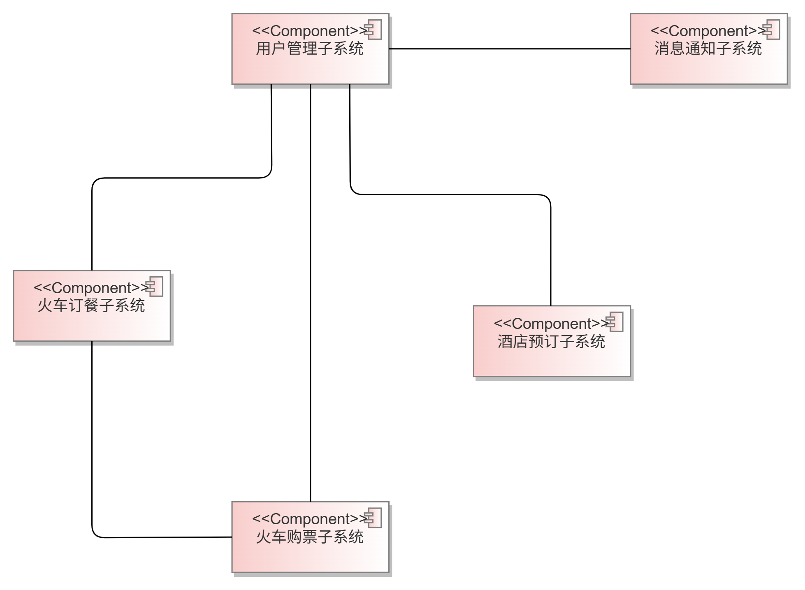

### 2.2 火车购票子系统
#### 2.2.1 功能概述

火车购票子系统负责提供列车信息查询、车票预订、订单管理、退改签等功能，是"风行旅途"平台的核心子系统之一。

#### 2.2.2 模块划分

1. **车次查询模块**：提供根据出发地、目的地、出发日期等条件查询列车信息的功能。
2. **座位查询模块**：查询指定车次的座位余票情况。
3. **车票预订模块**：完成车票预订的核心流程，包括乘客信息录入、座位选择等。
4. **订单管理模块**：管理用户的车票订单，包括订单查询、订单详情等。
5. **退改签模块**：处理用户的退票和改签请求。
6. **常用联系人模块**：管理用户常用乘车人信息。

#### 2.2.3 活动图 - 火车票预订流程
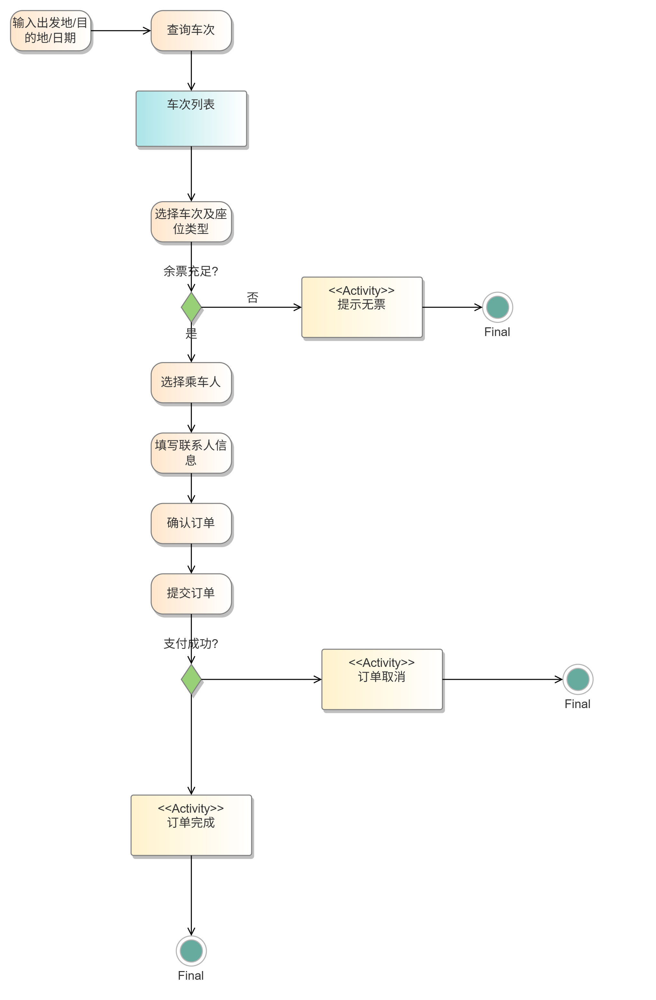

#### 2.2.4 顺序图 - 车票预订过程
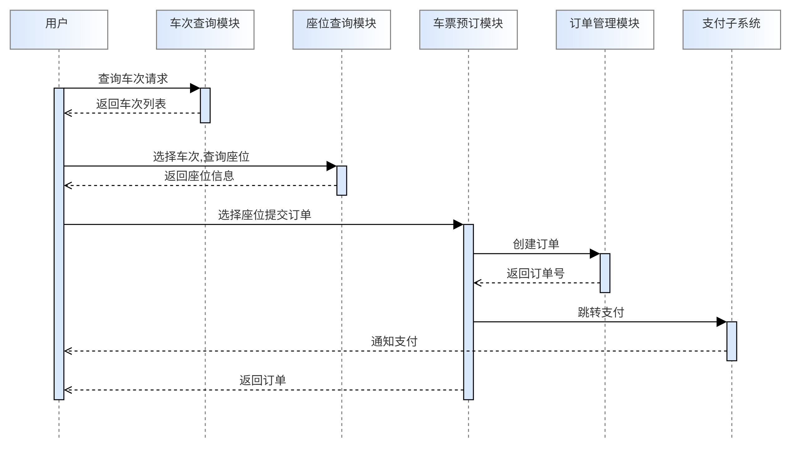

### 2.3 酒店预订子系统

#### 2.3.1 功能概述

酒店预订子系统为用户提供在线酒店搜索与预订服务，允许用户在酒店列表中筛选自己心仪的酒店，并可查看酒店详细信息，选择预订的具体时间并提交预订订单。

#### 2.3.2 模块划分

1. 酒店搜索模块：处理用户输入的搜索条件，返回符合条件的酒店列表。
2. 酒店信息展示模块：提供酒店的详细信息。
3. 酒店预订模块：处理用户的预订请求。
4. 订单管理模块：允许用户查询历史酒店订单和取消现有订单。

#### 2.3.3 活动图

#### 2.3.4 顺序图


### 2.4 火车订餐子系统

#### 2.4.1 功能概述
火车订餐子系统负责提供列车餐食预订服务，允许用户在乘车前或乘车过程中选择并预订餐食，提升旅行体验。

#### 2.4.2 模块划分
1. 餐食信息模块：提供列车可用餐食信息查询。
2. 餐食预订模块：处理用户的餐食预订请求。
3. 订单管理模块：管理用户的餐食订单。
4. 餐食评价模块：收集和管理用户对餐食的评价。
5. 餐食推荐模块：根据用户偏好和历史订单推荐餐食

#### 2.4.3 活动图 - 火车订餐流程
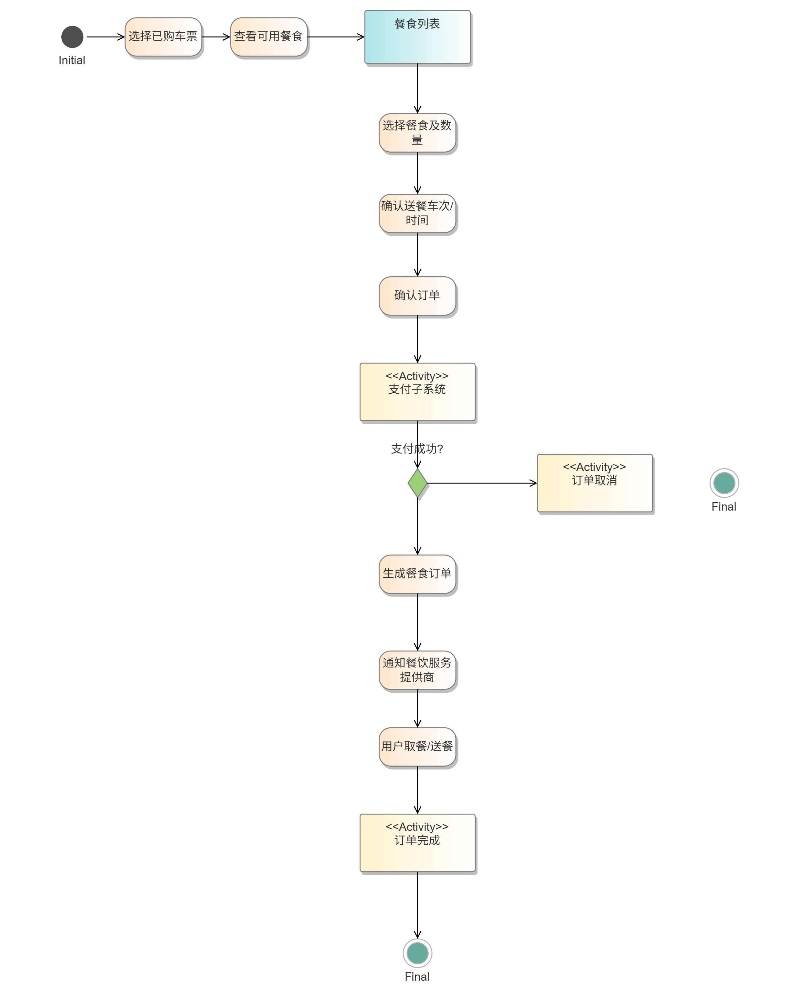

#### 2.4.4 顺序图 - 火车订餐过程
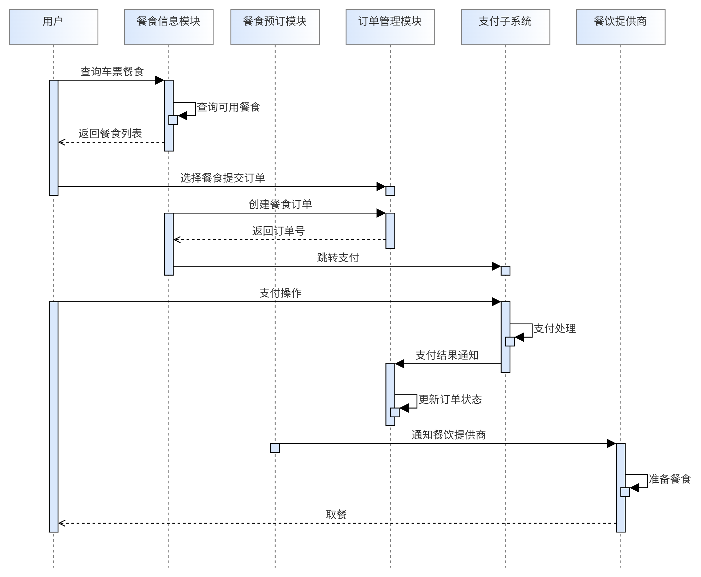

### 2.5 支付结算子系统

#### 2.5.1 功能概述

支付结算子系统负责为各订单进行支付操作，根据在火车票购买、酒店预订、餐食订购等场景中的付款需求，完成从订单创建、支付请求发起、支付状态跟踪到结果回调与异常处理的全过程。

#### 2.5.2 模块划分

1. **支付网关接口模块：** 负责对接第三方支付平台（如支付宝、微信、银联），封装支付请求构造、签名、跳转/二维码生成等逻辑，并接收第三方支付异步回调、校验签名并转发至处理模块
2. **支付订单管理模块：** 创建支付订单，与业务订单建立绑定关系，更新支付状态（已支付、未支付、失败、已关闭），并支持订单过期、自动关闭等状态流转
3. **支付流程控制模块：** 协调支付各环节逻辑，包括请求生成、跳转、回调处理、状态确认，管理支付幂等性控制，防止重复下单或重复支付，向业务系统发送支付结果通知（如订单服务）
4. **风险与安全控制模块：** 校验用户支付权限、风控限制（如频繁支付、IP 异常等），加密/解密敏感参数，防止伪造与数据篡改，签名验证、防重放机制、防刷单策略

#### 2.5.3 活动图 - 支付结算流程
<div style="text-align: center;">
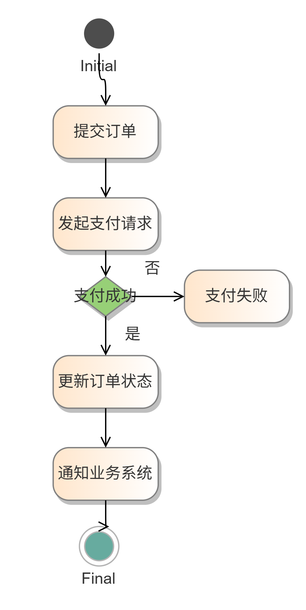
</div>

#### 2.5.4 顺序图 - 支付结算系统

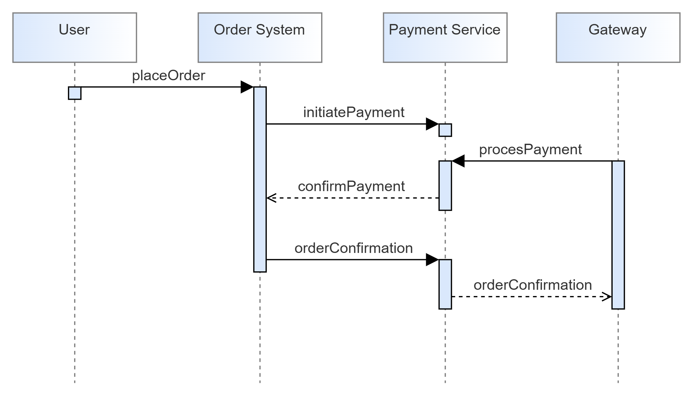

### 2.6 消息通知子系统

#### 2.6.1 功能概述

消息通知子系统负责将系统内部产生的各种关键事件、状态变化及时、可靠地通知用户或业务系统。它为车票下单成功、支付结果、酒店预订状态变更、超时提醒、退改签等场景提供统一的消息发送能力。

#### 2.6.2 模块划分

1. **通知请求接收模块：** 接收来自各业务系统的消息请求（如订单系统、支付系统），对请求内容进行格式校验、去重处理
2. **消息模板管理模块：** 管理各种消息类型的模板，如“车票预订成功通知”、“支付失败提醒”等
3. **渠道适配模块：** 根据消息类型与用户偏好选择合适的发送渠道（如短信、邮件）
4. **消息中心与任务调度模块：** 异步处理大规模消息推送任务，支持延时投递、定时发送、失败重试等机制
5. **消息状态追踪与日志模块：** 记录每一条通知的发送状态（成功、失败、退订等），提供对业务系统/用户的查询接口

#### 2.6.3 活动图 - 消息通知子系统

<div style="text-align: center;">
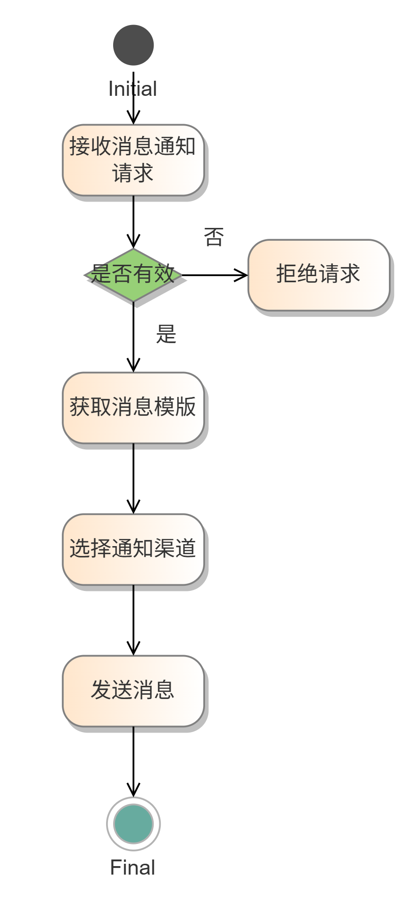
</div>

#### 2.6.4 顺序图 - 消息通知子系统

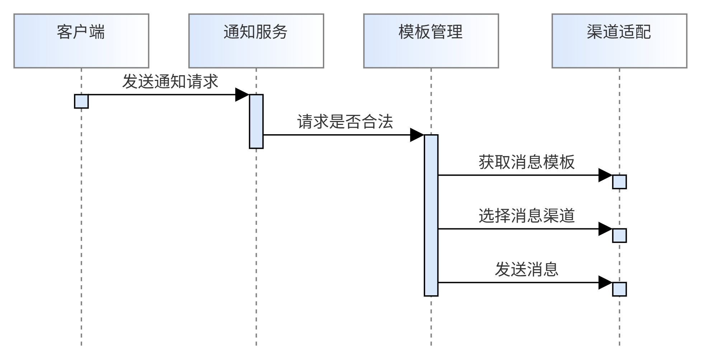

#### 2.7 子系统间接口设计

#### 2.7.1 火车购票子系统与其他子系统的接口

1. **与用户管理子系统的接口**
   - 获取用户基本信息
   - 验证用户身份信息
   - 获取常用联系人列表

2. **与支付结算子系统的接口**
   - 创建支付订单
   - 获取支付结果
   - 申请退款

3. **与消息通知子系统的接口**
   - 发送订票成功通知
   - 发送出行提醒
   - 发送退改签结果通知

4. **与火车订餐子系统的接口**
   - 提供车票信息
   - 检验乘车人身份

#### 2.7.2 火车订餐子系统与其他子系统的接口

1. **与火车购票子系统的接口**
   - 获取车票信息
   - 验证乘车人身份

2. **与支付结算子系统的接口**
   - 创建餐食支付订单
   - 获取支付结果
   - 申请退款

3. **与消息通知子系统的接口**
   - 发送订餐成功通知
   - 发送取餐提醒
   - 发送餐食评价提醒

4. **与评价反馈子系统的接口**
   - 提交餐食评价
   - 获取餐食评分

## 3 功能模块设计

*详细设计系统中的各个模块。包括模块功能描述、输入输出定义、算法设计等。每个模块的设计应该遵循高内聚、低耦合的原则，保证模块的独立性和可维护性。*

*每个模块的描述说明需要包括以下内容：*

*模块编号、模块名称、输入、处理、算法描述、输出*


## 4 界面设计

### 4.1 外部界面设计

#### 4.1.1 火车购票系统接口

**查询直达车次**

请求方法：GET

请求URL：/api/ticket/getCarriages

请求参数：

| 参数名     | 数据类型 | 中文说明 |
| ---------- | -------- | -------- |
| depStation | string   | 始发站   |
| depCity    | string   | 始发城市 |
| arrStation | string   | 目标站   |
| arrCity    | string   | 目标城市 |
| depDate    | string   | 出发时间 |

返回响应：

code：HTTP状态码

message：返回信息

data：返回数据

**查询特定类型车次**

请求方法：GET

请求URL：/api/ticket/getCarriagesByType

请求参数：

| 参数名     | 数据类型 | 中文说明 |
| ---------- | -------- | -------- |
| depStation | string   | 始发站   |
| depCity    | string   | 始发城市 |
| arrStation | string   | 目标站   |
| arrCity    | string   | 目标城市 |
| depDate    | string   | 出发时间 |
| type       | string   | 车厢类型 |

返回响应：

code：HTTP状态码

message：返回信息

data：返回数据

**查询用户历史订单**

请求方法：GET

请求URL：/api/ticket/getTicketOrders

请求参数：

| 参数名 | 数据类型 | 中文说明 |
| ------ | -------- | -------- |
| userId | string   | 用户ID   |

返回响应：

code：HTTP状态码

message：返回信息

data：返回数据

**查询中转车次**

请求方法：GET

请求URL：/api/ticket/getCarriagesTransfer

请求参数：

| 参数名  | 数据类型 | 中文说明 |
| ------- | -------- | -------- |
| depCity | string   | 出发城市 |
| arrCity | string   | 到达城市 |
| depDate | string   | 出发日期 |

返回响应：

code：HTTP状态码

message：返回信息

data：返回数据

**删除订单**

请求方法：DELETE

请求URL：/api/ticket/deleteTicketOrder

请求参数：

| 参数名  | 数据类型 | 中文说明 |
| ------- | -------- | -------- |
| orderId | string   | 订单ID   |

返回响应：

code：HTTP状态码

message：返回信息

data：返回数据

#### 4.1.2 酒店预订系统接口

1. **酒店搜索接口**
    - 功能：根据目的地和日期搜索酒店
    - 输入参数：城市、入住/离店日期、排序方式（价格/评分）
    - 输出：酒店列表（含图片、评分、价格范围）
2. **房型查询接口**
    - 功能：获取酒店详细房型信息
    - 输入参数：酒店ID、日期
    - 输出：房型列表（含价格、设施、可订数量）

#### 4.1.3 火车餐系统接口

1. **餐品查询接口**
    - 功能：查询特定车次提供的餐品
    - 输入参数：车次号
    - 输出：餐品列表（含图片、价格、供应时段）
2. **订餐接口**
    - 功能：提交火车餐订单
    - 输入参数：用户ID、车次号、餐品ID、用餐时段
    - 输出：订单确认信息

### 4.2 内部界面设计

#### 4.2.1 模块调用关系

各个系统模块分为数据层Mapper，服务层Service和接口层Controller三部分，这三部分的调用关系为

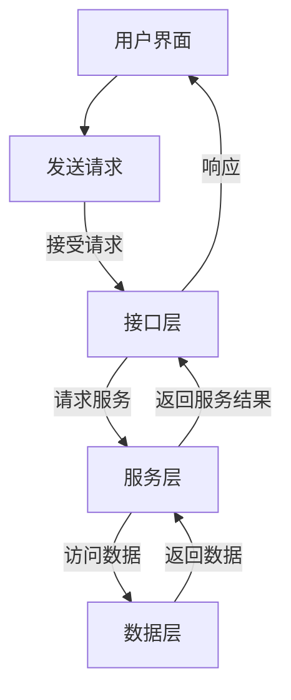

比如车票订购子系统模块调用关系为

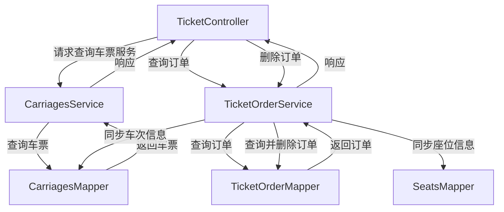

完整图

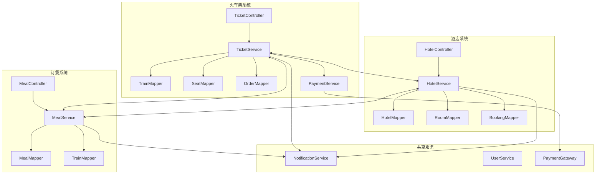

#### 4.2.2 数据接口规范

1. 通用响应格式

   ```json
   {
       "code": 200,
       "message": "响应信息",
       "data": ...(返回数据)
   }
   ```

2. 返回值数据结构设计

   `Result`

   由`integer data`、`string message`、`Object data`构成

### 4.3 用户界面设计

#### 4.3.1 界面风格规范

1. **设计语言**
    - 主色调：深蓝色(#1A237E) + 活力橙(#FF6D00)
    - 字体：主标题-思源黑体Medium 20px，正文-思源黑体Regular 14px
    - 间距规范：8px基准网格系统
2. **交互原则**
    - 重要操作（如支付）需二次确认
    - 表单错误实时验证
    - 超过3秒的操作需显示加载状态

#### 4.3.2 核心界面设计

##### 主页设计


**风格**：蓝色调，简约现代风

**工具栏**：PC端工具栏放置于左侧，便于用户使用，同时不会占据主要空间，主页设置指引按钮，指导用户快捷购票订购酒店

##### 火车订购页

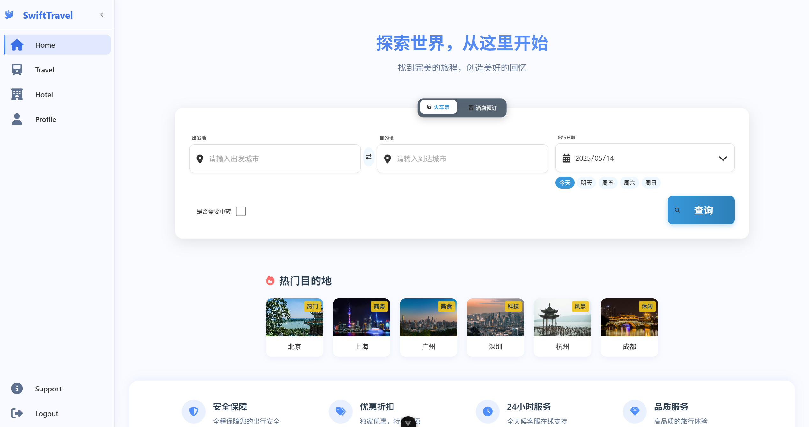

**查询选择工具**：居中放大。便于用户使用。

**热门推荐**：推荐热门景点，利于火车票销售。

##### 酒店订购页

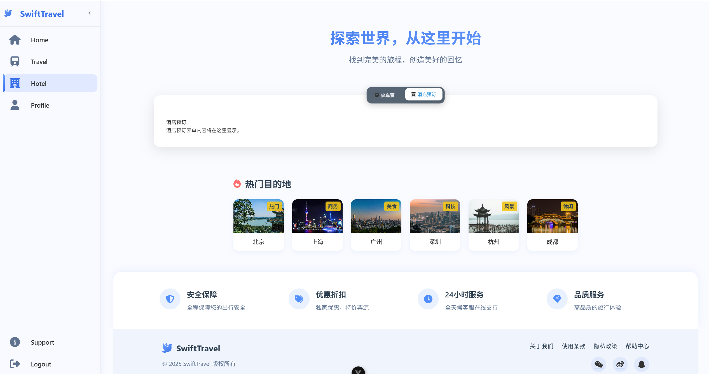

与车票订购页面相近

##### 用户信息页

**主要内容**：用户账户名、用户订单快捷查询、用户密码设置、用户基本信息（年龄、身份等等）

**页面设计**：风格与其它页面相同

#### 4.3.4 响应式设计

1. **多端适配方案**
    - 移动端：汉堡菜单 + 底部导航栏
    - PC端：左侧导航栏 + 顶部快捷入口
    - 平板：横屏双栏布局，竖屏移动端样式
2. **关键断点设置**
    - $<576px$：移动优先布局
    - $576-992px$：平板优化布局
    - $> 992px$：PC完整功能布局

## 5 异常处理设计

本节描述系统运行过程中可能出现的异常情况，包括输入错误、服务中断、支付失败等问题，并提出相应的错误提示策略、预防机制以及维护方案，确保系统具备良好的健壮性和用户体验。

### 5.1 出错信息管理
系统需对不同模块中的异常情况进行统一管理与处理，并向用户或运维人员提供清晰、可操作的错误提示信息。出错信息应具备唯一编号、清晰描述和可能的解决方案建议。

| 模块         | 异常场景             | 错误码 | 错误信息（面向用户）        | 系统日志记录                     | 处理策略                           |
|--------------|----------------------|--------|------------------------------|----------------------------------|------------------------------------|
| 火车票购买   | 查询不到余票         | T001   | 当前车次无余票               | [WARN] 无票信息                 | 提示用户换车次或日期              |
| 火车票购买   | 支付失败             | T002   | 支付未成功，请重试           | [ERROR] 支付接口失败，订单号X   | 回滚订单状态，支持重新支付        |
| 酒店预订     | 酒店已满房           | H001   | 所选酒店无可预订房间         | [WARN] 房态已变更               | 建议用户选择其他酒店              |
| 餐食购买     | 商品售罄             | M001   | 餐品已售罄                   | [INFO] 商品库存为0              | 屏蔽该商品显示，建议更换          |
| 消息通知     | 通知接口超时         | N001   | -（后台异常，无用户提示）    | [ERROR] 短信接口超时            | 自动重试并告警                    |
| 用户账户     | 登录失败（密码错误） | U001   | 账号或密码错误               | [INFO] 登录失败尝试             | 限制错误次数，提示找回密码        |

### 5.2故障预防与补救

为了最大限度减少系统异常对业务流程的影响，系统设计中引入了以下预防与补救机制：

- **接口熔断与重试机制**

    对接外部系统（如支付、通知、酒店）时，设置超时限制、重试次数，若连续失败自动熔断，避免拖慢系统主线程。

- **服务降级机制**

    某些非核心模块（如餐食推荐、历史记录）在依赖异常时可临时关闭，主流程不受影响。

- **缓存与本地兜底数据**

    使用缓存存储热门数据，如热门车次、常用车站等，防止因后台服务不可用造成查询失败。

- **订单幂等性设计**

    火车票、餐食、酒店等下单流程均支持幂等处理，避免因网络抖动、重复请求造成多次扣款或重复订单。

- **支付失败回滚机制**

    若支付未完成，系统将自动释放占用资源（座位、房间、库存）并通知用户，避免资源锁死。

- **错误日志与告警系统**

    后端部署统一日志收集与监控机制（如 ELK + Prometheus + AlertManager），对异常进行实时告警、定位与追踪。

### 5.3 系统维护设计

为了支持系统长期稳定运行，系统在设计时考虑了以下维护机制：

- **日志管理：**
所有服务按模块记录访问日志与错误日志，日志文件按时间轮转，支持关键字检索与日志级别过滤（INFO/WARN/ERROR）。

- **异常监控与报：**
引入统一的监控平台，实时跟踪服务状态（如 CPU、内存、响应时间、错误率等），发现异常及时通知运维人员。

- **自动化部署与回滚：**
支持 CI/CD 自动部署，并配置蓝绿部署、回滚机制，确保系统升级可控、安全。

- **数据库健康检测：**
定期检测数据库连接状态、慢查询日志、磁盘空间，自动告警异常情况。

- **接口测试与模拟：**
提供完整的接口测试用例和测试环境，关键业务流程设有接口模拟器（Mock Server）防止联调时中断主系统。

## 6 性能优化和安全设计

### 6.1 性能优化

为确保“风行旅途”在线火车购票旅游系统提供流畅的用户体验，尤其在查询、预订等关键操作中实现低延迟，将采取以下性能优化措施：

* **数据库优化：**
    * **索引策略：** 对常用查询字段（如火车票的日期、始发站、终点站，酒店的目的地、价格、评分等）建立高效索引，加速数据检索速度。
    * **查询优化：** 优化SQL查询语句，避免全表扫描，减少复杂连接。对于火车票和酒店的排序功能（按时长、出发时间、价格、评分排序），将特别关注查询性能。
    * **读写分离：** 对于高并发读的场景（如车票查询、酒店列表），考虑使用读写分离架构，分散数据库压力。
    * **缓存机制：** 对热门线路、酒店信息、火车餐品等不经常变动的数据引入缓存机制，减少数据库直接访问，提高响应速度。
* **后端服务优化：**
    * **异步处理：** 对于非核心、耗时的操作（如发送通知消息），采用异步消息队列处理，避免阻塞主流程。
    * **并发控制：** 采用合理的并发控制机制（如连接池、线程池），有效管理系统资源，提高并发处理能力。
    * **代码优化：** 对核心业务逻辑代码进行性能分析和优化，减少不必要的计算和资源消耗。
    * **负载均衡：** 在高并发场景下，部署负载均衡策略，将用户请求分发到多个应用服务器，提高系统的整体处理能力和可用性。
* **前端优化：**
    * **静态资源优化：** 对图片、CSS、JavaScript等静态资源进行压缩、合并，利用CDN加速，减少加载时间。
    * **懒加载：** 对于列表数据（如搜索结果），采用分页加载或无限滚动懒加载技术，提高首屏加载速度。
    * **代码优化：** 优化前端JavaScript代码，减少DOM操作，提高页面渲染效率。
* **响应时长：** 特别关注换乘功能的响应时长，确保在可接受范围内完成复杂的换乘逻辑计算和数据呈现。


### 6.2 安全设计

为保障系统数据和用户隐私安全，将从以下几个方面进行安全设计：

* **数据存储安全：**
    * **敏感数据加密：** 对用户密码、支付信息（即使是模拟系统也应考虑）等敏感数据，在数据库中进行加密存储（例如使用哈希加盐处理密码）。
    * **数据库访问控制：** 严格控制数据库的访问权限，不同应用模块使用不同权限的数据库账户。
    * **数据备份与恢复：** 定期进行数据备份，并制定有效的数据恢复计划，防止数据丢失。
* **数据传输安全：**
    * **HTTPS加密：** 全站启用HTTPS协议，对用户浏览器与服务器之间的所有数据传输进行SSL/TLS加密，防止数据在传输过程中被窃取或篡改。
* **访问控制与身份认证：**
    * **用户认证：** 实现安全的 用户注册和登录机制。
    * **权限管理：** 根据用户角色（如普通用户、管理员等）设计权限体系，确保用户只能访问其授权的资源和功能。例如，只有购买了特定车次车票的用户才能预订该车次的火车餐。
    * **防暴力破解：** 对登录等关键操作接口设置尝试次数限制、验证码等机制，防止暴力破解。
* **输入验证与输出编码：**
    * **输入验证：** 对所有用户输入进行严格的合法性校验（前端和后端双重校验），防止SQL注入、XSS跨站脚本等常见Web攻击。
    * **输出编码：** 对输出到页面的数据进行适当的编码，防止XSS攻击。
* **日志审计：**
    * 记录关键操作日志（如登录、订单操作、支付操作等），便于安全审计和问题追溯。
* **隐私保护：**
    * 严格遵守隐私保护原则，收集和使用用户信息时，明确告知用户并获得同意。
    * 对用户个人信息进行脱敏处理，如在展示或分析时。


## 7 项目测试计划

### 7.1 测试策略

本项目将采用分阶段、多层次的测试策略，包括单元测试、集成测试和系统测试，确保各模块功能正确、模块间协作无误，最终系统满足所有需求。测试过程将贯穿整个开发周期。


### 7.2 测试方法与内容

| 序号 | 测试类型 | 对应部分                  | 测试内容                                                     | 计划测试时间 |
| ---- | -------- | ------------------------- | ------------------------------------------------------------ | ------------ |
| 1    | 单元测试 | 火车购票模块              | - 查询功能（时间、起止站）<br>- 车型展示<br>- 座位选择与价格对应<br>- 历史订单查询<br>- 取消订单<br>- 按旅途总时长排序<br>- 按出发时间早晚排序 | 开发阶段     |
| 2    | 单元测试 | 酒店预订模块              | - 按目的地搜索酒店<br>- 查看酒店详情<br>- 选择日期预订<br>- 取消订单<br>- 查询历史订单<br>- 按价格排序<br>- 按评分排序 | 开发阶段     |
| 3    | 单元测试 | 火车餐购买模块            | - 查看特定班次提供的餐品<br>- 餐品选择<br>- 用餐时间段选择<br>- 购买权限校验（已购票用户） | 开发阶段     |
| 4    | 单元测试 | 消息通知模块              | - 订购成功/失败通知<br>- 取消订购成功/失败通知<br>- 其他必要场景通知 | 开发阶段     |
| 5    | 单元测试 | 缴费系统模块              | - 模拟缴费流程<br>- 缴费成功/失败状态反馈                    | 开发阶段     |
| 6    | 单元测试 | 用户认证与授权模块 (假设) | - 用户登录功能<br>- 用户注册功能<br>- 访问权限控制           | 开发阶段     |
| 7    | 集成测试 | 购票与订餐流程            | - 用户购票后成功预订该车次火车餐<br>- 未购票用户无法预订火车餐<br>- 取消车票后火车餐订单状态联动（如适用） | 集成测试阶段 |
| 8    | 集成测试 | 订单与通知流程            | - 火车票/酒店/火车餐下单后收到成功通知<br>- 取消订单后收到成功通知<br>- 支付成功/失败后收到通知 | 集成测试阶段 |
| 9    | 集成测试 | 查询与排序功能            | - 火车票查询结果按指定条件正确排序<br>- 酒店查询结果按指定条件正确排序<br>- 换乘查询功能模块间数据传递和响应时长 | 集成测试阶段 |
| 10   | 系统测试 | 完整购票流程              | - 用户从查询、选择车次座位、下单、模拟支付到收到通知的完整流程 | 系统测试阶段 |
| 11   | 系统测试 | 完整酒店预订流程          | - 用户从搜索、查看详情、选择日期、下单、模拟支付到收到通知的完整流程 | 系统测试阶段 |
| 12   | 系统测试 | 完整火车餐购买流程        | - 已购票用户查看餐品、选择、下单、模拟支付到收到通知的完整流程 | 系统测试阶段 |
| 13   | 系统测试 | 订单管理                  | - 用户能正确查询和取消各类历史订单（火车票、酒店、火车餐）   | 系统测试阶段 |
| 14   | 系统测试 | 性能测试                  | - 并发用户购票、查询场景下的系统响应时间<br>- 大数据量查询的响应时间<br>- 换乘查询的响应时间 | 系统测试阶段 |
| 15   | 系统测试 | 安全测试                  | - SQL注入、XSS等常见漏洞测试<br>- 用户数据（特别是隐私数据）的保护测试<br>- 权限控制测试（如越权访问订单）<br>- 支付流程安全性测试（即使是模拟） | 系统测试阶段 |
| 16   | 系统测试 | 兼容性测试 (假设)         | - 不同主流浏览器下的功能和界面兼容性                         | 系统测试阶段 |
| 17   | 系统测试 | 可用性测试                | - 用户操作流程是否顺畅<br>- 界面是否友好易懂                 | 系统测试阶段 |

