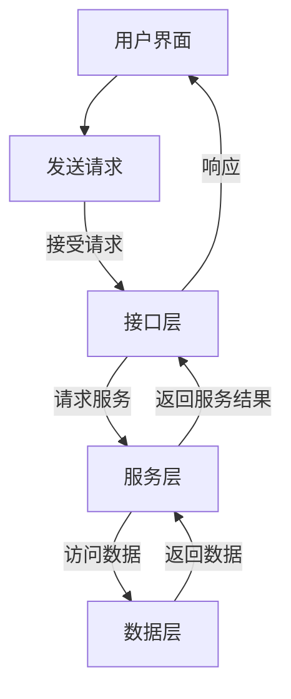
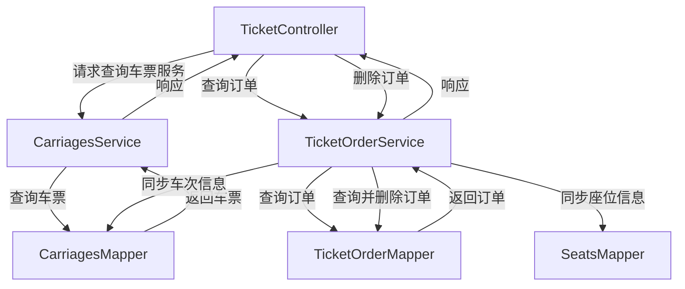
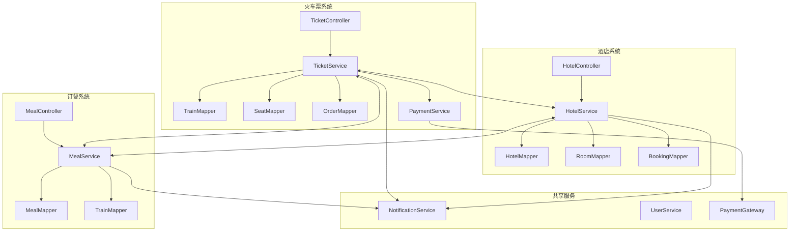

# 软件详细设计说明书

> 《软件详细设计说明书》是对《软件概要设计说明书》的补充。
>
> 1. 本课程及本实验不涉及、不强调、不关注的部分可省略，但不允许删除已有条目。
> 2. 最终文档请删除所有灰色字体和斜体等说明部分。

[TOC]

## 1 引言

*介绍编写该设计文档的目的、背景和范围。说明文档的读者和主要参考资料。*

### 1.1 编写目的

*说明编写这份概要设计说明书的目的，指出预期的读者。*

### 1.2 背景

*说明：*

*a．待开发软件系统的名称；*

*b．列出此项目的任务提出者、开发者、用户以及将运行该软件的计算站（中心）。*

### 1.3 术语表

*列出本文件中用到的专门术语的定义和外文首字母组词的原词组，为读者在阅读文档时提供必要的参考信息。*

### 1.4 参考文档

*列出有关的参考文件*


## 2 系统结构设计及子系统划分

对系统的组成及逻辑结构进行设计前确认，划*分子系统。*

*如：登录注册子系统、个人信息维护子系统。*每个子系统需要有使用CodeArts画出活动图与顺序图予以说明。


## 3 功能模块设计

*详细设计系统中的各个模块。包括模块功能描述、输入输出定义、算法设计等。每个模块的设计应该遵循高内聚、低耦合的原则，保证模块的独立性和可维护性。*

*每个模块的描述说明需要包括以下内容：*

*模块编号、模块名称、输入、处理、算法描述、输出*


## 4 界面设计

*如果系统包含用户界面，需要提供界面设计。包括界面布局、控件和交互方式等*

### 4.1 外部界面设计

*根据系统页面划分进行系统外部界面设计，对系统的所有外部接口（包括功能和数据接口）进行设计。*

#### 4.1.1 火车购票系统接口

**查询直达车次**

请求方法：GET

请求URL：/api/ticket/getCarriages

请求参数：

| 参数名     | 数据类型 | 中文说明 |
| ---------- | -------- | -------- |
| depStation | string   | 始发站   |
| depCity    | string   | 始发城市 |
| arrStation | string   | 目标站   |
| arrCity    | string   | 目标城市 |
| depDate    | string   | 出发时间 |

返回响应：

code：HTTP状态码

message：返回信息

data：返回数据

**查询特定类型车次**

请求方法：GET

请求URL：/api/ticket/getCarriagesByType

请求参数：

| 参数名     | 数据类型 | 中文说明 |
| ---------- | -------- | -------- |
| depStation | string   | 始发站   |
| depCity    | string   | 始发城市 |
| arrStation | string   | 目标站   |
| arrCity    | string   | 目标城市 |
| depDate    | string   | 出发时间 |
| type       | string   | 车厢类型 |

返回响应：

code：HTTP状态码

message：返回信息

data：返回数据

**查询用户历史订单**

请求方法：GET

请求URL：/api/ticket/getTicketOrders

请求参数：

| 参数名 | 数据类型 | 中文说明 |
| ------ | -------- | -------- |
| userId | string   | 用户ID   |

返回响应：

code：HTTP状态码

message：返回信息

data：返回数据

**查询中转车次**

请求方法：GET

请求URL：/api/ticket/getCarriagesTransfer

请求参数：

| 参数名  | 数据类型 | 中文说明 |
| ------- | -------- | -------- |
| depCity | string   | 出发城市 |
| arrCity | string   | 到达城市 |
| depDate | string   | 出发日期 |

返回响应：

code：HTTP状态码

message：返回信息

data：返回数据

**删除订单**

请求方法：DELETE

请求URL：/api/ticket/deleteTicketOrder

请求参数：

| 参数名  | 数据类型 | 中文说明 |
| ------- | -------- | -------- |
| orderId | string   | 订单ID   |

返回响应：

code：HTTP状态码

message：返回信息

data：返回数据

#### 4.1.2 酒店预订系统接口

1. **酒店搜索接口**
   - 功能：根据目的地和日期搜索酒店
   - 输入参数：城市、入住/离店日期、排序方式（价格/评分）
   - 输出：酒店列表（含图片、评分、价格范围）
2. **房型查询接口**
   - 功能：获取酒店详细房型信息
   - 输入参数：酒店ID、日期
   - 输出：房型列表（含价格、设施、可订数量）

#### 4.1.3 火车餐系统接口

1. **餐品查询接口**
   - 功能：查询特定车次提供的餐品
   - 输入参数：车次号
   - 输出：餐品列表（含图片、价格、供应时段）
2. **订餐接口**
   - 功能：提交火车餐订单
   - 输入参数：用户ID、车次号、餐品ID、用餐时段
   - 输出：订单确认信息

### 4.2 内部界面设计

*设计系统内部各功能模块间的调用关系和数据接口。*

#### 4.2.1 模块调用关系

各个系统模块分为数据层Mapper，服务层Service和接口层Controller三部分，这三部分的调用关系为



比如车票订购子系统模块调用关系为



完整图



#### 4.2.2 数据接口规范

1. 通用响应格式

   ```json
   {
       "code": 200,
       "message": "响应信息",
       "data": ...(返回数据)
   }
   ```

2. 返回值数据结构设计

   `Result`

   由`integer data`、`string message`、`Object data`构成

### 4.3 用户界面设计

*规定人机界面的内容、界面风格、调用方式等，包括表单设计、用户需要的打印输出等设计。*

#### 4.3.1 界面风格规范

1. **设计语言**
   - 主色调：深蓝色(#1A237E) + 活力橙(#FF6D00)
   - 字体：主标题-思源黑体Medium 20px，正文-思源黑体Regular 14px
   - 间距规范：8px基准网格系统
2. **交互原则**
   - 重要操作（如支付）需二次确认
   - 表单错误实时验证
   - 超过3秒的操作需显示加载状态

#### 4.3.2 核心界面设计

##### 主页设计


**风格**：蓝色调，简约现代风

**工具栏**：PC端工具栏放置于左侧，便于用户使用，同时不会占据主要空间，主页设置指引按钮，指导用户快捷购票订购酒店

##### 火车订购页


**查询选择工具**：居中放大。便于用户使用。

**热门推荐**：推荐热门景点，利于火车票销售。

##### 酒店订购页


与车票订购页面相近

##### 用户信息页

**主要内容**：用户账户名、用户订单快捷查询、用户密码设置、用户基本信息（年龄、身份等等）

**页面设计**：风格与其它页面相同

#### 4.3.4 响应式设计

1. **多端适配方案**
   - 移动端：汉堡菜单 + 底部导航栏
   - PC端：左侧导航栏 + 顶部快捷入口
   - 平板：横屏双栏布局，竖屏移动端样式
2. **关键断点设置**
   - $<576px$：移动优先布局
   - $576-992px$：平板优化布局
   - $> 992px$：PC完整功能布局

## 5 异常处理设计

*描述各种可能出现的错误和异常情况，并提供相应的处理方法和策略。*

### 5.1 出错信息管理

### 5.2故障预防与补救

### 5.3 系统维护设计


## 6 性能优化和安全设计

*针对系统的性能和安全性进行优化和设计，包括数据存储、传输和访问的安全性考虑。*


## 7 项目测试计划

*描述对系统进行测试的策略和方法。包括单元测试、集成测试和系统测试等。*

| 序号 | 测试类型 | 对应部分 | 测试内容 | 计划测试时间 |
| ---- | -------- | -------- | -------- | ------------ |
|      |          |          |          |              |
