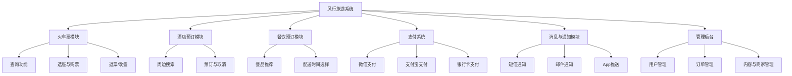

# 软件需求规格说明书

> 1. 《软件需求规格说明》(SRS)描述对计算机软件配置项 CSCI的需求，及确保每个要求得以满足的所使用的方法。涉及该 CSCI外部接口的需求可在本 SRS 中给出：或在本 SRS引用的一个或多个《接口需求规格说明》(IRS)中给出。
> 2. 这个 SRS，可能还要用 IRS加以补充，是CSCI设计与合格性测试的基础。
> 3. 本课程及本实验不涉及、不强调、不关注的部分可省略，但不允许删除已有条目。
> 4. 最终文档请删除所有灰色字体和斜体等说明部分。
> 5. 高亮章节为重点关注章节。

[TOC]

## 1 范围

### 1.1 标识

- 系统名称：“风行旅途”综合出行服务系统
- 简称：风行系统
- 版本号：V1.0
- 发行号：FX-2025-TRS
- 编写日期：2025年4月
- 文档类型：软件需求规格说明书（SRS）

### 1.2 系统概述

风行旅途系统是一个面向公众用户的综合出行服务平台，旨在提供高效、便捷、安全的一站式铁路出行服务。系统融合火车票购买、餐饮预订、酒店推荐与预订、支付系统、消息通知等多个子系统，致力于提升用户出行体验。

系统主要特性包括：
- 火车票购票系统：实现车次查询、余票实时查询、选座、购票、退改签等功能；
- 酒店预订系统：提供目的地周边酒店信息、价格对比、在线预订与取消服务；
- 餐饮预订系统：提供乘车前或途中餐食预定及配送服务；
- 统一支付系统：支持多种支付方式（如银行卡、支付宝、微信等）；
- 消息通知系统：提供购票成功通知、行程提醒、退改签信息等多类型通知。

系统开发运行历史：

项目启动于2025年3月，处于产品需求分析与系统设计阶段。系统将采用分布式微服务架构，基于Spring Boot + Vue的技术栈开发。

系统相关方：

- 投资方：北航软件学院软件工程课程组
- 需方：北航软件学院软件工程课程组
- 开发方：远方开发团队
- 用户：中国境内铁路出行旅客、游客及相关第三方商家（酒店、餐饮等）
- 运维支持：远方开发团队

计划部署地点：

初期部署于云平台，后期将根据用户量进行多地数据中心部署。

相关文档：

- 软件开发计划书
- 软件需求规格说明书
- 软件概要设计说明书
- 软件详细设计说明书
- 测试报告

### 1.3 文档概述

本文档的主要目的是规范并明确风行旅途系统的各项功能、性能、安全性及用户交互需求，为后续的软件设计、开发、测试和维护工作提供统一的依据。内容包括但不限于：功能需求描述、系统性能指标、接口需求、安全性要求、用户需求及环境需求等。

本说明书适用于系统设计人员、开发人员、测试人员、项目管理人员、运维人员以及最终用户代表。

保密性要求：

- 本文档涉及商业机密，仅限项目相关人员内部传阅；
- 禁止未经授权对外传播；
- 如需披露给第三方，需签署保密协议。

### 1.4 基线

本计划编制基于以下已确认的基线文档：

| 基线文档名称                  | 批准日期   | 存储位置                           |
| :---------------------------- | :--------- | :--------------------------------- |
| 项目4：“风行旅途”需求描述文档 | 2025-03-31 | /项目4：“风行旅途”需求描述文档.pdf |
| 软件需求规格说明书            | 2025-04-20 | /软件需求规格说明书.md             |
| 软件概要设计说明书            | 2025-05-04 | /软件概要设计说明书.md             |
| 软件详细设计说明书            | 2024-05-18 | /软件详细设计说明书.md             |
| 测试报告                      | 2024-06-08 | /测试报告.md                       |

## 2 引用文件

本章列出了在编制《软件需求规格说明书》过程中所参考的相关文档和资料。除非另有说明，所列文档均可通过风行科技项目文档管理系统或公开渠道获得。

| 编号 | 文档名称                                                 | 修订版本 | 发行日期      | 来源                     |
| ---- | -------------------------------------------------------- | -------- | ------------- | ------------------------ |
| R1   | 风行旅途项目立项书                                       | V1.0     | 2025年3月28日 | 风行科技产品中心         |
| R2   | 风行旅途开发计划书                                       | V1.0     | 2025年2月18日 | 风行科技开发组           |
| R3   | 12306官方功能手册（公开版）                              | V3.5     | 2024年9月     | 中国铁路客户服务中心官网 |
| R4   | GB/T 8567-2006 软件工程文档规范                          | 2006版   | 2006年        | 国家标准全文公开系统     |
| R5   | GB/T 25000.51-2016 软件工程 产品质量要求与评价（SQuaRE） | 2016版   | 2016年        | 国家标准全文公开系统     |

**说明：**  
- `R4` 和 `R5` 为国家标准文档，用于规范文档结构与质量评估标准；  
- `R1` 和 `R2` 为风行旅途项目相关的内部资料；  
- `R3` 为参考同类系统12306的功能设计与业务流程；  

## 3 需求

本章详细描述了“风行旅途”综合出行服务系统（CSCI）的各项软件需求。每项需求均具有唯一标识符，便于后续的测试、追踪及维护。所有需求均以可测量、可验证的方式定义，确保构成CSCI的验收标准。

### 3.1 所需的状态和方式

风行旅途系统在整个生命周期中将处于以下几种主要状态和方式：

| 状态/方式    | 描述                                                                       |
| ------------ | -------------------------------------------------------------------------- |
| 空闲状态     | 系统待机，无用户操作，无活动处理任务。                                     |
| 准备就绪状态 | 系统启动完成，准备接受用户操作和请求。                                     |
| 活动状态     | 系统正常处理用户请求，如购票、支付、预订等操作。                           |
| 降级模式     | 系统部分模块出现异常，仅提供核心功能（如查询）。                           |
| 紧急模式     | 在突发情况下（如系统攻击、高并发），进入限流与只读模式，保障核心服务运行。 |

所有需求将在相应条目中明确标注其适用状态，未涉及状态的需求默认为“活动状态”下生效。

### 3.2 ==需求概述==

#### 3.2.1 目标

- *本系统的开发意图、应用目标及作用范围(现有产品存在的问题和建议产品所要解决的问题)。*
- *本系统的主要功能、处理流程、数据流程及简要说明。*
- *表示外部接口和数据流的系统高层次图。说明本系统与其他相关产品的关系,是独立产品还是一个较大产品的组成部分(可用方框图说明)。*

风行旅途系统旨在解决当前铁路购票系统用户体验差、功能割裂、服务分散等问题，提供统一的一站式出行服务平台。系统目标包括：

- 提供直观、易用的票务购买流程，支持车次查询、选座、购票、退改签等完整服务；
- 集成酒店预订、餐饮服务、行程提醒等功能，覆盖出行全流程；
- 支持多渠道支付和订单管理，提升交易便捷性；
- 通过高可用系统架构，保障系统稳定运行，支持高并发访问；
- 基于用户行为提供个性化推荐服务。

系统主要功能模块和数据流程如下图所示：

#### 3.2.2 运行环境

- **操作系统**：Windows10、11
- **硬件平台**：x86_64服务器集群，支持负载均衡和容灾部署
- **运行平台**：Docker容器化环境
- **数据库**：MySQL 8.0、Redis 缓存
- **中间件**：Nginx、RabbitMQ、Spring Cloud Gateway

#### 3.2.3 用户的特点

风行旅途系统主要面向以下类型用户：

- **普通乘客**：具备基础操作能力，使用手机/PC购票与预订；
- **老年用户**：需要简化界面与引导式操作流程；
- **合作商户**：如餐饮商、酒店方，通过商家后台进行数据管理；
- **运维与客服人员**：通过专属后台系统进行数据监控、问题处理与客户服务。

#### 3.2.4 关键点

- **关键功能**：购票流程稳定性、选座逻辑、余票查询效率，酒店、餐饮推荐；
- **关键算法**：推荐系统（基于用户行为）、余票动态计算、路径规划；
- **关键技术**：微服务架构、分布式数据库读写分离、高并发下的限流与熔断处理、跨模块消息通信机制（如消息队列）。

#### 3.2.5 约束条件

- **开发期限**：2025年6月前完成主要开发并上线试运行；
- **经费限制**：由风行科技投资，初期预算为10万元；
- **技术框架限制**：前端基于Vue3，后端基于Spring Boot；
- **政策合规**：系统需符合中华人民共和国《网络安全法》《消费者权益保护法》等相关法律法规；
- **用户隐私保护**：需遵循GDPR与中国《个人信息保护法》相关标准。

### 3.3 ==需求规格==

#### 3.3.1 软件系统总体功能/对象结构

*对软件系统总体功能/对象结构进行描述,包括结构图、流程图或对象图。*

系统功能结构图如下：



#### 3.3.2 软件子系统功能/对象结构

每个模块的子功能简述如下：

- **火车票模块**
  - 实时余票查询（通过铁路API接口）
  - 智能选座（算法支持靠窗/靠近同行人）
  - 退改签规则适配不同车次

- **酒店模块**
  - 按地点、评分、价格过滤搜索
  - 与车票联动推荐（目的地推荐）

- **餐饮模块**
  - 根据乘车时间和路线智能推荐可配送车站
  - 接入第三方餐饮平台接口

- **支付模块**
  - 支持主流支付方式
  - 安全性校验（验证码、支付限额、风控机制）

- **通知模块**
  - 多通道通知策略
  - 事件触发器配置（如订单成功后推送）

#### 3.3.3 描述约定

- 时间表示统一采用 **YYYY-MM-DD HH:mm:ss**
- 金额单位为 **人民币元（¥）**
- 距离单位为 **公里（km）**
- 数据流图中，圆形代表处理单元，矩形为外部实体，平行线为数据存储，箭头为数据流向
- 本说明书中，“必须”表示强制实现，“应”表示优先级较高建议，“可”表示可选功能

### 3.4 ==CSCI能力需求==

#### 3.4.1 火车票购买能力
**描述**：此功能允许用户在系统中选择出发地、目的地、日期、座位类型等信息，并查询可用的火车票，最后完成支付和购票

输入：
1. 用户基本信息：

    - 用户名（可选）：用于识别用户身份，已登录用户默认为系统中的注册账号。

    - 用户联系方式（可选）：包括手机号或电子邮件，用于发送购票确认信息。

2. 查询参数：

    - 出发地：用户选择的出发城市。

    - 目的地：用户选择的到达城市。

    - 出发日期：用户选择的乘车日期。

    - 座位类型：用户选择的座位类型（硬座、软座、一等座、二等座等）。

3. 支付信息：

    - 支付方式：如信用卡、借记卡、支付宝、微信支付等。

    - 支付账户信息：用于处理支付（如银行卡号、支付宝账号等）。

**处理**：
1. 火车票查询：

    - 系统根据用户提供的出发地、目的地和出发日期，查询数据库中的火车票余量。

    - 如果查询到符合条件的车票，系统返回车票信息（包括票价、座位类型、车次信息等）。

    - 如果没有可用车票，系统向用户提示“无票”并提供替代方案（如选择其他时间或车次）。

2. 用户选择座位：

    - 用户在查询结果中选择一个合适的车票，系统记录用户的选择（车次、座位类型等）。

3. 支付流程：

    - 系统验证用户的支付信息（如信用卡号、支付账户等）是否合法。

    - 在验证通过后，系统发起支付请求，使用所选的支付方式进行扣款。

    - 支付成功后，系统生成购票记录，并为用户分配座位号。

4. 票务确认：

    - 系统向用户发送购票确认信息，包括车票信息（如车次、座位号、票价等）及支付凭证。

    - 用户通过短信或邮件收到电子车票，并能通过系统查看详细的购票信息。

**输出**：
1. 车票信息：

    - 车票确认信息（车次号、座位号、票价、出发和到达时间等）。

2. 支付状态：

    - 支付是否成功。若支付成功，返回支付凭证和电子车票。若支付失败，返回错误信息（如余额不足、支付超时等）。

3. 消息通知：

    - 购票成功后，系统会发送电子车票、支付成功通知到用户的手机或邮箱

**性能要求**：
1. 响应时间：

    - 车票查询响应时间不超过3秒。

    - 支付处理响应时间不超过5秒，支付确认时间不超过2秒。

2. 并发要求：

    - 系统应支持每秒处理至少1000次车票查询请求，系统能支持5000并发用户的购票请求。

3. 吞吐量：

    - 在系统高峰期（例如假期前夕），系统能够稳定处理10,000个并发购票请求

**安全性要求**：
1. 支付安全：

    - 支付过程必须使用 SSL/TLS加密，确保支付信息的安全性。

    - 支付系统应符合 PCI-DSS标准，确保处理银行卡信息时的安全性。

2. 用户隐私：

    - 用户的个人信息（如姓名、联系方式、支付信息等）需加密存储，确保数据的安全。

    - 系统需遵守隐私保护政策，不泄露用户信息给第三方，除非用户同意。

3. 身份验证：

    - 用户需要通过 两步验证（如短信验证码或邮件验证）来确认身份，特别是在支付环节

**异常处理**：
1. 无票情况：

    - 如果查询到没有符合用户条件的车票，系统将提示用户“无票”，并提供替代方案，如建议其他日期、车次或座位类型。

2. 支付失败：

    - 如果支付过程中发生错误（如支付账户余额不足、支付超时等），系统将显示错误信息，允许用户重新尝试支付，或选择其他支付方式。

    - 支付失败时，系统需自动回滚购票事务，确保用户账户不被错误扣款。

3. 用户输入错误：

    - 如果用户输入无效的信息（如错误的城市名称、日期格式错误等），系统应及时提示并引导用户正确填写信息。

4. 系统崩溃：

    - 在系统崩溃或异常情况下，所有未完成的购票请求将被回滚，用户不会被误扣款。

    - 错误信息和日志应及时记录，并通知管理员。

**容错能力**：
- 系统应具备 高可用性，能够在部分节点故障的情况下继续运行。

- 系统在出现临时性故障时，能够自动恢复，确保用户能够尽快完成购票操作。

#### 3.4.2 酒店预订能力
**描述**：此功能允许用户根据出发地、目的地、入住和离店日期等信息，查询可用的酒店房间并进行预订。系统还需支持用户查看酒店的详细信息、价格、房间类型、设施等，并进行支付确认。

**输入**：
1. 用户基本信息：

    - 用户名（可选）：已登录用户的身份标识。

    - 用户联系方式（可选）：包括手机号、电子邮件，用于发送预订确认信息。

2. 查询参数：

    - 目的地：用户选择的目的城市（入住酒店的所在地）。

    - 入住日期：用户选择的入住日期。

    - 离店日期：用户选择的离店日期。

    - 房间类型：用户选择的房间类型（如单人间、双人间、套房等）。

    - 人数：入住人数（可能影响房间选择和房价）。

3. 支付信息：

    - 支付方式：如信用卡、借记卡、支付宝、微信支付等。

    - 支付账户信息：处理支付（如银行卡号、支付账户等）。

**处理**：
1. 酒店查询：

    - 系统根据用户提供的目的地、入住和离店日期、房间类型等条件查询可用的酒店房间，并返回符合条件的酒店列表。

    - 查询结果将包括酒店名称、房间类型、价格、设施、用户评价等信息。

2. 房间选择：

    - 用户根据酒店列表选择合适的房间类型，系统会显示该房间的详细信息，包括价格、床型、是否有空房等。

    - 用户可以根据价格、评价等进行筛选。

3. 预订房间：

    - 用户选择房间后，系统记录其选择的酒店、房间类型、入住日期、离店日期等信息，并为其预留房间。

4. 支付流程：

    - 系统验证用户支付信息，若验证通过，则发起支付请求，处理房间预订费用。

    - 支付成功后，系统生成预订记录，标记房间为已预订，并为用户分配预订号。

5. 预订确认：

    - 系统向用户发送预订确认信息，包括酒店名称、房间类型、入住日期、离店日期、预订号等详细信息。

**性能要求**：
1. 响应时间：

    - 酒店查询响应时间不应超过5秒。

    - 支付处理响应时间不超过5秒，支付确认时间不超过3秒。

2. 并发要求：

    - 系统应支持每秒处理至少2000个并发查询请求，能够稳定处理5000个并发预订请求。

3. 吞吐量：

    - 在高峰时段（如节假日），系统能够处理10,000个并发的酒店查询和预订请求。

**安全性要求**：
1. 支付安全：

    - 支付过程中必须使用 SSL/TLS加密，确保支付信息的安全性。

    - 系统应符合 PCI-DSS标准，确保支付信息的合法和安全处理。

2. 用户隐私：

    - 用户的个人信息（如姓名、联系方式、支付信息等）应加密存储，确保数据的安全。

     - 所有用户数据应符合隐私保护政策，未经授权不得外泄。

3. 身份验证：

    - 用户需通过 两步验证（如短信验证码或邮件验证）进行身份确认，尤其在支付过程中。

**异常处理**：
1. 无空房情况：

    - 如果没有符合用户条件的酒店房间，系统将提示用户“无空房”，并建议其他日期、地点或房间类型。

    - 系统可提供其他推荐酒店或选择相近价格和位置的替代方案。

2. 支付失败：

    - 如果支付过程中发生错误（如账户余额不足、支付超时等），系统将显示错误信息，并允许用户重新选择支付方式或重新尝试支付。

    - 支付失败时，系统会保留用户的订单状态，防止误扣款。

3. 用户输入错误：

    - 如果用户输入无效信息（如日期格式错误、支付信息不完整等），系统应立即提示用户重新输入，并提供正确格式的提示。

4. 系统崩溃：

    - 系统在崩溃或异常情况下，未完成的预订请求会被回滚，确保用户不会被误扣款。

    - 系统日志应详细记录异常情况，并及时通知管理员。

**容错能力**：
- 系统应具备 高可用性，能够在部分节点故障时继续提供酒店查询和预订服务。

- 在出现暂时性故障时，系统能够自动恢复服务，确保用户能够尽快完成预订操作。

### 3.5 CSCI外部接口需求

#### 3.5.1 接口标识和接口图

本酒店预订系统的CSCI（客户预订服务模块）与多个外部实体进行数据交换，包括用户前端界面、酒店信息管理系统、第三方支付平台以及数据库系统等。

下图展示了CSCI与外部实体的接口图：
```
+------------------+             +-----------------------+
|  用户前端界面     |<----------->|  客户预订服务模块（CSCI） |
+------------------+             +-----------------------+
                                         ^    ^    ^
                                         |    |    |
                                         |    |    |
                    +-------------------+    |    +------------------+
                    |                        |                       |
        +---------------------+   +----------------------+  +------------------+
        | 酒店信息管理系统     |   | 第三方支付平台接口模块 |  | 数据库系统（MySQL） |
        +---------------------+   +----------------------+  +------------------+

```
说明：

- 用户前端界面：由 Web 和移动端组成，负责发起预订请求、接收预订结果。

- 酒店信息管理系统：负责提供实时的客房信息、价格等。

- 第三方支付平台接口模块：与支付宝、微信支付等支付服务对接。

- 数据库系统：存储预订记录、用户信息、支付状态等。

下面以“第三方支付平台接口模块（项目唯一标识符：INTF-03）”为例，详细说明接口能力要求。
```
+------------------+             +-----------------------+
|  用户前端界面     |<----------->|  火车票预订服务模块（CSCI） |
+------------------+             +-----------------------+
                                         ^    ^    ^
                                         |    |    |
                                         |    |    |
                    +-------------------+    |    +------------------+
                    |                        |                       |
        +------------------------+   +----------------------+  +------------------+
        | 火车票库存系统          |   | 第三方支付平台接口模块 |  | 数据库系统（MySQL） |
        +------------------------+   +----------------------+  +------------------+
```

**说明**：

- 用户前端界面：由 Web 和移动端组成，负责发起预订请求、接收预订结果。

- 酒店信息管理系统：负责提供实时的客房信息、价格等。

- 第三方支付平台接口模块：与支付宝、微信支付等支付服务对接。

- 数据库系统：存储预订记录、用户信息、支付状态等。

下面以“火车票预订接口（项目唯一标识符：INTF-03）”为例，详细说明接口能力要求。

#### 3.5.2 第三方支付平台接口（INTF-03）
**接口实体标识**：
- 项目唯一标识符：INTF-03

- 非技术名称：第三方支付接口

- 技术名称：PaymentGatewayAdapter

- 版本：v1.2

- 涉及实体：第三方支付服务（如支付宝、微信支付等）

**接口类型与要求**：
- 类型：实时数据传输接口

- 功能：实现用户支付、退款及支付状态查询功能

-  优先级：高（直接影响交易成功与否）

**数据元素特性**：

| 属性     | 描述                              |
| -------- | --------------------------------- |
| 名称     | order_id                          |
| 类型     | 字符串（String）                  |
| 大小     | 32字符                            |
| 计量单位 | 无                                |
| 范围     | 任意合法 UTF-8 字符，字母数字组成 |
| 精度     | 精确到订单级别                    |
| 约束     | 必须唯一、不可更新                |
| 保密性   | 中（日志中需脱敏）                |
| 来源     | 客户预订服务模块                  |
| 接收者   | 支付平台                          |

| 属性   | 描述                   |
| ------ | ---------------------- |
| 名称   | payment_status         |
| 类型   | 枚举（Enum）           |
| 取值   | SUCCESS，FAIL，PENDING |
| 精度   | 一次支付事务级别       |
| 保密性 | 低                     |
| 来源   | 第三方支付平台         |
| 接收者 | 客户预订服务模块       |

**数据集合特性（支付请求消息体）**：

| 属性         | 描述                                                      |
| ------------ | --------------------------------------------------------- |
| 非技术名称   | 支付请求体                                                |
| 技术名称     | PaymentRequestDTO                                         |
| 数据结构     | JSON 对象，包含：order_id, amount, user_id, notify_url 等 |
| 媒体         | HTTPS POST 请求                                           |
| 输出特性     | 无图形界面，后台调用                                      |
| 访问特性     | 单次调用，不支持分页或流式传输                            |
| 约束条件     | 总体大小不得超过10KB，字段必须校验                        |
| 私密性       | 高（必须使用HTTPS传输，内容需加签）                       |
| 来源与接收者 | 来源：CSCI模块，接收者：支付宝/微信支付服务器             |

**通信方法特性**：
- 通信方式：HTTPS（双向认证）

- 带宽：使用HTTP标准请求，不超过2Mbps带宽消耗

- 数据格式：JSON格式

- 控制特性：异步回调机制 + 轮询机制兼容

- 传送速率：非周期性（用户发起即发送）

- 地址规则：由第三方平台提供固定地址（如：https://api.xxx.com/pay）

**协议特性**：
- 协议：基于RESTful API协议

- 校验机制：签名 + 时间戳 + 随机数防重放

- 同步机制：初始请求同步返回交易单号，后续通过状态轮询或异步通知确认最终状态

- 状态反馈：支付状态包括处理中、成功、失败三种

**其他特性**：
- 物理接口兼容性：无物理接口要求，仅为逻辑对接

- 安全性要求：

    - 必须支持RSA或SM2签名机制
    
    - 支持Token校验或OAuth 2.0接入方式
    
    - 回调接口必须支持IP白名单

#### 3.5.3 火车票预订接口（INTF-03）
**接口实体标识**：
- 项目唯一标识符：INTF-03

- 非技术名称：火车票库存接口

- 技术名称：TicketInventoryService

- 版本：v1.2

- 涉及实体：火车票库存管理系统

**接口类型与要求**：
- 类型：实时数据传输接口

- 功能：实现查询火车票库存、预订火车票、退票等操作

- 优先级：高（直接影响交易成功与否）

**数据元素特性**：

| 属性     | 描述                                 |
| -------- | ------------------------------------ |
| 名称     | train_id                             |
| 类型     | 字符串（String）                     |
| 大小     | 6字符                                |
| 计量单位 | 无                                   |
| 范围     | 标准火车车次ID（如：G1234、D5678等） |
| 精度     | 精确到车次级别                       |
| 约束     | 必须唯一、不可更新                   |
| 保密性   | 中（可在日志中记录，但不公开显示）   |
| 来源     | 火车票库存管理系统                   |
| 接收者   | 客户预订服务模块                     |

| 属性   | 描述                     |
| ------ | ------------------------ |
| 名称   | available_seat_count     |
| 类型   | 整数（Integer）          |
| 范围   | ≥ 0                      |
| 精度   | 精确到每个车次的座位数量 |
| 约束   | 必须大于等于0            |
| 保密性 | 低                       |
| 来源   | 火车票库存管理系统       |
| 接收者 | 客户预订服务模块         |

**数据集合特性（支付请求消息体）**：

| 属性         | 描述                                                                     |
| ------------ | ------------------------------------------------------------------------ |
| 非技术名称   | 票务查询响应体                                                           |
| 技术名称     | TicketQueryResponseDTO                                                   |
| 数据结构     | JSON 对象，包含：train_id, available_seat_count, price, departure_time等 |
| 媒体         | HTTPS POST 请求                                                          |
| 输出特性     | 无图形界面，后台调用                                                     |
| 访问特性     | 单次查询，不支持分页或流式传输                                           |
| 约束条件     | 总体大小不得超过10KB，字段必须校验                                       |
| 私密性       | 低                                                                       |
| 来源与接收者 | 来源：CSCI模块，接收者：火车票库存系统                                   |

**通信方法特性**：
- 通信方式：HTTPS（双向认证）

- 带宽：使用HTTP标准请求，不超过2Mbps带宽消耗

- 数据格式：JSON格式

- 控制特性：异步回调机制 + 轮询机制兼容

- 传送速率：非周期性（用户发起即发送）

- 地址规则：由第三方平台提供固定地址（如：https://api.xxx.com/pay）

**协议特性**：
- 协议：基于RESTful API协议

- 校验机制：签名 + 时间戳 + 随机数防重放

- 同步机制：初始请求同步返回交易单号，后续通过状态轮询或异步通知确认最终状态

- 状态反馈：支付状态包括处理中、成功、失败三种

**其他特性**：
- 物理接口兼容性：无物理接口要求，仅为逻辑对接

- 安全性要求：

    - 必须支持RSA或SM2签名机制

    - 支持Token校验或OAuth 2.0接入方式

    - 回调接口必须支持IP白名单

### 3.6 CSCI内部接口需求

内部接口是指系统内部模块之间的交互和数据传输，通常用于支持不同功能模块之间的协同工作。在此部分，我们会列出软件系统内部各个模块之间的接口需求，并且针对每个接口，标明输入输出要求、数据格式、通信方式等详细信息。

#### 3.6.1 订票模块与支付模块接口（INTF-06）
- 接口标识符：INTF-06

- 接口名称：订票与支付模块通信接口

- 版本：v1.0

- 接口类型：同步接口

- 功能描述：该接口用于在用户完成火车票预订后，传递订票信息至支付模块进行支付。支付模块在接收到支付信息后进行支付处理，处理结果会返回给订票模块，用于最终确定预订状态。

**数据元素特性**：
- 输入数据：

    - 订单号（order_id）：字符串类型，最大长度为32个字符，表示当前订单的唯一标识。

    - 用户支付金额（amount）：浮动类型，精确到小数点后两位，表示用户应支付的金额。

    - 用户支付方式（payment_method）：字符串类型，可能的值包括“支付宝”、“微信支付”、“信用卡”等，表示用户选择的支付方式。

| 属性 | 描述             |
| ---- | ---------------- |
| 名称 | order_id         |
| 类型 | 字符串（String） |
| 长度 | 32字符           |
| 范围 | 唯一订单标识符   |
| 约束 | 必填，不能为空   |

| 属性 | 描述                                               |
| ---- | -------------------------------------------------- |
| 名称 | error_code                                         |
| 类型 | 字符串（String）                                   |
| 长度 | 10字符                                             |
| 范围 | 如“INSUFFICIENT_FUNDS”、“INVALID_PAYMENT_METHOD”等 |
| 约束 | 可选，仅在支付失败时返回                           |

**通信方式与协议**：
- 通信方式：通过 HTTP/HTTPS 实现同步请求与响应，采用 RESTful API 接口风格。

- 协议：使用 JSON 格式传输数据，具体协议要求参考支付模块和订票模块设计。

- 安全性要求：所有传输数据必须通过 HTTPS 协议加密，确保用户信息的安全。对接请求需进行身份验证（如OAuth 2.0或API密钥认证）。

**错误处理与容错**：
- 错误代码映射：支付状态为“失败”时，接口应返回具体的错误码（如“网络错误”、“余额不足”）。

- 重试机制：在支付失败或网络异常的情况下，接口应支持重试机制，最多重试3次。

- 超时处理：支付请求应设定超时机制，最大超时时间为60秒。

#### 3.6.2 用户信息模块与订单管理模块接口（INTF-07）

- 接口标识符：INTF-07

- 接口名称：用户信息与订单管理模块接口

- 版本：v1.0

- 接口类型：双向接口

- 功能描述：用户信息模块与订单管理模块之间的接口用于传递用户的个人信息、订单历史等数据。订单管理模块通过该接口访问用户的个人信息，用于订单确认、发送通知、修改订单等操作。

**数据元素特性：**
- 输入数据：

  - 用户ID（user_id）：字符串类型，最大长度为64个字符，唯一标识用户。

  - 用户姓名（user_name）：字符串类型，表示用户的全名。

  - 用户联系方式（user_contact）：字符串类型，表示用户的手机号或电子邮件。

| 属性 | 描述             |
| ---- | ---------------- |
| 名称 | user_id          |
| 类型 | 字符串（String） |
| 长度 | 64字符           |
| 范围 | 唯一用户标识符   |
| 约束 | 必填，不能为空   |

| 属性 | 描述             |
| ---- | ---------------- |
| 名称 | user_name        |
| 类型 | 字符串（String） |
| 长度 | 50字符           |
| 范围 | 用户姓名         |
| 约束 | 必填，不能为空   |

- 输出数据：

  - 订单历史（order_history）：数组类型，包含用户的历史订单记录。每个订单记录包含订单号、订单状态、订单金额等字段。

  - 用户账户状态（account_status）：字符串类型，表示用户账户的状态，可能的值包括“正常”、“冻结”等。

| 属性 | 描述                           |
| ---- | ------------------------------ |
| 名称 | order_history                  |
| 类型 | 数组（Array）                  |
| 内容 | 包含每个订单的ID、金额、状态等 |
| 约束 | 可选，用户可能没有历史订单     |

| 属性 | 描述             |
| ---- | ---------------- |
| 名称 | account_status   |
| 类型 | 字符串（String） |
| 长度 | 20字符           |
| 范围 | “正常”、“冻结”   |
| 约束 | 必填，不能为空   |

**通信方式与协议：**
- 通信方式：通过内部API进行数据传输，使用JSON格式进行数据交换。

- 协议：采用 RESTful API，支持CRUD操作。

- 安全性要求：数据传输过程中，所有用户敏感信息（如姓名、联系方式）必须进行加密，确保隐私安全。

**错误处理与容错：**
- 数据一致性：在获取用户信息或订单历史时，确保系统的事务一致性，避免因系统崩溃或网络故障造成数据丢失。

- 超时处理：接口调用最大超时时间为30秒，如果超时未返回结果，应返回错误码“TIMEOUT”。

#### 3.6.3 消息通知模块与用户模块接口（INTF-08）
- 接口标识符：INTF-08

- 接口名称：消息通知模块与用户模块接口

- 版本：v1.0

- 接口类型：推送接口

- 功能描述：消息通知模块通过此接口向用户发送订单确认、支付成功等信息。

**数据元素特性：**
- 输入数据：

  - 用户ID（user_id）：字符串类型，唯一标识用户。

  - 通知内容（message_content）：字符串类型，表示推送的消息内容。

| 属性 | 描述             |
| ---- | ---------------- |
| 名称 | user_id          |
| 类型 | 字符串（String） |
| 长度 | 64字符           |
| 范围 | 唯一用户标识符   |
| 约束 | 必填，不能为空   |

| 属性 | 描述             |
| ---- | ---------------- |
| 名称 | message_content  |
| 类型 | 字符串（String） |
| 长度 | 256字符          |
| 范围 | 消息内容         |
| 约束 | 必填，不能为空   |


**通信方式与协议：**
- 通信方式：推送通知接口，支持HTTP POST请求

- 协议：使用JSON格式，消息内容通过接口传递。

- 安全性要求：使用SSL加密，确保消息传输安全。


### 3.7 ==CSCI内部数据需求==

#### 3.7.1 数据库需求

CSCI内部数据通常存储在数据库中。数据库设计应满足高效存取数据、数据一致性、安全性、扩展性等要求。在此部分列出所需的数据库表格、字段以及每个字段的具体要求。

具体关于数据库内部字段的属性待设计时决定

#### 3.7.2 数据文件需求
除了数据库表格，CSCI 还可能需要存储一些常规的静态数据，如配置文件、日志文件等。此部分描述了对数据文件的需求。

1. 配置文件（config.json）

    - 功能描述：存储系统的配置参数，如数据库连接信息、支付网关信息等。

    - 文件格式：JSON

    - 文件需求说明：该配置文件存储系统所需的基础配置信息，所有敏感数据（如密码、API密钥等）应加密存储。文件采用JSON格式，易于人类读取和修改。

2. 日志文件（system_log.txt）

    - 功能描述：存储系统运行期间的日志信息，用于故障排查和性能分析。

    - 文件格式：文本文件（.txt）

    - 文件需求说明：日志文件应按日期分类存储，每条日志包括时间戳、日志级别（如 INFO、ERROR 等）和日志内容。系统必须能够根据日志文件进行故障排查，及时识别系统中的异常。

#### 3.7.3 数据访问与安全性要求

- 数据访问要求：

  - 所有数据访问应符合最小权限原则，用户只应有访问和操作与其相关的数据的权限。

 - 对于数据库的查询操作，系统应提供必要的索引，以提高查询性能。

- 数据安全性要求：

  - 所有敏感信息（如用户密码、支付信息等）应进行加密存储和传输。

  - 使用访问控制和身份验证机制，确保只有授权的用户才能访问敏感数据。

  - 系统应定期进行数据备份，防止数据丢失。

### 3.8 适应性需求

*(若有)本条应指明要求 CSCI提供的、依赖于安装的数据有关的需求(如:依赖现场的经纬度)和要求 CSCI使用的,根据运行需要进行变化的运行参数(如:表示与运行有关的目标常量或数据记录的参数)。*

### 3.9 保密性需求

*(若有)本条应描述有关防止对人员、财产、环境产生潜在的危险或把此类危险减少到最低的CSCI需求,包括:为防止意外动作(如意外地发出“自动导航关闭”命令)和无效动作(发出一个想要的“自动导航关闭”命令时失败)CSCI必须提供的安全措施。*

### 3.10 保密性和私密性需求

*(若有)本条应指明保密性和私密性的 CSCI需求,包括:CSCI运行的保密性/私密性环境、提供的保密性或私密性的类型和程度、CSCI必须经受的保密性/私密性的风险、减少此类危险所需的安全措施、CSCI必须遵循的保密性/私密性政策、CSCI必须提供的保密性/私密性审核,保密性/私密性必须遵循的确证/认可准则。*

### 3.11 ==CSCI环境需求==

*(若有)本条应指明有关 CSCI必须运行的环境的需求。例如,包括用于 CSCI运行的计算机硬件和操作系统(其他有关计算机资源方面的需求在下条中描述)。*

### 3.12 计算机资源需求

#### 3.12.1 计算机硬件需求

*本条应描述 CSCI使用的计算机硬件需求,(若适用)包括,各类设备的数量、处理器,存储器、输人/输出设备、辅助存储器、通信/网络设备和其他所需的设备的类型,大小,容量及其他所要求的特征。*

#### 3.12.2 计算机硬件资源利用需求

*本条应描述 CSCI计算机硬件资源利用方面的需求,如:最大许可使用的处理器能力、存储器容量、输入/输出设备能力、辅助存储器容量、通信/网络设备能力。描述(如每个计算机硬件资源能力的百分比)还包括测量资源利用的条件。*

#### 3.12.3 计算机软件需求

*本条应描述 CSCI必须使用或引人 CSCI的计算机软件的需求,例如包括:操作系统、数据库管理系统、通信/网络软件、实用软件、输入和设备模拟器、测试软件、生产用软件。必须提供每个软件项的正确名称、版本、文档引用。*

#### 3.12.4 计算机通信需求

*本条应描述 CSCI必须使用的计算机通信方面的需求,例如包括:连接的地理位置、配置和网络拓扑结构、传输技术、数据传输速率、网关、要求的系统使用时间、传送/接收数据的类型和容量、传送/接收/响应的时间限制、数据的峰值、诊断功能。*

### 3.13 ==软件质量因素==

==次要关注点==

*(若有)本条应描述合同中标识的或从更高层次规格说明派生出来的对CSCI的软件质量方面的需求,例如包括有关 CSCI的功能性(实现全部所需功能的能力)、可靠性(产生正确、一致结果的能力)、可维护性(易于更正的能力)、可用性(需要时进行访问和操作的能力)、灵活性(易于适应需求变化的能力)、可移植性(易于修改以适应新环境的能力)、可重用性(可被多个应用使用的能力)、可测试性(易于充分测试的能力),易用性(易于学习和使用的能力)以及其他属性的定量需求。*

### 3.14 设计和实现的约束

*(若有)本条应描述约束CSCI设计和实现的那些需求。这些需求可引用适当的标准和规范例如需求包括：*

- *特殊 CSCI体系结构的使用或体系结构方面的需求,例如:需要的数据库和其他软件配置项；标准部件、现有的部件的使用；需方提供的资源(设备、信息、软件)的使用；*
- *特殊设计或实现标准的使用;特殊数据标准的使用;特殊编程语言的使用；*
- *为支持在技术、风险或任务等方面预期的增长和变更区域,必须提供的灵活性和可扩展性。*

### 3.15 数据

*说明本系统的输入,、输出数据及数据管理能力方面的要求(处理量、数据量)。*

### 3.16 操作

*说明本系统在常规操作、特殊操作以及初始化操作、恢复操作等方面的要求。*

### 3.17 故障处理

*说明本系统在发生可能的软硬件故障时,对故障处理的要求。包括：*

- *说明属于软件系统的问题；*
- *给出发生错误时的错误信息；*
- *说明发生错误时可能采取的补救措施。*

### 3.18 算法说明

*用于实施系统计算功能的公式和算法的描述。包括:*

- *每个主要算法的概况；*
- *用于每个主要算法的详细公式。*

### 3.19 有关人员需求

*(若有)本条应描述与使用或支持 CSCI的人员有关的需求,包括人员数量、技能等级、责任期、培训需求,其他的信息。如:同时存在的用户数量的需求,内在帮助和培训能力的需求,(若有)还应包括强加于 CSCI的人力行为工程需求,这些需求包括对人员在能力与局限性方面的考虑:在正常和极端条件下可预测的人为错误,人为错误造成严重影响的特定区域,例如包括错误消息的颜色和持续时间、关键指示器或关键的物理位置以及听觉信号的使用的需求。*

### 3.20 有关培训需求

*(若有)本条应描述有关培训方面的CSCI需求。包括:在 CSCI中包含的培训软件。*

### 3.21 有关后勤需求

*(若有)本条应描述有关后勤方面的 CSCI需求,包括:系统维护、软件支持、系统运输方式、供应系统的需求、对现有设施的影响、对现有设备的影响。*

### 3.22 其他需求

*(若有)本条应描述在以上各条中没有涉及到的其他CSCI需求。*

### 3.23 包装需求

*(若有)本条应描述需交付的 CSCI在包装、加标签和处理方面的需求(如用确定方式标记和包装8磁道磁带的交付)。(若适用)可引用适当的规范和标准。*

### 3.24 需求的优先次序和关键程度

*(若适用)本条应给出本规格说明中需求的、表明其相对重要程度的优先顺序、关键程度或赋予的权值,如:标识出那些认为对安全性、保密性或私密性起关键作用的需求,以便进行特殊的处理如果所有需求具有相同的权值,本条应如实陈述。*

## 4 合格性规定

*本章定义一组合格性方法,对于第3章中每个需求,指定所使用的方法,以确保需求得到满足可以用表格形式表示该信息,也可以在第3章的每个需求中注明要使用的方法。合格性方法包括：*

- *演示:运行依赖于可见的功能操作的 CSCI或部分 CSCI,不需要使用仪器,专用测试设备或进行事后分析；*
- *测试.使用仪器或其他专用测试设备运行 CSCI或部分 CSCI,以便采集数据供事后分析使用；*
- *分析:对从其他合格性方法中获得的积累数据进行处理,例如测试结果的归约、解释或推断；*
- *审查:对 CSCI代码、文档等进行可视化检查；*
- *特殊的合格性方法。任何应用到CSCI的特殊合格性方法,如:专用工具、技术、过程、设施、验收限制。*

## 5 需求可追踪性

*本章应包括：*

- *从本规格说明中每个 CSCI的需求到其所涉及的系统(或子系统)需求的可追踪性。(该可追踪性也可以通过对第3章中的每个需求进行注释的方法加以描述)*

  *注:每一层次的系统细化可能导致对更高层次的需求不能直接进行追踪。例如:建立多个 CSCI的系统体系结构设计可能会产生有关 CSCI之间接口的需求,而这些接口需求在系统需求中并没有被覆盖,这样的需求可以被追踪到诸如”系统实现”这样的一般需求,或被追踪到导致它们产生的系统设计决策上。*

- *从分配到被本规格说明中的 CSCI的每个系统(或子系统)需求到涉及它的 CSCI需求的可0.追踪性。分配到 CSC的所有系统(或子系统)需求应加以说明。追踪到IRS中所包含的CSCI需求可引用 IRS。*

## 6 ==尚未解决的问题==

*如需要,可说明软件需求中的尚未解决的遗留问题。*

## 7 注解

*本章应包含有助于理解本文档的一般信息(例如背景信息、词汇表、原理》。本章应包含为理解本文档需要的术语和定义,所有缩略语和它们在文档中的含义的字母序列表。*

## 附录

*附录可用来提供那些为便于文档维护而单独出版的信息(例如图表、分类数据)。为便于处理附录可单独装订成册。附录应按字母顺序(A,B等)编排。*
