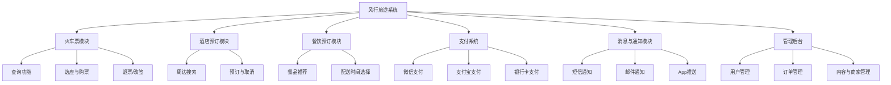
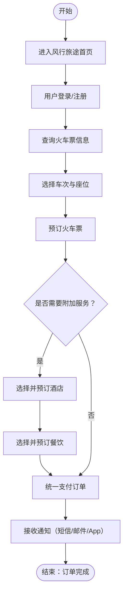

# 软件需求规格说明书

> 1. 《软件需求规格说明》(SRS)描述对计算机软件配置项 CSCI的需求，及确保每个要求得以满足的所使用的方法。涉及该 CSCI外部接口的需求可在本 SRS 中给出：或在本 SRS引用的一个或多个《接口需求规格说明》(IRS)中给出。
> 2. 这个 SRS，可能还要用 IRS加以补充，是CSCI设计与合格性测试的基础。
> 3. 本课程及本实验不涉及、不强调、不关注的部分可省略，但不允许删除已有条目。
> 4. 最终文档请删除所有灰色字体和斜体等说明部分。
> 5. 高亮章节为重点关注章节。

[TOC]

## 1 范围

### 1.1 标识

- 系统名称：“风行旅途”综合出行服务系统
- 简称：风行系统
- 版本号：V1.0
- 发行号：FX-2025-TRS
- 编写日期：2025年4月
- 文档类型：软件需求规格说明书（SRS）

### 1.2 系统概述

风行旅途系统是一个面向公众用户的综合出行服务平台，旨在提供高效、便捷、安全的一站式铁路出行服务。系统融合火车票购买、餐饮预订、酒店推荐与预订、支付系统、消息通知等多个子系统，致力于提升用户出行体验。

系统主要特性包括：
- 火车票购票系统：实现车次查询、余票实时查询、选座、购票、退改签等功能；
- 酒店预订系统：提供目的地周边酒店信息、价格对比、在线预订与取消服务；
- 餐饮预订系统：提供乘车前或途中餐食预定及配送服务；
- 统一支付系统：支持多种支付方式（如银行卡、支付宝、微信等）；
- 消息通知系统：提供购票成功通知、行程提醒、退改签信息等多类型通知。

系统开发运行历史：

项目启动于2025年3月，处于产品需求分析与系统设计阶段。系统将采用分布式微服务架构，基于Spring Boot + Vue的技术栈开发。

系统相关方：

- 投资方：北航软件学院软件工程课程组
- 需方：北航软件学院软件工程课程组
- 开发方：远方开发团队
- 用户：中国境内铁路出行旅客、游客及相关第三方商家（酒店、餐饮等）
- 运维支持：远方开发团队

计划部署地点：

初期部署于云平台，后期将根据用户量进行多地数据中心部署。

相关文档：

- 软件开发计划书
- 软件需求规格说明书
- 软件概要设计说明书
- 软件详细设计说明书
- 测试报告

### 1.3 文档概述

本文档的主要目的是规范并明确风行旅途系统的各项功能、性能、安全性及用户交互需求，为后续的软件设计、开发、测试和维护工作提供统一的依据。内容包括但不限于：功能需求描述、系统性能指标、接口需求、安全性要求、用户需求及环境需求等。

本说明书适用于系统设计人员、开发人员、测试人员、项目管理人员、运维人员以及最终用户代表。

保密性要求：

- 本文档涉及商业机密，仅限项目相关人员内部传阅；
- 禁止未经授权对外传播；
- 如需披露给第三方，需签署保密协议。

### 1.4 基线

本计划编制基于以下已确认的基线文档：

| 基线文档名称                  | 批准日期   | 存储位置                           |
| :---------------------------- | :--------- | :--------------------------------- |
| 项目4：“风行旅途”需求描述文档 | 2025-03-31 | /项目4：“风行旅途”需求描述文档.pdf |
| 软件需求规格说明书            | 2025-04-20 | /软件需求规格说明书.md             |
| 软件概要设计说明书            | 2025-05-04 | /软件概要设计说明书.md             |
| 软件详细设计说明书            | 2024-05-18 | /软件详细设计说明书.md             |
| 测试报告                      | 2024-06-08 | /测试报告.md                       |

## 2 引用文件

本章列出了在编制《软件需求规格说明书》过程中所参考的相关文档和资料。除非另有说明，所列文档均可通过风行科技项目文档管理系统或公开渠道获得。

| 编号 | 文档名称                                                 | 修订版本 | 发行日期      | 来源                     |
| ---- | -------------------------------------------------------- | -------- | ------------- | ------------------------ |
| R1   | 风行旅途项目立项书                                       | V1.0     | 2025年3月28日 | 风行科技产品中心         |
| R2   | 风行旅途开发计划书                                       | V1.0     | 2025年2月18日 | 风行科技开发组           |
| R3   | 12306官方功能手册（公开版）                              | V3.5     | 2024年9月     | 中国铁路客户服务中心官网 |
| R4   | GB/T 8567-2006 软件工程文档规范                          | 2006版   | 2006年        | 国家标准全文公开系统     |
| R5   | GB/T 25000.51-2016 软件工程 产品质量要求与评价（SQuaRE） | 2016版   | 2016年        | 国家标准全文公开系统     |

**说明：**  
- `R4` 和 `R5` 为国家标准文档，用于规范文档结构与质量评估标准；  
- `R1` 和 `R2` 为风行旅途项目相关的内部资料；  
- `R3` 为参考同类系统12306的功能设计与业务流程；  

## 3 需求

本章详细描述了“风行旅途”综合出行服务系统（CSCI）的各项软件需求。每项需求均具有唯一标识符，便于后续的测试、追踪及维护。所有需求均以可测量、可验证的方式定义，确保构成CSCI的验收标准。

### 3.1 所需的状态和方式

风行旅途系统在整个生命周期中将处于以下几种主要状态和方式：

| 状态/方式    | 描述                                                                       |
| ------------ | -------------------------------------------------------------------------- |
| 空闲状态     | 系统待机，无用户操作，无活动处理任务。                                     |
| 准备就绪状态 | 系统启动完成，准备接受用户操作和请求。                                     |
| 活动状态     | 系统正常处理用户请求，如购票、支付、预订等操作。                           |
| 降级模式     | 系统部分模块出现异常，仅提供核心功能（如查询）。                           |
| 紧急模式     | 在突发情况下（如系统攻击、高并发），进入限流与只读模式，保障核心服务运行。 |

所有需求将在相应条目中明确标注其适用状态，未涉及状态的需求默认为“活动状态”下生效。

### 3.2 ==需求概述==

#### 3.2.1 目标

风行旅途系统旨在解决当前铁路购票系统用户体验差、功能割裂、服务分散等问题，提供统一的一站式出行服务平台。系统目标包括：

- 提供直观、易用的票务购买流程，支持车次查询、选座、购票、退改签等完整服务；
- 集成酒店预订、餐饮服务、行程提醒等功能，覆盖出行全流程；
- 支持多渠道支付和订单管理，提升交易便捷性；
- 通过高可用系统架构，保障系统稳定运行，支持高并发访问；
- 基于用户行为提供个性化推荐服务。

以下为主要处理流程描述：
- 用户访问与身份验证;
- 车票查询与预订;
- 附加服务选择;
- 订单确认与支付;
- 消息通知
- 后台处理

#### 3.2.2 运行环境

- **操作系统**：Windows10、11
- **硬件平台**：x86_64服务器集群，支持负载均衡和容灾部署
- **运行平台**：Docker容器化环境
- **数据库**：MySQL 8.0、Redis 缓存
- **中间件**：Nginx、RabbitMQ、Spring Cloud Gateway

#### 3.2.3 用户的特点

风行旅途系统主要面向以下类型用户：

- **普通乘客**：具备基础操作能力，使用手机/PC购票与预订；
- **老年用户**：需要简化界面与引导式操作流程；
- **合作商户**：如餐饮商、酒店方，通过商家后台进行数据管理；
- **运维与客服人员**：通过专属后台系统进行数据监控、问题处理与客户服务。

#### 3.2.4 关键点

- **关键功能**：购票流程稳定性、选座逻辑、余票查询效率，酒店、餐饮推荐；
- **关键算法**：推荐系统（基于用户行为）、余票动态计算、路径规划；
- **关键技术**：微服务架构、分布式数据库读写分离、高并发下的限流与熔断处理、跨模块消息通信机制（如消息队列）。

#### 3.2.5 约束条件

- **开发期限**：2025年6月前完成主要开发并上线试运行；
- **经费限制**：由风行科技投资，初期预算为10万元；
- **技术框架限制**：前端基于Vue3，后端基于Spring Boot；
- **政策合规**：系统需符合中华人民共和国《网络安全法》《消费者权益保护法》等相关法律法规；
- **用户隐私保护**：需遵循GDPR与中国《个人信息保护法》相关标准。

### 3.3 ==需求规格==

#### 3.3.1 软件系统总体功能/对象结构

系统功能结构图如下：



系统流程图如下：


#### 3.3.2 软件子系统功能/对象结构

每个模块的子功能简述如下：

- **火车票模块**
  - 实时余票查询（通过铁路API接口）
  - 智能选座（算法支持靠窗/靠近同行人）
  - 退改签规则适配不同车次

- **酒店模块**
  - 按地点、评分、价格过滤搜索
  - 与车票联动推荐（目的地推荐）

- **餐饮模块**
  - 根据乘车时间和路线智能推荐可配送车站
  - 接入第三方餐饮平台接口

- **支付模块**
  - 支持主流支付方式
  - 安全性校验（验证码、支付限额、风控机制）

- **通知模块**
  - 多通道通知策略
  - 事件触发器配置（如订单成功后推送）

#### 3.3.3 描述约定

- 时间表示统一采用 **YYYY-MM-DD HH:mm:ss**
- 金额单位为 **人民币元（¥）**
- 距离单位为 **公里（km）**
- 数据流图中，圆形代表处理单元，矩形为外部实体，平行线为数据存储，箭头为数据流向
- 本说明书中，“必须”表示强制实现，“应”表示优先级较高建议，“可”表示可选功能

### 3.4 ==CSCI能力需求==

#### 3.4.1 火车票购买能力
**描述**：此功能允许用户在系统中选择出发地、目的地、日期、座位类型等信息，并查询可用的火车票，最后完成支付和购票

输入：
1. 用户基本信息：

    - 用户名（可选）：用于识别用户身份，已登录用户默认为系统中的注册账号。

    - 用户联系方式（可选）：包括手机号或电子邮件，用于发送购票确认信息。

2. 查询参数：

    - 出发地：用户选择的出发城市。

    - 目的地：用户选择的到达城市。

    - 出发日期：用户选择的乘车日期。

    - 座位类型：用户选择的座位类型（硬座、软座、一等座、二等座等）。

3. 支付信息：

    - 支付方式：如信用卡、借记卡、支付宝、微信支付等。

    - 支付账户信息：用于处理支付（如银行卡号、支付宝账号等）。

**处理**：
1. 火车票查询：

    - 系统根据用户提供的出发地、目的地和出发日期，查询数据库中的火车票余量。

    - 如果查询到符合条件的车票，系统返回车票信息（包括票价、座位类型、车次信息等）。

    - 如果没有可用车票，系统向用户提示“无票”并提供替代方案（如选择其他时间或车次）。

2. 用户选择座位：

    - 用户在查询结果中选择一个合适的车票，系统记录用户的选择（车次、座位类型等）。

3. 支付流程：

    - 系统验证用户的支付信息（如信用卡号、支付账户等）是否合法。

    - 在验证通过后，系统发起支付请求，使用所选的支付方式进行扣款。

    - 支付成功后，系统生成购票记录，并为用户分配座位号。

4. 票务确认：

    - 系统向用户发送购票确认信息，包括车票信息（如车次、座位号、票价等）及支付凭证。

    - 用户通过短信或邮件收到电子车票，并能通过系统查看详细的购票信息。

**输出**：
1. 车票信息：

    - 车票确认信息（车次号、座位号、票价、出发和到达时间等）。

2. 支付状态：

    - 支付是否成功。若支付成功，返回支付凭证和电子车票。若支付失败，返回错误信息（如余额不足、支付超时等）。

3. 消息通知：

    - 购票成功后，系统会发送电子车票、支付成功通知到用户的手机或邮箱

**性能要求**：
1. 响应时间：

    - 车票查询响应时间不超过3秒。

    - 支付处理响应时间不超过5秒，支付确认时间不超过2秒。

2. 并发要求：

    - 系统应支持每秒处理至少1000次车票查询请求，系统能支持5000并发用户的购票请求。

3. 吞吐量：

    - 在系统高峰期（例如假期前夕），系统能够稳定处理10,000个并发购票请求

**安全性要求**：
1. 支付安全：

    - 支付过程必须使用 SSL/TLS加密，确保支付信息的安全性。

    - 支付系统应符合 PCI-DSS标准，确保处理银行卡信息时的安全性。

2. 用户隐私：

    - 用户的个人信息（如姓名、联系方式、支付信息等）需加密存储，确保数据的安全。

    - 系统需遵守隐私保护政策，不泄露用户信息给第三方，除非用户同意。

3. 身份验证：

    - 用户需要通过 两步验证（如短信验证码或邮件验证）来确认身份，特别是在支付环节

**异常处理**：
1. 无票情况：

    - 如果查询到没有符合用户条件的车票，系统将提示用户“无票”，并提供替代方案，如建议其他日期、车次或座位类型。

2. 支付失败：

    - 如果支付过程中发生错误（如支付账户余额不足、支付超时等），系统将显示错误信息，允许用户重新尝试支付，或选择其他支付方式。

    - 支付失败时，系统需自动回滚购票事务，确保用户账户不被错误扣款。

3. 用户输入错误：

    - 如果用户输入无效的信息（如错误的城市名称、日期格式错误等），系统应及时提示并引导用户正确填写信息。

4. 系统崩溃：

    - 在系统崩溃或异常情况下，所有未完成的购票请求将被回滚，用户不会被误扣款。

    - 错误信息和日志应及时记录，并通知管理员。

**容错能力**：
- 系统应具备 高可用性，能够在部分节点故障的情况下继续运行。

- 系统在出现临时性故障时，能够自动恢复，确保用户能够尽快完成购票操作。

#### 3.4.2 酒店预订能力
**描述**：此功能允许用户根据出发地、目的地、入住和离店日期等信息，查询可用的酒店房间并进行预订。系统还需支持用户查看酒店的详细信息、价格、房间类型、设施等，并进行支付确认。

**输入**：
1. 用户基本信息：

    - 用户名（可选）：已登录用户的身份标识。

    - 用户联系方式（可选）：包括手机号、电子邮件，用于发送预订确认信息。

2. 查询参数：

    - 目的地：用户选择的目的城市（入住酒店的所在地）。

    - 入住日期：用户选择的入住日期。

    - 离店日期：用户选择的离店日期。

    - 房间类型：用户选择的房间类型（如单人间、双人间、套房等）。

    - 人数：入住人数（可能影响房间选择和房价）。

3. 支付信息：

    - 支付方式：如信用卡、借记卡、支付宝、微信支付等。

    - 支付账户信息：处理支付（如银行卡号、支付账户等）。

**处理**：
1. 酒店查询：

    - 系统根据用户提供的目的地、入住和离店日期、房间类型等条件查询可用的酒店房间，并返回符合条件的酒店列表。

    - 查询结果将包括酒店名称、房间类型、价格、设施、用户评价等信息。

2. 房间选择：

    - 用户根据酒店列表选择合适的房间类型，系统会显示该房间的详细信息，包括价格、床型、是否有空房等。

    - 用户可以根据价格、评价等进行筛选。

3. 预订房间：

    - 用户选择房间后，系统记录其选择的酒店、房间类型、入住日期、离店日期等信息，并为其预留房间。

4. 支付流程：

    - 系统验证用户支付信息，若验证通过，则发起支付请求，处理房间预订费用。

    - 支付成功后，系统生成预订记录，标记房间为已预订，并为用户分配预订号。

5. 预订确认：

    - 系统向用户发送预订确认信息，包括酒店名称、房间类型、入住日期、离店日期、预订号等详细信息。

**性能要求**：
1. 响应时间：

    - 酒店查询响应时间不应超过5秒。

    - 支付处理响应时间不超过5秒，支付确认时间不超过3秒。

2. 并发要求：

    - 系统应支持每秒处理至少2000个并发查询请求，能够稳定处理5000个并发预订请求。

3. 吞吐量：

    - 在高峰时段（如节假日），系统能够处理10,000个并发的酒店查询和预订请求。

**安全性要求**：
1. 支付安全：

    - 支付过程中必须使用 SSL/TLS加密，确保支付信息的安全性。

    - 系统应符合 PCI-DSS标准，确保支付信息的合法和安全处理。

2. 用户隐私：

    - 用户的个人信息（如姓名、联系方式、支付信息等）应加密存储，确保数据的安全。

     - 所有用户数据应符合隐私保护政策，未经授权不得外泄。

3. 身份验证：

    - 用户需通过 两步验证（如短信验证码或邮件验证）进行身份确认，尤其在支付过程中。

**异常处理**：
1. 无空房情况：

    - 如果没有符合用户条件的酒店房间，系统将提示用户“无空房”，并建议其他日期、地点或房间类型。

    - 系统可提供其他推荐酒店或选择相近价格和位置的替代方案。

2. 支付失败：

    - 如果支付过程中发生错误（如账户余额不足、支付超时等），系统将显示错误信息，并允许用户重新选择支付方式或重新尝试支付。

    - 支付失败时，系统会保留用户的订单状态，防止误扣款。

3. 用户输入错误：

    - 如果用户输入无效信息（如日期格式错误、支付信息不完整等），系统应立即提示用户重新输入，并提供正确格式的提示。

4. 系统崩溃：

    - 系统在崩溃或异常情况下，未完成的预订请求会被回滚，确保用户不会被误扣款。

    - 系统日志应详细记录异常情况，并及时通知管理员。

**容错能力**：
- 系统应具备 高可用性，能够在部分节点故障时继续提供酒店查询和预订服务。

- 在出现暂时性故障时，系统能够自动恢复服务，确保用户能够尽快完成预订操作。

### 3.5 CSCI外部接口需求

#### 3.5.1 接口标识和接口图

本酒店预订系统的CSCI（客户预订服务模块）与多个外部实体进行数据交换，包括用户前端界面、酒店信息管理系统、第三方支付平台以及数据库系统等。

下图展示了CSCI与外部实体的接口图：
```
+------------------+             +-----------------------+
|  用户前端界面     |<----------->|  客户预订服务模块（CSCI） |
+------------------+             +-----------------------+
                                         ^    ^    ^
                                         |    |    |
                                         |    |    |
                    +-------------------+    |    +------------------+
                    |                        |                       |
        +---------------------+   +----------------------+  +------------------+
        | 酒店信息管理系统     |   | 第三方支付平台接口模块 |  | 数据库系统（MySQL） |
        +---------------------+   +----------------------+  +------------------+

```
说明：

- 用户前端界面：由 Web 和移动端组成，负责发起预订请求、接收预订结果。

- 酒店信息管理系统：负责提供实时的客房信息、价格等。

- 第三方支付平台接口模块：与支付宝、微信支付等支付服务对接。

- 数据库系统：存储预订记录、用户信息、支付状态等。

下面以“第三方支付平台接口模块（项目唯一标识符：INTF-03）”为例，详细说明接口能力要求。
```
+------------------+             +-----------------------+
|  用户前端界面     |<----------->|  火车票预订服务模块（CSCI） |
+------------------+             +-----------------------+
                                         ^    ^    ^
                                         |    |    |
                                         |    |    |
                    +-------------------+    |    +------------------+
                    |                        |                       |
        +------------------------+   +----------------------+  +------------------+
        | 火车票库存系统          |   | 第三方支付平台接口模块 |  | 数据库系统（MySQL） |
        +------------------------+   +----------------------+  +------------------+
```

**说明**：

- 用户前端界面：由 Web 和移动端组成，负责发起预订请求、接收预订结果。

- 酒店信息管理系统：负责提供实时的客房信息、价格等。

- 第三方支付平台接口模块：与支付宝、微信支付等支付服务对接。

- 数据库系统：存储预订记录、用户信息、支付状态等。

下面以“火车票预订接口（项目唯一标识符：INTF-03）”为例，详细说明接口能力要求。

#### 3.5.2 第三方支付平台接口（INTF-03）
**接口实体标识**：
- 项目唯一标识符：INTF-03

- 非技术名称：第三方支付接口

- 技术名称：PaymentGatewayAdapter

- 版本：v1.2

- 涉及实体：第三方支付服务（如支付宝、微信支付等）

**接口类型与要求**：
- 类型：实时数据传输接口

- 功能：实现用户支付、退款及支付状态查询功能

-  优先级：高（直接影响交易成功与否）

**数据元素特性**：

| 属性     | 描述                              |
| -------- | --------------------------------- |
| 名称     | order_id                          |
| 类型     | 字符串（String）                  |
| 大小     | 32字符                            |
| 计量单位 | 无                                |
| 范围     | 任意合法 UTF-8 字符，字母数字组成 |
| 精度     | 精确到订单级别                    |
| 约束     | 必须唯一、不可更新                |
| 保密性   | 中（日志中需脱敏）                |
| 来源     | 客户预订服务模块                  |
| 接收者   | 支付平台                          |

| 属性   | 描述                   |
| ------ | ---------------------- |
| 名称   | payment_status         |
| 类型   | 枚举（Enum）           |
| 取值   | SUCCESS，FAIL，PENDING |
| 精度   | 一次支付事务级别       |
| 保密性 | 低                     |
| 来源   | 第三方支付平台         |
| 接收者 | 客户预订服务模块       |

**数据集合特性（支付请求消息体）**：

| 属性         | 描述                                                      |
| ------------ | --------------------------------------------------------- |
| 非技术名称   | 支付请求体                                                |
| 技术名称     | PaymentRequestDTO                                         |
| 数据结构     | JSON 对象，包含：order_id, amount, user_id, notify_url 等 |
| 媒体         | HTTPS POST 请求                                           |
| 输出特性     | 无图形界面，后台调用                                      |
| 访问特性     | 单次调用，不支持分页或流式传输                            |
| 约束条件     | 总体大小不得超过10KB，字段必须校验                        |
| 私密性       | 高（必须使用HTTPS传输，内容需加签）                       |
| 来源与接收者 | 来源：CSCI模块，接收者：支付宝/微信支付服务器             |

**通信方法特性**：
- 通信方式：HTTPS（双向认证）

- 带宽：使用HTTP标准请求，不超过2Mbps带宽消耗

- 数据格式：JSON格式

- 控制特性：异步回调机制 + 轮询机制兼容

- 传送速率：非周期性（用户发起即发送）

- 地址规则：由第三方平台提供固定地址（如：https://api.xxx.com/pay）

**协议特性**：
- 协议：基于RESTful API协议

- 校验机制：签名 + 时间戳 + 随机数防重放

- 同步机制：初始请求同步返回交易单号，后续通过状态轮询或异步通知确认最终状态

- 状态反馈：支付状态包括处理中、成功、失败三种

**其他特性**：
- 物理接口兼容性：无物理接口要求，仅为逻辑对接

- 安全性要求：

    - 必须支持RSA或SM2签名机制
    
    - 支持Token校验或OAuth 2.0接入方式
    
    - 回调接口必须支持IP白名单

#### 3.5.3 火车票预订接口（INTF-03）
**接口实体标识**：
- 项目唯一标识符：INTF-03

- 非技术名称：火车票库存接口

- 技术名称：TicketInventoryService

- 版本：v1.2

- 涉及实体：火车票库存管理系统

**接口类型与要求**：
- 类型：实时数据传输接口

- 功能：实现查询火车票库存、预订火车票、退票等操作

- 优先级：高（直接影响交易成功与否）

**数据元素特性**：

| 属性     | 描述                                 |
| -------- | ------------------------------------ |
| 名称     | train_id                             |
| 类型     | 字符串（String）                     |
| 大小     | 6字符                                |
| 计量单位 | 无                                   |
| 范围     | 标准火车车次ID（如：G1234、D5678等） |
| 精度     | 精确到车次级别                       |
| 约束     | 必须唯一、不可更新                   |
| 保密性   | 中（可在日志中记录，但不公开显示）   |
| 来源     | 火车票库存管理系统                   |
| 接收者   | 客户预订服务模块                     |

| 属性   | 描述                     |
| ------ | ------------------------ |
| 名称   | available_seat_count     |
| 类型   | 整数（Integer）          |
| 范围   | ≥ 0                      |
| 精度   | 精确到每个车次的座位数量 |
| 约束   | 必须大于等于0            |
| 保密性 | 低                       |
| 来源   | 火车票库存管理系统       |
| 接收者 | 客户预订服务模块         |

**数据集合特性（支付请求消息体）**：

| 属性         | 描述                                                                     |
| ------------ | ------------------------------------------------------------------------ |
| 非技术名称   | 票务查询响应体                                                           |
| 技术名称     | TicketQueryResponseDTO                                                   |
| 数据结构     | JSON 对象，包含：train_id, available_seat_count, price, departure_time等 |
| 媒体         | HTTPS POST 请求                                                          |
| 输出特性     | 无图形界面，后台调用                                                     |
| 访问特性     | 单次查询，不支持分页或流式传输                                           |
| 约束条件     | 总体大小不得超过10KB，字段必须校验                                       |
| 私密性       | 低                                                                       |
| 来源与接收者 | 来源：CSCI模块，接收者：火车票库存系统                                   |

**通信方法特性**：
- 通信方式：HTTPS（双向认证）

- 带宽：使用HTTP标准请求，不超过2Mbps带宽消耗

- 数据格式：JSON格式

- 控制特性：异步回调机制 + 轮询机制兼容

- 传送速率：非周期性（用户发起即发送）

- 地址规则：由第三方平台提供固定地址（如：https://api.xxx.com/pay）

**协议特性**：
- 协议：基于RESTful API协议

- 校验机制：签名 + 时间戳 + 随机数防重放

- 同步机制：初始请求同步返回交易单号，后续通过状态轮询或异步通知确认最终状态

- 状态反馈：支付状态包括处理中、成功、失败三种

**其他特性**：
- 物理接口兼容性：无物理接口要求，仅为逻辑对接

- 安全性要求：

    - 必须支持RSA或SM2签名机制

    - 支持Token校验或OAuth 2.0接入方式

    - 回调接口必须支持IP白名单

### 3.6 CSCI内部接口需求

内部接口是指系统内部模块之间的交互和数据传输，通常用于支持不同功能模块之间的协同工作。在此部分，我们会列出软件系统内部各个模块之间的接口需求，并且针对每个接口，标明输入输出要求、数据格式、通信方式等详细信息。

#### 3.6.1 订票模块与支付模块接口（INTF-06）
- 接口标识符：INTF-06

- 接口名称：订票与支付模块通信接口

- 版本：v1.0

- 接口类型：同步接口

- 功能描述：该接口用于在用户完成火车票预订后，传递订票信息至支付模块进行支付。支付模块在接收到支付信息后进行支付处理，处理结果会返回给订票模块，用于最终确定预订状态。

**数据元素特性**：
- 输入数据：

    - 订单号（order_id）：字符串类型，最大长度为32个字符，表示当前订单的唯一标识。

    - 用户支付金额（amount）：浮动类型，精确到小数点后两位，表示用户应支付的金额。

    - 用户支付方式（payment_method）：字符串类型，可能的值包括“支付宝”、“微信支付”、“信用卡”等，表示用户选择的支付方式。

| 属性 | 描述             |
| ---- | ---------------- |
| 名称 | order_id         |
| 类型 | 字符串（String） |
| 长度 | 32字符           |
| 范围 | 唯一订单标识符   |
| 约束 | 必填，不能为空   |

| 属性 | 描述                                               |
| ---- | -------------------------------------------------- |
| 名称 | error_code                                         |
| 类型 | 字符串（String）                                   |
| 长度 | 10字符                                             |
| 范围 | 如“INSUFFICIENT_FUNDS”、“INVALID_PAYMENT_METHOD”等 |
| 约束 | 可选，仅在支付失败时返回                           |

**通信方式与协议**：
- 通信方式：通过 HTTP/HTTPS 实现同步请求与响应，采用 RESTful API 接口风格。

- 协议：使用 JSON 格式传输数据，具体协议要求参考支付模块和订票模块设计。

- 安全性要求：所有传输数据必须通过 HTTPS 协议加密，确保用户信息的安全。对接请求需进行身份验证（如OAuth 2.0或API密钥认证）。

**错误处理与容错**：
- 错误代码映射：支付状态为“失败”时，接口应返回具体的错误码（如“网络错误”、“余额不足”）。

- 重试机制：在支付失败或网络异常的情况下，接口应支持重试机制，最多重试3次。

- 超时处理：支付请求应设定超时机制，最大超时时间为60秒。

#### 3.6.2 用户信息模块与订单管理模块接口（INTF-07）

- 接口标识符：INTF-07

- 接口名称：用户信息与订单管理模块接口

- 版本：v1.0

- 接口类型：双向接口

- 功能描述：用户信息模块与订单管理模块之间的接口用于传递用户的个人信息、订单历史等数据。订单管理模块通过该接口访问用户的个人信息，用于订单确认、发送通知、修改订单等操作。

**数据元素特性：**
- 输入数据：

  - 用户ID（user_id）：字符串类型，最大长度为64个字符，唯一标识用户。

  - 用户姓名（user_name）：字符串类型，表示用户的全名。

  - 用户联系方式（user_contact）：字符串类型，表示用户的手机号或电子邮件。

| 属性 | 描述             |
| ---- | ---------------- |
| 名称 | user_id          |
| 类型 | 字符串（String） |
| 长度 | 64字符           |
| 范围 | 唯一用户标识符   |
| 约束 | 必填，不能为空   |

| 属性 | 描述             |
| ---- | ---------------- |
| 名称 | user_name        |
| 类型 | 字符串（String） |
| 长度 | 50字符           |
| 范围 | 用户姓名         |
| 约束 | 必填，不能为空   |

- 输出数据：

  - 订单历史（order_history）：数组类型，包含用户的历史订单记录。每个订单记录包含订单号、订单状态、订单金额等字段。

  - 用户账户状态（account_status）：字符串类型，表示用户账户的状态，可能的值包括“正常”、“冻结”等。

| 属性 | 描述                           |
| ---- | ------------------------------ |
| 名称 | order_history                  |
| 类型 | 数组（Array）                  |
| 内容 | 包含每个订单的ID、金额、状态等 |
| 约束 | 可选，用户可能没有历史订单     |

| 属性 | 描述             |
| ---- | ---------------- |
| 名称 | account_status   |
| 类型 | 字符串（String） |
| 长度 | 20字符           |
| 范围 | “正常”、“冻结”   |
| 约束 | 必填，不能为空   |

**通信方式与协议：**
- 通信方式：通过内部API进行数据传输，使用JSON格式进行数据交换。

- 协议：采用 RESTful API，支持CRUD操作。

- 安全性要求：数据传输过程中，所有用户敏感信息（如姓名、联系方式）必须进行加密，确保隐私安全。

**错误处理与容错：**
- 数据一致性：在获取用户信息或订单历史时，确保系统的事务一致性，避免因系统崩溃或网络故障造成数据丢失。

- 超时处理：接口调用最大超时时间为30秒，如果超时未返回结果，应返回错误码“TIMEOUT”。

#### 3.6.3 消息通知模块与用户模块接口（INTF-08）
- 接口标识符：INTF-08

- 接口名称：消息通知模块与用户模块接口

- 版本：v1.0

- 接口类型：推送接口

- 功能描述：消息通知模块通过此接口向用户发送订单确认、支付成功等信息。

**数据元素特性：**
- 输入数据：

  - 用户ID（user_id）：字符串类型，唯一标识用户。

  - 通知内容（message_content）：字符串类型，表示推送的消息内容。

| 属性 | 描述             |
| ---- | ---------------- |
| 名称 | user_id          |
| 类型 | 字符串（String） |
| 长度 | 64字符           |
| 范围 | 唯一用户标识符   |
| 约束 | 必填，不能为空   |

| 属性 | 描述             |
| ---- | ---------------- |
| 名称 | message_content  |
| 类型 | 字符串（String） |
| 长度 | 256字符          |
| 范围 | 消息内容         |
| 约束 | 必填，不能为空   |


**通信方式与协议：**
- 通信方式：推送通知接口，支持HTTP POST请求

- 协议：使用JSON格式，消息内容通过接口传递。

- 安全性要求：使用SSL加密，确保消息传输安全。


### 3.7 ==CSCI内部数据需求==

#### 3.7.1 数据库需求

CSCI内部数据通常存储在数据库中。数据库设计应满足高效存取数据、数据一致性、安全性、扩展性等要求。在此部分列出所需的数据库表格、字段以及每个字段的具体要求。

具体关于数据库内部字段的属性待设计时决定

#### 3.7.2 数据文件需求
除了数据库表格，CSCI 还可能需要存储一些常规的静态数据，如配置文件、日志文件等。此部分描述了对数据文件的需求。

1. 配置文件（config.json）

    - 功能描述：存储系统的配置参数，如数据库连接信息、支付网关信息等。

    - 文件格式：JSON

    - 文件需求说明：该配置文件存储系统所需的基础配置信息，所有敏感数据（如密码、API密钥等）应加密存储。文件采用JSON格式，易于人类读取和修改。

2. 日志文件（system_log.txt）

    - 功能描述：存储系统运行期间的日志信息，用于故障排查和性能分析。

    - 文件格式：文本文件（.txt）

    - 文件需求说明：日志文件应按日期分类存储，每条日志包括时间戳、日志级别（如 INFO、ERROR 等）和日志内容。系统必须能够根据日志文件进行故障排查，及时识别系统中的异常。

#### 3.7.3 数据访问与安全性要求

- 数据访问要求：

  - 所有数据访问应符合最小权限原则，用户只应有访问和操作与其相关的数据的权限。

 - 对于数据库的查询操作，系统应提供必要的索引，以提高查询性能。

- 数据安全性要求：

  - 所有敏感信息（如用户密码、支付信息等）应进行加密存储和传输。

  - 使用访问控制和身份验证机制，确保只有授权的用户才能访问敏感数据。

  - 系统应定期进行数据备份，防止数据丢失。

### 3.8 适应性需求

本系统的适应性需求包括以下几个方面：

1. **数据依赖需求**：系统需要支持根据不同地区的实际情况调整数据，例如：对于火车购票功能，系统需能够根据不同城市和车站的经纬度信息调整查询结果的准确性；对于酒店预订，系统应根据用户所在位置提供附近的酒店信息，并显示相应的交通方式和路线。
   
2. **运行参数变化**：系统需要支持动态变化的运行参数。例如，火车票查询系统应能够根据实时的列车时刻表、列车状态（如延误、停运等）和天气等条件调整查询结果和显示信息；酒店预订系统则需根据实时房态、价格变动和用户要求调整搜索结果。

3. **支持动态配置**：系统应能够根据不同用户的需求和设备的性能进行动态配置。例如，系统可根据用户的操作设备（如手机、PC等）自动调整页面布局和加载内容的方式，以确保良好的用户体验。

### 3.9 保密性需求

本系统在以下几个方面需确保高度的保密性：

1. **用户隐私保护**：用户的个人信息（如身份证号、联系方式、支付信息等）在系统中需要加密存储，并且严格控制对这些数据的访问权限。系统必须遵守相关的隐私保护法律法规（如GDPR、中华人民共和国个人信息保护法等）。

2. **交易数据保密性**：所有用户的购票、酒店预订、火车餐购买等交易数据必须确保在传输过程中进行加密，并且存储时也要进行加密，防止数据泄露或篡改。

3. **意外和无效操作的防范**：系统必须防止意外的操作行为，例如防止用户误操作取消已经确认的订单或提交无效的支付请求。系统应提供明确的确认提示，防止此类意外事件发生。

### 3.10 保密性和私密性需求

本系统的保密性和私密性需求包括：

1. **保密性环境**：系统必须在受控的环境下运行，确保所有操作日志和用户数据都受到保护，防止未授权的访问。
   
2. **私密性保障**：用户的所有个人信息（如姓名、联系方式、支付账户信息等）必须仅在用户授权的范围内使用，并且不得用于其他商业目的。

3. **保密性风险**：系统需要识别并评估潜在的保密性风险，特别是在数据传输、存储和处理过程中。所有敏感信息必须遵循严格的加密标准进行保护。

4. **保密性审核与认证**：系统需要定期进行保密性审核，确保符合相关的法律和行业标准。系统的安全措施必须符合ISO/IEC 27001等国际信息安全管理标准。

### 3.11 CSCI环境需求

本系统的环境需求包括：

1. **硬件环境**：系统应能够运行在现代的计算机硬件平台上，包括但不限于PC、智能手机、平板电脑等。系统的硬件环境应支持多平台访问，以适应不同用户的需求。

2. **操作系统要求**：系统应兼容常见的操作系统，如Windows、macOS、Android、iOS等。应确保不同操作系统之间的数据同步和功能实现无障碍。

3. **外部系统接口**：系统应能够与外部系统（如火车票查询系统、酒店预订平台、支付平台等）进行数据交互，确保功能的顺畅实现。

### 3.12 计算机资源需求

#### 3.12.1 计算机硬件需求

本系统的硬件需求包括：

- **处理器**：系统应支持至少双核处理器，以满足多个用户并发请求的处理需求。
- **内存**：最低要求4GB内存，以确保系统在高并发情况下依然能够稳定运行。
- **存储**：系统需支持至少100GB的存储空间，用于存储用户数据、订单信息、交易记录等。
- **网络设备**：系统需要稳定的互联网连接，支持用户通过互联网进行数据交互和查询操作。
- **输入输出设备**：包括用户的操作设备（如触摸屏、鼠标、键盘）和后端的打印设备（如火车票打印机等）。

#### 3.12.2 计算机硬件资源利用需求

- **处理器利用率**：系统应优化资源利用，处理器使用率不应超过85%，以确保系统性能。
- **内存使用**：内存使用率应控制在70%以内，避免过高的内存占用导致系统性能下降。
- **存储利用率**：建议系统的存储利用率不超过75%，以避免因存储空间不足导致数据丢失或系统崩溃。

#### 3.12.3 计算机软件需求

本系统需要以下计算机软件支持：

- **操作系统**：Windows 10及以上版本、macOS 10.14及以上版本、Android 8.0及以上版本、iOS 12.0及以上版本。
- **数据库管理系统**：MySQL 8.0及以上版本，用于存储用户信息、订单信息等。
- **网络通信软件**：支持RESTful API的Web框架，如Spring Boot、Express.js等，进行系统间的数据交互。
- **支付系统集成软件**：集成第三方支付SDK（如支付宝、微信支付）进行支付操作。

#### 3.12.4 计算机通信需求

- **网络连接**：系统需支持至少100Mbps的网络带宽，保证数据的快速传输。
- **数据传输速率**：在正常情况下，用户数据传输速率应不低于10KB/s。
- **响应时间**：系统的响应时间应控制在3秒以内，确保良好的用户体验。
- **数据传输安全**：所有敏感数据（如支付信息、个人信息等）应通过SSL/TLS协议加密传输。

### 3.13 软件质量因素

#### 次要关注点

本系统的质量要求包括：

- **功能性**：系统必须实现全部需求功能，能够支持火车购票、酒店预订、火车餐购买等功能。
- **可靠性**：系统必须能够提供稳定可靠的服务，确保在高并发环境下不出现崩溃或错误。
- **可维护性**：系统应易于维护和更新，能够方便地添加新的功能模块或修复已知问题。
- **可用性**：系统应提供良好的用户界面，确保用户能够方便地进行各项操作。
- **灵活性**：系统应具备良好的灵活性，能够应对不同用户需求和系统环境的变化。
- **可移植性**：系统应能够在不同平台上运行，包括PC、移动设备等。
- **易用性**：系统应具有简洁直观的用户界面，使得用户能够快速上手并完成操作。

### 3.14 设计和实现的约束

本系统的设计和实现应遵循以下约束：

- **系统架构**：应采用微服务架构，以支持系统的扩展性和灵活性。各个模块应松耦合，能够独立开发、部署和维护。
- **编程语言**：推荐使用Java（Spring Boot）和JavaScript（React/Node.js）进行前后端开发，以支持高效的开发和维护。
- **数据库**：推荐使用MySQL数据库存储用户和订单数据，Redis可用于缓存和提高查询性能。
- **数据标准**：系统需遵循标准的数据存储格式，并确保与其他系统的数据交换符合相关规范。

### 3.15 数据

本系统涉及的主要数据包括：

- **用户数据**：包括用户的基本信息（如姓名、联系方式、身份证号等）和历史订单数据。
- **订单数据**：包括火车票订单、酒店预订订单、火车餐购买订单等。
- **支付数据**：包括用户的支付信息、支付状态等。
- **实时数据**：如火车时刻表、酒店房态、天气信息等。

系统应能够高效处理和存储大量的订单数据，确保系统在高并发情况下依然能够稳定运行。

### 3.16 操作

本系统应支持以下操作：

1. **常规操作**：用户能够顺利进行火车票查询、预订、支付等操作；同时能够进行酒店预订、取消等常规操作。
2. **初始化操作**：系统应在首次使用时完成初始化配置，包括数据库初始化、用户账户配置等。
3. **恢复操作**：系统应具备数据备份和恢复功能，在出现系统故障时能够迅速恢复数据并保持服务不中断。


### 3.17 故障处理

在系统运行过程中，可能会出现各类软硬件故障，为保障系统的稳定运行和用户体验，特制定以下故障处理要求：

1. **软件系统问题**
   - **数据获取异常**：在用户进行火车购票、酒店预订或火车餐购买等操作时，系统可能无法正确获取相关数据，如车次信息、酒店房间数量、餐品库存等。这可能是由于数据库连接中断、数据传输错误或数据处理逻辑错误导致的。
   - **订单处理错误**：当用户提交订单或进行订单相关操作（如取消订单）时，系统可能出现订单处理失败的情况。原因可能是订单数据格式错误、业务逻辑冲突或并发操作导致的数据不一致问题。
   - **功能模块异常**：如消息通知模块无法正常发送消息，可能是消息推送服务故障、网络连接问题或消息格式不兼容导致的；缴费系统模拟过程中出现计算错误或界面显示异常，可能是算法错误或前端显示代码问题。
2. **错误信息**
   * **数据获取异常**：系统弹出提示框显示 “很抱歉，获取相关信息失败，请稍后重试。如问题持续，请联系客服。” 同时，在系统后台记录详细的错误日志，包括错误发生的时间、用户操作步骤、错误代码及相关数据信息。
   * **订单处理错误**：向用户提示 “订单处理失败，请检查您的操作是否正确，或稍后重试。如有疑问，请查看订单详情或联系客服。” 在后台记录订单相关信息、错误发生时间、错误类型及具体错误描述。
   * **功能模块异常**：对于消息通知异常，提示用户 “消息发送失败，请检查网络连接或稍后再试。” 在后台记录消息发送的目标用户、消息内容、发送时间及错误原因。若缴费系统出错，提示 “缴费模拟过程中出现错误，请刷新页面或重新尝试。如仍无法解决，请联系客服。” 并记录错误发生时的用户操作、涉及金额及错误详情。
3. **补救措施**
   - **数据获取异常**：系统尝试自动重新连接数据库或重新获取数据，最多重试 3 次。若重试后仍无法获取数据，通知系统管理员进行数据库及相关数据服务的检查和修复。同时，向用户发送短信或邮件告知问题及预计解决时间。
   - **订单处理错误**：系统对订单进行回滚操作，确保数据一致性。检查订单处理逻辑和数据格式，修复发现的问题后，提示用户重新提交订单。对于受影响的用户，提供一定的补偿措施，如优惠券或积分奖励。
   - **功能模块异常**：消息通知异常时，检查消息推送服务的运行状态，重启相关服务或修复网络连接问题。若涉及消息格式问题，调整消息格式后重新发送。对于缴费系统错误，恢复到错误发生前的状态，检查计算逻辑和前端显示代码，修复问题后通知用户重新进行模拟缴费操作。


### 3.18 算法说明

在系统运行过程中，涉及的算法主要用于满足系统核心功能需求，为用户提供准确、高效的服务。以下是对系统主要算法的说明： 

1. **车次排序算法**    
   - **算法概况**：在火车购票模块，为了方便用户快速筛选符合需求的车次，系统提供了根据旅途总时长和出发时间早晚进行排序的功能。该算法会在用户查询火车票后，获取所有符合条件车次的出发时间、到达时间等信息，通过特定逻辑计算旅途总时长，并结合出发时间早晚对车次进行排序，然后将排序结果展示给用户。    
   - **详细公式及逻辑**：假设车次$i$的出发时间为$T_{start,i}$，到达时间为$T_{end,i}$。旅途总时长$D_{i}$的计算方法为：先将$T_{start,i}$和$T_{end,i}$转换为时间戳（以秒为单位），分别记为$t_{start,i}$和$t_{end,i}$，则$D_{i}=(t_{end,i}-t_{start,i})/3600$（结果单位为小时）。在排序时，先按照出发时间早晚进行升序排序，如果出发时间相同，则按照旅途总时长进行升序排序。
2. **酒店排序算法**    
   - **算法概况**：在酒店预订模块的高级搜索功能中，用户可以根据价格和评分对酒店搜索结果进行排序。该算法会获取每个酒店的价格信息和评分数据，按照用户选择的排序方式（价格升序/降序、评分升序/降序）对酒店列表进行重新排列，使符合用户偏好的酒店优先展示。  
   -  **详细公式及逻辑**：假设酒店$j$的价格为$P_{j}$，评分为$S_{j}$。当用户选择价格升序排序时，按照$P_{j}$从小到大的顺序排列酒店；选择价格降序排序时，按照$P_{j}$从大到小的顺序排列。当选择评分升序排序时，按照$S_{j}$从小到大的顺序排列酒店；选择评分降序排序时，按照$S_{j}$从大到小的顺序排列。若存在多个酒店价格或评分相同，则保持原有顺序或按照其他默认规则（酒店ID顺序）排列。 


### 3.19 有关人员需求

#### 3.19.1 人员数量与等级 

1. **开发团队**：预计需要软件开发工程师5人，其中包括2名资深工程师负责系统核心功能模块开发与架构设计，具备丰富的前后端开发经验以及数据库设计能力；3名初级或中级工程师协助进行功能实现、页面开发和测试工作。另外，配备2名测试人员，具备软件测试专业知识和一定的自动化测试技能，负责对系统进行全面测试。 
2. **运维团队**：需要2 - 3名运维人员，至少1名具备高级运维工程师资质，能够熟练处理服务器故障、网络配置等复杂问题；其余1 - 2名为初级或中级运维人员，协助进行日常服务器监控、数据备份等基础运维工作。 
3. **客服团队**：初期设置3 - 5名客服人员，具备良好的沟通能力和问题解决能力，能够快速响应和处理用户咨询与投诉。 

#### 3.19.2 责任期 

1. **开发团队**：在整个项目开发周期内负责系统的设计、开发、测试与修复工作，从项目启动到上线后1 - 2个月的维护期，确保系统稳定运行。 
2. **运维团队**：在系统上线前完成服务器部署、环境配置等工作，上线后长期负责系统的日常运维、监控和故障处理，保障系统持续稳定运行。
3. **客服团队**：在系统上线前接受相关业务培训，上线后长期为用户提供服务支持，及时处理用户问题。

#### 3.19.3 培训需求 

1. **开发团队**：在项目启动前，针对系统涉及的新技术、业务逻辑进行集中培训，确保开发人员熟悉系统需求和开发规范。在开发过程中，定期组织技术交流分享会，提升团队整体技术水平。 
2. **运维团队**：在系统上线前，对运维人员进行系统架构、服务器部署、故障处理流程等方面的培训，使其熟悉系统运维要点。定期安排参加行业运维技术培训课程，了解最新的运维技术和工具。
3. **客服团队**：在系统上线前，对客服人员进行系统功能、业务流程、常见问题处理等方面的培训，使其能够熟练解答用户疑问。上线后，定期根据用户反馈和系统更新情况，进行业务知识更新培训。 

#### 3.19.4 同时存在的用户数量需求 

系统应支持至少500 - 1000名用户同时在线进行操作，确保在高并发情况下系统响应速度和稳定性，避免出现卡顿、崩溃等问题。 

#### 3.19.5 内在帮助和培训能力需求 

1. 在系统界面设置“帮助中心”入口，提供常见问题解答、操作指南等文档，方便用户自助查询。以图文并茂的形式展示火车购票、酒店预订、火车餐购买等操作流程，帮助新用户快速上手。 
2. 定期录制系统使用教程视频，发布在系统官网和社交媒体平台上，方便用户随时观看学习。对于系统的重大功能更新，及时制作更新说明文档和视频教程，引导用户了解新功能的使用方法。 

#### 3.19.6 人力行为工程需求 

1. **考虑人为错误**：在正常使用情况下，用户可能会因为误操作导致订单错误或其他问题。例如，在选择车次、酒店预订日期时可能选错时间。系统应设置二次确认弹窗等提示机制，在关键操作前提醒用户确认信息，减少误操作概率。在极端情况下，如网络不稳定时用户频繁点击操作按钮，系统应进行操作频率限制，并给出友好提示，告知用户操作过于频繁，请稍后重试。 
2. **错误影响区域及应对**：在订单提交、支付等关键环节，人为错误可能造成严重影响。对于订单提交错误，系统应在错误发生时立即弹出红色醒目的提示框，告知用户错误原因，如“订单信息填写不完整，请检查后重新提交”，提示框持续显示3 - 5秒。对于支付错误，除了显示错误提示外，应及时冻结支付操作，避免用户重复支付，并引导用户联系客服解决。
3. **关键指示器与听觉信号**：在系统界面上，对于重要操作按钮（如提交订单、支付按钮）采用醒目的颜色进行区分，使其易于识别。当用户完成重要操作（如成功预订车票、酒店）时，系统发出简短的提示音，让用户及时知晓操作结果。同时，在消息通知区域设置红点提示，提醒用户查看新消息。 


### 3.20 有关培训需求

1. **系统功能与业务逻辑培训**：针对开发、运维、客服等内部人员，开展系统功能与业务逻辑培训。详细讲解 “风行旅途” 系统的架构设计、各功能模块的实现原理以及业务流程。例如，向开发人员深入介绍火车购票模块中车次查询算法、座位选择逻辑；向运维人员深入介绍系统的架构设计、数据库的需求、服务器的部署环境；向客服人员讲解订单处理流程、不同状态订单的处理方式等。
2. **应急处理培训**：组织应急处理培训，模拟系统可能出现的故障场景，如服务器宕机、数据丢失、支付异常等。培训内容包括故障的识别、应急处理流程以及与用户沟通的话术。通过实际案例分析和模拟演练，提升内部人员应对突发问题的能力，确保在最短时间内恢复系统正常运行并安抚用户情绪。
3. **系统更新培训**：每当系统进行功能更新或升级时，及时组织相关内部人员进行培训。介绍新功能的特点、使用方法以及对现有业务流程的影响，确保内部人员能够快速熟悉并向用户提供准确的服务。


### 3.21 有关后勤需求

#### 3.21.1 系统维护

- 日常维护：建立 7×24 小时的系统监控机制，实时监测服务器的 CPU、内存、磁盘 I/O 等资源使用情况，以及系统各功能模块的运行状态。每日对系统日志进行分析，及时发现潜在问题并处理。定期对数据库进行优化，清理冗余数据，更新索引，以提升系统的响应速度和数据处理能力。
- 故障维护：制定详细的故障应急预案，当系统出现故障时，运维人员能够按照预案迅速定位问题并采取相应的修复措施。对于硬件故障，与硬件供应商建立快速响应机制，确保在最短时间内更换故障设备。对于软件故障，及时回滚到上一个稳定版本，并组织开发人员进行紧急修复。
- 版本更新维护：在进行系统版本更新前，进行全面的测试，包括功能测试、性能测试、兼容性测试等，确保新版本的稳定性和可靠性。更新过程中，制定合理的切换计划，尽量选择业务低峰期进行更新，减少对用户的影响。更新完成后，持续关注系统运行状态，及时处理可能出现的问题。

#### 3.21.2 软件支持

- 技术支持团队：组建专业的技术支持团队，成员包括软件开发工程师、运维工程师和测试工程师。技术支持团队负责解答内部人员和用户在使用系统过程中遇到的技术问题，及时处理系统故障和异常情况。建立技术支持知识库，将常见问题及解决方案整理归档，方便团队成员快速查询和参考。
- 在线客服支持：在 “风行旅途” 系统中设置在线客服入口，用户可以随时通过在线聊天的方式咨询问题。在线客服人员经过专业培训，能够快速解答用户的常见问题，对于复杂问题及时转交给技术支持团队处理。同时，利用智能客服机器人，自动回答一些常见问题，提高客服效率。

#### 3.21.3 系统运输方式

系统的部署和更新主要通过网络进行，利用服务器之间的数据传输、云平台的资源调配等方式实现。在系统开发过程中，开发人员之间的代码协作和文件传输通过版本控制工具Git和内部文件共享平台进行，确保代码的安全传输和高效协作。

#### 3.21.4 供应系统的需求

- 服务器资源供应：根据系统的预估用户量和业务增长趋势，合理规划服务器资源。初期准备足够的物理服务器或云服务器资源，以满足系统的基本运行需求。随着用户量的增加，能够快速扩展服务器资源，如增加服务器数量、提升服务器配置等。建立服务器资源监控机制，实时掌握服务器资源的使用情况，及时进行资源调整和优化。
- 数据供应：与铁路部门、酒店供应商、餐饮供应商等建立数据对接渠道，确保能够及时获取最新的车次信息、酒店房源信息、火车餐品信息等。建立数据缓存机制，对常用数据进行缓存，减少数据获取的延迟，提高系统的响应速度。同时，定期对数据进行清洗和整理，保证数据的准确性和完整性。
- 支付渠道供应：与多家支付机构合作，提供多样化的支付方式，如银行卡支付、第三方支付（微信支付、支付宝支付等）。确保支付渠道的稳定性和安全性，及时处理支付过程中出现的问题，保障用户的支付体验。定期对支付渠道进行评估和优化，根据用户的使用习惯和支付市场的变化，调整支付渠道的布局和合作策略。

#### 3.21.5 对现有设施的影响

- 网络设施：系统的运行可能会对现有网络设施造成一定的压力，特别是在用户访问高峰期。需要对网络带宽进行评估和升级，确保网络的稳定性和可靠性。在网络架构设计上，采用负载均衡技术，合理分配网络流量，避免单点故障。同时，对网络设备进行定期维护和更新，提高网络设备的性能和安全性。
- 办公设施：为满足系统开发、运维和客服人员的工作需求，可能需要对现有办公设施进行调整和补充，确保人员能够舒适、高效地工作。

#### 3.21.6 对现有设备的影响

- 服务器设备：随着系统用户量的增加和业务功能的扩展，现有服务器设备可能无法满足系统的性能需求。需要对服务器设备进行性能评估，根据评估结果进行升级或更换。在服务器设备升级或更换过程中，要确保数据的安全迁移和系统的无缝切换，减少对业务的影响。
- 存储设备：系统产生的大量数据（如用户订单数据、日志数据等）需要足够的存储设备进行存储。随着数据量的增长，可能需要增加存储设备的容量或更换更高效的存储设备。同时，要建立数据备份和恢复机制，确保数据的安全性和可靠性。
- 终端设备：对于使用 “风行旅途” 系统的用户终端设备，系统的更新和升级可能会对其兼容性产生一定影响。在系统开发过程中，要充分考虑不同终端设备的操作系统版本、屏幕分辨率等因素，进行兼容性测试，确保系统能够在各种终端设备上正常运行。对于无法兼容的终端设备，及时向用户提供升级建议或解决方案。


### 3.22 其他需求

1. **系统扩展性需求**：随着业务的发展，“风行旅途”系统需要具备良好的扩展性。在架构设计上，采用模块化、松耦合的设计理念，便于新增功能模块或对现有模块进行升级改造。例如，未来若计划拓展旅游景点门票预订、旅游线路规划等功能，系统应能够轻松集成新模块，而不影响现有功能的正常运行。同时，系统数据库设计要预留足够的可扩展字段和表结构，以应对不断增长的数据存储需求。 
2. **第三方服务集成需求**：系统可能需要与更多第三方服务进行集成。除了现有的与铁路、酒店、餐饮数据供应商的对接，未来可能会接入旅游攻略平台、地图导航服务等。这要求系统具备统一的接口规范，能够快速、稳定地与各类第三方服务进行交互。在集成过程中，要确保数据安全和传输稳定，同时明确数据使用权限和责任边界。
3.  **系统性能优化需求**：持续关注系统性能表现，定期进行性能测试和优化。随着用户数量的增加，通过缓存优化、数据库查询优化、代码优化等手段，确保系统响应时间在可接受范围内。例如，对频繁访问的车次、酒店信息等进行更高效的缓存管理，减少数据库查询次数；优化算法，提高排序和搜索功能的执行效率。
4. **用户体验优化需求**：定期收集用户反馈，不断优化系统的用户界面和交互流程。根据用户使用习惯和市场趋势，调整页面布局、按钮设计等。简化操作步骤，使火车购票、酒店预订流程更加便捷；增加个性化推荐功能，根据用户历史订单和浏览记录，为用户推荐符合其需求的车次、酒店和火车餐品。 


### 3.23 包装需求

#### 3.23.1 软件发布包包装 

1. **格式与规范**：软件发布包应采用行业通用且便于分发和安装的格式。对于Web应用部分，将代码文件进行压缩打包，如使用ZIP或TAR格式，确保文件结构清晰，包含所有必要的前端页面文件、后端脚本、配置文件等。移动应用部分，按照对应应用商店的要求，生成特定格式的安装包，并严格遵守各平台的规范进行打包，保证应用能顺利上架和被用户下载安装。
2. **版本标识**：在每个发布包中，必须明确标识软件版本号。版本号遵循语义化版本控制规范，应在安装包文件名、软件内部关于页面以及相关元数据文件中清晰呈现，方便用户和开发团队识别软件版本，便于进行版本管理和更新操作。 

#### 3.23.2 部署相关包装 

1. **服务器部署包**：当进行系统部署到服务器环境时，将服务器所需的配置文件、数据库脚本、运行时依赖等打包成部署包。对于使用容器化技术（如Docker）的部署方式，创建包含完整应用环境和应用代码的Docker镜像，在镜像标签中注明版本信息、构建时间等关键元数据，确保在不同服务器环境中能够快速、准确地部署系统，且便于追踪和管理部署版本。
2. **部署文档包装**：将详细的部署说明文档与部署包一同提供。文档以PDF格式进行包装，内容涵盖服务器环境要求（操作系统版本、硬件配置等）、部署步骤、配置参数说明以及常见问题解决方法等。在文档封面和文件名中注明软件版本号，与部署包版本相对应，方便运维人员在部署过程中查阅参考。

#### 3.23.3 标识与说明 

1. **版权标识**：在软件的登录页面、关于页面以及软件安装包的相关元数据中，显著展示版权声明，明确软件的版权归属为公司所有，注明版权起始年份及当前年份，防止未经授权的使用和复制行为，保护公司的知识产权。
2. **软件说明**：编写软件功能说明文档，以PDF格式提供。文档内容包括软件的各项功能介绍、操作指南、业务规则等，方便用户在使用前了解软件的功能和使用方法。在软件发布包和应用内帮助中心中提供该说明文档的入口，确保用户能够随时获取相关信息。 


### 3.24 需求的优先次序和关键程度

1. **高优先级且关键需求**  
   - **火车购票核心功能**：包括车次查询、座位选择、订单管理（查询历史订单和取消订单）。这是系统的核心业务，直接关系到用户能否正常购买火车票，影响用户的基本出行需求，对系统的可用性起着关键作用。若该功能出现问题，用户将无法完成购票操作，导致系统失去核心价值。    
   - **酒店预订核心功能**：涵盖酒店搜索、详情查看、预订、订单管理（查询历史订单和取消订单）。酒店预订是出行服务的重要组成部分，与用户的住宿安排紧密相关，是用户选择本系统的重要因素之一。若此功能无法正常运行，会严重影响用户体验和系统的实用性。 
   - **缴费系统**：虽然是简单模拟，但缴费功能涉及到交易环节，关乎用户资金安全和交易的完整性。确保缴费系统稳定运行，准确显示费用信息，是保障用户权益的关键，也是系统正常运营的必要条件。若缴费环节出现错误，可能导致用户资金损失或订单异常，引发用户信任危机。 
   - **隐私安全**：保护用户个人信息、支付信息等隐私数据的安全，防止数据泄露。在当今数字化时代，用户对隐私安全高度重视，若系统出现隐私安全问题，将严重损害用户利益和公司声誉，甚至可能引发法律风险，因此这是系统必须重点保障的关键需求。
2. **中优先级且重要需求**    
   - **火车餐购买**：为用户提供增值服务，提升用户出行体验。但相比火车购票和酒店预订，并非用户出行的必备功能，若该功能暂时出现问题，不会影响用户的基本出行安排。不过，完善的火车餐购买功能有助于提高用户对系统的满意度和忠诚度。  
   - **消息通知**：及时向用户反馈订购、取消订购等操作结果，以及在必要场景发送信息，能增强用户与系统的交互体验，让用户及时了解订单状态和系统通知。虽然消息通知功能出现故障不会直接影响核心业务操作，但会降低用户体验，可能导致用户错过重要信息，影响用户对系统的信任度。  
   - **排序和高级搜索功能**：在火车购票时根据旅途总时长和出发时间早晚排序，酒店预订时根据价格和评分进行排序，以及火车餐购买前查看班次餐品情况。这些功能能够提高用户查找和筛选信息的效率，优化用户使用体验，但并非核心业务功能，属于提升系统易用性的重要需求。
3. **低优先级但有价值需求**：系统的一些辅助功能，如帮助文档、新手引导等。这些功能虽然不直接影响核心业务的运行，但有助于新用户快速上手使用系统，提升用户的整体体验。在系统资源有限的情况下，可以适当推迟这些功能的开发，但从长期来看，对于提高用户满意度和留存率具有一定价值。 

## 4 合格性规定

*本章定义一组合格性方法,对于第3章中每个需求,指定所使用的方法,以确保需求得到满足可以用表格形式表示该信息,也可以在第3章的每个需求中注明要使用的方法。合格性方法包括：*

- *演示:运行依赖于可见的功能操作的 CSCI或部分 CSCI,不需要使用仪器,专用测试设备或进行事后分析；*
- *测试.使用仪器或其他专用测试设备运行 CSCI或部分 CSCI,以便采集数据供事后分析使用；*
- *分析:对从其他合格性方法中获得的积累数据进行处理,例如测试结果的归约、解释或推断；*
- *审查:对 CSCI代码、文档等进行可视化检查；*
- *特殊的合格性方法。任何应用到CSCI的特殊合格性方法,如:专用工具、技术、过程、设施、验收限制。*

### 4.1 CSCI能力需求部分

| 能力需求类别       | 演示方法                                                     | 测试方法                                                     | 分析方法                                                     | 审查方法                                                     |
| ------------------ | ------------------------------------------------------------ | ------------------------------------------------------------ | ------------------------------------------------------------ | ------------------------------------------------------------ |
| 火车票购买能力需求 | 运行 CSCI，展示用户登录（若已登录则默认进入）后输入出发地、目的地、日期、座位类型等参数，查询车票，选择车票，模拟支付（展示支付信息输入和验证界面），完成购票并展示确认信息的全过程 | 1. 模拟大量用户并发查询车票，采集响应时间数据，验证是否不超过 3 秒 2. 模拟不同并发数量（5000 并发用户、高峰期 10000 个并发购票请求等）的购票请求，采集处理情况和响应时间数据 3. 测试支付流程，模拟各种支付方式，采集支付处理响应时间（不超过 5 秒）和支付确认时间（不超过 2 秒）数据，模拟支付失败采集系统回滚事务和提示信息数据 | 1. 分析车票查询、购票并发、支付等数据，归约响应时间，解释系统性能表现，推断是否满足性能要求 2. 分析支付安全测试数据，检查 SSL/TLS 加密有效性及是否符合 PCI-DSS 标准 3. 分析用户隐私测试数据，验证个人信息加密存储及隐私政策遵守情况 | 1. 检查 CSCI 代码中支付过程 SSL/TLS 加密实现代码，确保算法正确使用 2. 审查用户个人信息存储代码，检查加密存储实现方式合理性 3. 查看系统身份验证（两步验证）代码，确认逻辑和实现正确性 4. 审查系统异常处理和容错能力相关代码，如无票、支付失败、用户输入错误、系统崩溃等情况及部分节点故障时高可用性实现代码 |
| 酒店预订能力需求   | 运行 CSCI，展示用户输入目的地、入住和离店日期、房间类型等参数，查询酒店，选择房间，模拟支付（展示支付信息输入和验证界面），完成预订并展示确认信息的全过程 | 1. 模拟大量用户并发查询酒店，采集响应时间数据，验证是否不超过 5 秒 2. 模拟不同并发数量（每秒 2000 个并发查询请求、5000 个并发预订请求、高峰时段 10000 个并发查询和预订请求等）的预订请求，采集处理情况和响应时间数据 3. 测试支付流程，模拟各种支付方式，采集支付处理响应时间（不超过 5 秒）和支付确认时间（不超过 3 秒）数据，模拟支付失败采集系统处理和提示信息数据 | 1. 分析酒店查询、预订并发、支付等数据，归约响应时间，解释系统性能表现，推断是否满足性能要求 2. 分析支付安全测试数据，检查 SSL/TLS 加密有效性及是否符合 PCI-DSS 标准 3. 分析用户隐私测试数据，验证个人信息加密存储及隐私政策遵守情况 | 1. 检查 CSCI 代码中支付过程 SSL/TLS 加密实现代码，确保算法正确使用 2. 审查用户个人信息存储代码，检查加密存储实现方式合理性 3. 查看系统身份验证（两步验证）代码，确认逻辑和实现正确性 4. 审查系统异常处理和容错能力相关代码，如无空房、支付失败、用户输入错误、系统崩溃等情况及部分节点故障时高可用性实现代码 |

### 4.2 CSCI外部接口需求

| 接口名称及编号                | 演示方法                                                     | 测试方法                                                     | 分析方法                                                     | 审查方法                                                     |
| ----------------------------- | ------------------------------------------------------------ | ------------------------------------------------------------ | ------------------------------------------------------------ | ------------------------------------------------------------ |
| 第三方支付平台接口（INTF-03） | 1. 模拟支付流程，展示请求数据（如`PaymentRequestDTO`）发送过程 2. 模拟支付不同场景，查看系统接收`payment_status`数据及后续处理 3. 演示退款及支付状态查询功能及数据交互 | 1. **功能测试**：用 Postman 模拟支付请求，验证支付、退款及查询功能，检查返回数据准确性 2. **性能测试**：用 JMeter 模拟高并发支付，验证带宽、响应时间，测试异步回调和轮询机制稳定性 3. **安全性测试**：用 SSL Labs 等工具检查 HTTPS 双向认证，模拟攻击验证防重放机制，测试 Token 校验等安全性及回调 IP 白名单功能 4. **兼容性测试**：针对不同第三方支付平台（支付宝、微信支付等）测试兼容性 | 1. 汇总分析功能、性能、安全性测试数据，评估接口是否满足功能、性能和安全需求，分析支付成功率、失败原因、吞吐量、响应时间等 2. 分析日志中`order_id`等敏感信息脱敏情况及支付数据加密效果 | 1. 审查接口代码，检查 JSON 数据格式处理、RESTful API 协议使用、校验机制代码逻辑 2. 检查接口文档，确认接口实体标识、类型、数据元素特性等描述准确完整且与代码一致 |
| 火车票预订接口（INTF-03）     | 1. 模拟火车票查询请求，展示请求参数（如`train_id`）及票务查询响应体数据（`TicketQueryResponseDTO`） 2. 演示预订和退票操作，展示数据交互及系统反馈 | 1. **功能测试**：模拟发送查询、预订、退票请求，验证接口功能，检查返回数据（如`available_seat_count`）准确性和完整性 2. **性能测试**：模拟大量并发查询和预订，测试接口响应时间和吞吐量，验证带宽、异步回调和轮询机制可靠性 3. **数据校验测试**：输入不合法参数，验证接口数据校验能力及错误提示 4. **安全性测试**：测试 HTTPS 双向认证、防重放机制、Token 校验或 OAuth 2.0 接入方式及回调接口 IP 白名单安全性 | 1. 分析功能测试成功率、失败原因，性能测试资源占用、响应延迟等数据，评估接口是否满足业务需求 2. 分析日志数据，检查数据传输准确性和保密性 | 1. 审查接口代码，查看 JSON 数据结构处理、RESTful API 协议实现、数据校验逻辑 2. 核对接口文档与代码，确保接口实体标识、功能描述、数据元素特性等内容一致准确 |

### 4.3 CSCI内部接口需求

| 接口名称及编号                            | 演示方法                                                     | 测试方法                                                     | 分析方法                                                     | 审查方法                                                     |
| ----------------------------------------- | ------------------------------------------------------------ | ------------------------------------------------------------ | ------------------------------------------------------------ | ------------------------------------------------------------ |
| 订票模块与支付模块接口（INTF-06）         | 1. 模拟火车票预订操作，观察订票模块向支付模块传递`order_id`、`amount`、`payment_method`等数据的过程 2. 展示支付模块处理后的响应数据，如支付成功状态信息或支付失败的`error_code`及错误提示 | 1. **功能测试**：用 Postman 等工具模拟发送含不同`payment_method`、合法与非法`amount`值的请求数据，检查响应数据准确性和完整性 2. **性能测试**：用 JMeter 模拟高并发订票 - 支付请求，测接口响应时间，评估 HTTPS 加密对性能的影响 3. **安全性测试**：用 Wireshark 检查数据传输是否 HTTPS 加密，模拟非法身份认证请求验证认证机制 4. **错误处理测试**：模拟支付失败场景，验证接口返回正确`error_code`，测试重试机制在网络异常或支付失败时按规定重试 3 次 | 1. 分析功能测试结果，统计接口成功率、失败原因分布，评估接口功能稳定性 2. 分析性能测试数据（响应时间、吞吐量等），判断接口性能是否满足需求及是否存在瓶颈 3. 结合安全性和错误处理测试数据，分析数据加密、身份认证和错误处理机制的有效性 | 1. 审查接口代码，检查 HTTP/HTTPS 请求与响应处理逻辑、JSON 数据格式解析和生成、RESTful API 接口风格遵循情况 2. 检查身份验证代码，确保 OAuth 2.0 或 API 密钥认证符合安全规范，审查数据加密代码逻辑，确认用户信息安全性 3. 核对接口文档，验证接口标识符、名称、版本、功能描述等与代码实现一致，数据元素特性和通信方式描述准确 |
| 用户信息模块与订单管理模块接口（INTF-07） | 1. 模拟订单管理模块获取用户信息操作，展示输入数据传递和输出数据（用户信息）接收过程 2. 模拟订单管理模块查询用户订单历史操作，观察`user_id`传递和`order_history`数组数据返回过程，演示修改订单时用户信息更新操作 | 1. **功能测试**：构造不同`user_id`（合法与非法），模拟模块间数据交互，验证输入数据校验逻辑和输出数据准确性 2. **性能测试**：模拟大量用户同时请求用户信息或订单历史数据，测试接口响应时间和吞吐量 3. **数据一致性测试**：人为模拟系统崩溃或网络故障，检查事务一致性机制，验证数据完整性和准确性 4. **安全性测试**：抓包分析数据传输，检查用户敏感信息加密情况，模拟未授权访问验证访问控制机制 | 1. 分析功能测试结果，统计不同操作场景下接口成功率和失败原因，评估接口功能可靠性 2. 分析性能测试数据，判断接口在高并发下的性能表现及是否需要优化 3. 结合数据一致性和安全性测试数据，分析事务处理和数据加密机制的有效性，确保用户数据完整性和隐私性 | 1. 审查接口代码中 RESTful API 的 CRUD 操作实现逻辑、JSON 数据格式处理是否正确，检查数据加密代码，确保敏感信息安全性 2. 检查接口访问控制代码，验证授权访问实现情况，核对接口文档与代码实现，确保数据元素特性、通信方式等描述准确 |
| 消息通知模块与用户模块接口（INTF-08）     | 模拟订单确认或支付成功场景，触发消息通知模块向用户模块发送通知，展示`user_id`和`message_content`的传递过程及用户端接收消息通知的效果 | 1. **功能测试**：用工具模拟发送不同内容、不同用户 ID 的通知请求，验证用户模块接收并展示通知内容情况，测试输入数据必填项校验 2. **性能测试**：模拟大量消息推送请求，测试接口响应时间和吞吐量 3. **安全性测试**：用抓包工具检查消息传输是否 SSL 加密，模拟非法请求验证接口拒绝未授权消息推送情况 | 1. 分析功能测试中消息通知成功率和失败原因，评估接口功能可用性 2. 分析性能测试数据，判断接口在高并发下的性能是否满足业务需求 3. 结合安全性测试数据，分析 SSL 加密和访问控制机制的可靠性 | 1. 审查接口代码中 HTTP POST 请求处理逻辑、JSON 数据格式生成和解析是否正确，检查 SSL 加密代码，确保消息传输安全性 2. 核对接口文档与代码实现，保证接口标识符、功能描述、数据元素特性等信息准确一致 |

### 4.4 CSCI内部数据需求

| 需求类别             | 演示方法                                                     | 测试方法                                                     | 分析方法                                                     | 审查方法                                                     |
| -------------------- | ------------------------------------------------------------ | ------------------------------------------------------------ | ------------------------------------------------------------ | ------------------------------------------------------------ |
| 数据库需求           | 1. 运行数据库管理工具，展示表结构创建及表间关联关系，体现高效存取设计 2. 通过应用程序模拟用户操作，演示数据增删改查，展示数据支撑能力 | 1. **性能测试**：用 HammerDB 模拟高并发操作，测响应时间、吞吐量，验证索引性能 2. **数据一致性测试**：编写脚本在多线程 / 分布式环境读写，查事务提交回滚情况 3. **安全性测试**：用 sqlmap 等工具扫描漏洞，模拟未授权访问验证安全机制 | 1. 分析性能数据找瓶颈，判断设计是否满足高效存取 2. 分析一致性测试结果，评估事务处理可靠性 3. 结合安全性数据，分析加密、访问控制等防护效果 | 1. 审查数据库设计文档，确保表结构、字段、索引设计合规 2. 检查数据库操作代码，查看权限控制和加密逻辑是否正确 |
| 数据文件需求         | 1. 打开 config.json，展示配置参数及敏感数据加密方式 2. 打开 system_log.txt，按日期展示日志内容，讲解日志要素及故障排查方法 | 1. **配置文件测试**：修改非敏感参数重启系统，验证读取；尝试解密敏感数据，验加密有效性 2. **日志文件测试**：模拟系统多场景运行，查日志记录、日期分类及故障排查能力 | 1. 分析配置文件测试结果，评估加密安全性和可维护性 2. 分析日志文件测试数据，判断记录完整性、准确性及故障排查可行性 | 1. 审查配置和日志文件设计文档，确保格式、功能描述符合需求 2. 检查文件操作代码，查看敏感数据加密处理和日志记录格式是否正确 |
| 数据访问与安全性要求 | 1. 以不同权限用户登录，演示最小权限原则应用 2. 模拟数据传输，用抓包工具查看敏感数据加密情况 | 1. **数据访问权限测试**：创建不同权限账户，尝试访问操作数据，验证权限控制准确性 2. **数据加密测试**：尝试获取原始敏感数据，测试加密存储传输及解密，验证加密算法 3. **备份恢复测试**：执行备份，模拟数据丢失，用备份恢复，验证机制可行性和数据完整性 | 1. 分析权限测试结果，评估最小权限原则落实情况 2. 分析加密和备份恢复测试数据，判断加密保护和备份恢复机制可靠性 | 1. 审查数据访问控制和身份验证代码，确保逻辑合规 2. 检查敏感数据加密算法和备份策略流程是否合理完善 |

### 4.5 适应性需求

### 4.6 保密性需求

### 4.7 保密性和私密性需求

### 4.8 CSCI环境需求

### 4.9 计算机资源需求

### 4.10 有关人员需求

| 需求部分               | 演示方法                                                     | 测试方法                                                     | 分析方法                                                     | 审查方法                                             | 特殊合格性方法                     |
| ---------------------- | ------------------------------------------------------------ | ------------------------------------------------------------ | ------------------------------------------------------------ | ---------------------------------------------------- | ---------------------------------- |
| 人员数量与等级         | 展示组织架构图，人员自我介绍和经验分享                       | 模拟项目任务、故障场景和客服场景测试人员能力                 | 分析工作进度、故障处理和服务质量数据评估人员配置             | 审查人员简历、工作记录和培训资料                     | 建立人才储备和考核制度             |
| 责任期                 | 展示时间计划安排表，案例演示各团队工作                       | 检查工作进度、模拟故障和抽查客服服务验证责任期执行           | 分析工作完成、故障处理和服务质量数据评估责任期合理性         | 审查合同和工作记录核实责任期规定和执行情况           | 建立责任追溯和调整机制             |
| 培训需求               | 展示培训计划文档，人员分享培训收获                           | 培训后进行技术、操作和客服考核评估培训效果                   | 分析考核成绩、实际工作和用户反馈数据评估培训作用             | 审查培训计划和记录核实培训内容和效果                 | 引入反馈机制和建立培训资源库       |
| 同时存在的用户数量需求 | 使用模拟工具展示系统运行情况，图表展示资源占用               | 使用性能测试工具模拟高并发操作测试系统性能指标               | 分析性能测试和资源占用数据判断系统是否满足需求和存在瓶颈     | 审查架构设计和测试报告核实系统设计和测试准确性       | 建立性能监控预警和压力测试机制     |
| 内在帮助和培训能力需求 | 演示 “帮助中心” 和教程视频，介绍更新机制                     | 模拟用户操作、调查用户反馈和测试更新后使用情况评估帮助和培训功能 | 分析用户查询、反馈和操作行为数据评估帮助和培训内容效果       | 审查文档和视频制作质量和更新流程核实内容和发布规范   | 建立反馈收集和用户体验评估系统     |
| 人力行为工程需求       | 模拟误操作和错误场景展示提示和应对机制，演示关键指示器和听觉信号 | 让用户故意误操作、模拟极端情况和不同用户测试评估提示和辅助功能 | 分析误操作、操作频率和错误处理数据评估提示和应对措施有效性，用户反馈评估辅助功能 | 审查代码和界面设计文档核实提示、应对和设计逻辑和规范 | 进行用户体验测试和建立行为监测系统 |

### 4.11 有关培训需求

| 需求类别               | 演示方法                                                     | 测试方法                                                     | 分析方法                                                     | 审查方法                                                     | 特殊的合格性方法                                             |
| ---------------------- | ------------------------------------------------------------ | ------------------------------------------------------------ | ------------------------------------------------------------ | ------------------------------------------------------------ | ------------------------------------------------------------ |
| 系统功能与业务逻辑培训 | 现场演示系统核心功能操作流程，如火车购票模块的车次查询、座位选择过程；展示系统架构设计图与功能模块原理讲解文档演示。 | 培训后通过笔试考核人员对系统架构、功能原理、业务流程的掌握程度；设置实操任务，如模拟开发场景编写简单功能代码、模拟客服场景处理订单问题，评估应用能力。 | 分析笔试成绩分布、实操任务完成情况，评估培训内容的理解深度与应用效果；统计不同岗位人员的薄弱环节，优化后续培训重点。 | 审查培训课件、讲解资料，确保内容准确覆盖系统功能与业务逻辑；检查培训签到记录与考核试卷，核实培训执行情况。 | 引入在线学习平台追踪学习进度，对未达标人员进行针对性补训；设置培训效果反馈问卷，根据意见优化培训内容与方式。 |
| 应急处理培训           | 演示模拟故障场景下的应急处理流程，如服务器宕机后恢复步骤、支付异常时的处理流程，同步展示与用户沟通话术示范。 | 模拟真实故障场景，如模拟服务器宕机、数据丢失，观察人员故障识别速度、应急流程执行准确性及沟通话术使用情况；记录处理时间与用户满意度模拟评分。 | 分析故障处理耗时、流程执行错误率、沟通效果反馈，评估应急处理能力提升程度；总结典型问题，优化应急培训方案。 | 审查应急处理流程文档、培训案例资料，确保内容符合实际需求；检查模拟演练记录与评估报告，核实培训效果。 | 建立应急处理案例库，定期更新案例并组织复盘；与外部专业机构合作开展联合应急演练，提升培训专业性。 |
| 系统更新培训           | 演示新功能的操作演示，对比新旧业务流程差异；通过屏幕共享展示新功能代码实现逻辑（针对开发人员）。 | 培训后要求人员实际操作新功能，完成指定任务；设置问答环节，考察对新功能特点、使用方法及业务影响的理解；收集用户模拟使用反馈。 | 分析任务完成情况、问答准确率、用户模拟反馈，评估对新功能的掌握程度；统计常见问题，为后续用户培训提供参考。 | 审查新功能培训文档、更新说明资料，确保内容完整准确；检查培训记录与考核结果，核实培训覆盖范围与效果。 | 对新功能设置试用期，跟踪内部人员实际应用情况；建立新功能培训效果评估长效机制，定期复盘优化。 |

### 4.12 有关后勤需求

| 需求类别         | 演示方法                                                     | 测试方法                                                     | 分析方法                                                     | 审查方法                                                     | 特殊的合格性方法                                             |
| ---------------- | ------------------------------------------------------------ | ------------------------------------------------------------ | ------------------------------------------------------------ | ------------------------------------------------------------ | ------------------------------------------------------------ |
| 系统维护         | 1. 现场演示系统监控界面，展示实时的服务器资源使用情况和系统功能模块运行状态。 2. 演示数据库优化过程，如清理冗余数据、更新索引的操作步骤。 3. 模拟系统故障场景，演示故障应急预案的执行流程，包括硬件故障时更换设备和软件故障时回滚版本的操作。 4. 演示系统版本更新的切换计划，展示在业务低峰期进行更新的过程以及更新后的系统运行状态。 | 1. 利用专业的系统监控工具，测试服务器资源使用情况的监测准确性，记录 CPU、内存、磁盘 I/O 等指标数据。 2. 对系统日志分析工具进行测试，检查能否及时发现潜在问题。 3. 模拟硬件故障和软件故障场景，测试运维人员定位问题和修复故障的能力，记录故障处理时间。 4. 在系统版本更新前，进行全面的功能、性能、兼容性测试，记录测试结果；更新后，持续监测系统运行状态，收集用户反馈。 | 1. 分析系统监控数据，评估服务器资源使用情况是否合理，系统功能模块运行是否稳定。 2. 对系统日志分析结果进行分析，总结潜在问题的类型和出现频率，评估日常维护的效果。 3. 分析故障处理记录，评估故障应急预案的有效性和运维人员的应急处理能力。 4. 分析系统版本更新前后的性能指标变化和用户反馈，评估版本更新维护的质量。 | 1. 审查系统监控机制的文档，检查监控指标的设置是否全面，监控频率是否合理。 2. 检查系统日志分析报告，核实潜在问题的发现和处理情况。 3. 审查故障应急预案文档，评估其完整性和可操作性；检查故障处理记录，核实运维人员是否按照预案执行。 4. 审查系统版本更新的测试报告、切换计划和更新后的运行记录，确保版本更新维护工作符合要求。 | 1. 建立系统维护的 SLA（服务水平协议），明确系统监控、故障处理和版本更新的服务标准和响应时间要求，对不满足 SLA 的情况进行分析和改进。 2. 引入自动化的系统维护工具，提高日常维护和故障处理的效率，如自动化的数据库优化工具、故障预警系统等。 |
| 软件支持         | 1. 演示技术支持团队解答内部人员和用户技术问题的流程，展示技术支持知识库的使用方法。 2. 模拟用户通过在线客服入口咨询问题，演示在线客服人员和智能客服机器人的回答过程。 | 1. 向技术支持团队成员提出不同类型的技术问题，测试其解答问题的准确性和速度。 2. 模拟用户提出常见问题和复杂问题，测试在线客服人员和智能客服机器人的响应能力和问题解决能力。 3. 对技术支持知识库进行内容审查，检查常见问题及解决方案的完整性和准确性。 | 1. 分析技术支持团队的问题解答记录，评估其技术能力和服务质量，总结常见问题的类型和解决方案的有效性。 2. 分析在线客服的聊天记录，评估在线客服人员和智能客服机器人的工作效率和用户满意度，统计问题转接率和解决率。 | 1. 审查技术支持团队的人员配置和培训记录，确保团队具备专业的技术能力。 2. 检查技术支持知识库的更新记录，核实常见问题及解决方案的及时性和准确性。 3. 审查在线客服人员的培训记录和工作考核记录，评估其服务质量；检查智能客服机器人的算法和知识库，确保其回答的准确性和合理性。 | 1. 建立技术支持和在线客服的绩效考核机制，根据问题解答率、用户满意度等指标进行考核，对表现优秀的人员进行奖励，对不达标人员进行培训或调整。 2. 定期对技术支持知识库和智能客服机器人的知识库进行优化和更新，根据用户的问题反馈和业务变化，增加新的问题和解决方案。 |
| 系统运输方式     | 1. 演示服务器之间的数据传输过程，展示网络传输的实时状态。 2. 演示开发人员通过版本控制工具 Git 和内部文件共享平台进行代码协作和文件传输的操作流程。 | 1. 使用网络性能测试工具，测试服务器之间数据传输的速度、稳定性和安全性，记录传输过程中的丢包率和延迟时间。 2. 模拟开发人员之间的代码协作和文件传输场景，测试版本控制工具 Git 和内部文件共享平台的功能完整性和操作便捷性。 | 1. 分析网络性能测试数据，评估服务器之间数据传输的质量，判断是否满足系统的需求。 2. 对开发人员的代码协作和文件传输操作记录进行分析，评估版本控制工具和内部文件共享平台的使用效果，总结存在的问题和改进方向。 | 1. 审查网络架构设计文档，检查服务器之间的数据传输方式和安全措施是否合理。 2. 检查版本控制工具 Git 和内部文件共享平台的使用手册和操作记录，核实其功能的完整性和使用的规范性。 | 1. 建立网络传输的监控和预警机制，实时监测服务器之间的数据传输状态，对异常情况及时发出预警并采取相应的措施。 2. 定期对版本控制工具和内部文件共享平台进行性能优化和安全加固，确保代码和文件传输的安全和高效。 |
| 供应系统的需求   | 1. 演示服务器资源监控界面，展示服务器资源的使用情况和动态调整过程。 2. 模拟与铁路部门、酒店供应商、餐饮供应商的数据对接过程，展示数据获取和缓存的机制。 3. 演示用户通过不同支付方式进行支付的流程，展示支付渠道的稳定性和安全性。 | 1. 对服务器资源进行压力测试，模拟用户量增长和业务高峰场景，测试服务器资源的扩展能力和性能表现，记录服务器的响应时间和吞吐量。 2. 测试与供应商的数据对接接口，检查数据获取的及时性和准确性，对数据缓存机制进行性能测试，评估数据获取的延迟。 3. 模拟支付过程中的各种异常情况，如支付失败、重复支付等，测试支付渠道的处理能力和安全性；对支付渠道进行稳定性测试，记录支付成功率和响应时间。 | 1. 分析服务器资源的压力测试数据，评估服务器资源的规划和扩展能力，判断是否满足系统的业务增长需求。 2. 对数据对接和缓存测试结果进行分析，评估数据供应的及时性和准确性，总结数据清洗和整理的效果。 3. 分析支付渠道的测试数据，评估支付渠道的稳定性和安全性，根据用户的支付习惯和市场变化，分析支付渠道布局的合理性。 | 1. 审查服务器资源规划文档和监控记录，检查服务器资源的配置和调整是否合理。 2. 检查与供应商的数据对接协议和数据缓存机制的设计文档，核实数据供应的可靠性；审查数据清洗和整理的记录，确保数据的准确性和完整性。 3. 审查支付渠道的合作协议和安全措施文档，检查支付渠道的稳定性和安全性；检查支付过程的记录，核实支付问题的处理情况。 | 1. 建立服务器资源的动态调配机制，根据系统的实时负载情况，自动调整服务器资源的分配，提高资源利用率。 2. 与供应商建立数据质量监控和反馈机制，及时解决数据对接过程中出现的问题，确保数据的质量；定期对数据缓存机制进行优化，提高数据获取的效率。 3. 定期对支付渠道进行安全审计和性能评估，根据评估结果调整支付渠道的合作策略，保障用户的支付安全和体验。 |
| 对现有设施的影响 | 1. 演示网络带宽评估工具的使用，展示网络带宽的实时使用情况和压力测试结果。 2. 展示办公设施的调整和补充方案，如新增办公设备、优化办公空间布局等。 | 1. 使用网络性能测试工具，对网络带宽进行压力测试，模拟用户访问高峰期的网络流量，测试网络的稳定性和可靠性，记录网络延迟和丢包率。 2. 对办公设施的调整和补充方案进行评估，检查是否满足系统开发、运维和客服人员的工作需求，收集人员的使用反馈。 | 1. 分析网络带宽的压力测试数据，评估网络设施对系统运行的支持能力，判断是否需要升级网络带宽；分析网络延迟和丢包率的变化趋势，评估网络的稳定性。 2. 对办公设施的使用反馈进行分析，评估办公设施调整和补充的效果，总结存在的问题和改进方向。 | 1. 审查网络架构设计文档和网络设备的维护记录，检查网络设施的配置和维护情况是否合理。 2. 检查办公设施的调整和补充计划文档，核实是否满足人员的工作需求；审查设施的采购和安装记录，确保设施的质量和性能。 | 1. 建立网络设施的性能监控和优化机制，实时监测网络带宽的使用情况，对网络设备进行定期维护和更新，确保网络的稳定性和可靠性。 2. 定期对办公设施进行评估和调整，根据人员的工作需求和业务发展变化，及时更新办公设施，提高人员的工作效率和舒适度。 |
| 对现有设备的影响 | 1. 演示服务器设备性能评估工具的使用，展示服务器设备的性能指标和评估结果。 2. 模拟数据存储和访问场景，演示存储设备的容量扩展和数据备份恢复机制。 3. 展示不同终端设备上系统的运行情况，演示兼容性测试的过程和结果。 | 1. 对服务器设备进行性能测试，模拟用户量增加和业务功能扩展的场景，测试服务器设备的处理能力和响应时间，记录性能指标变化。 2. 对存储设备进行容量测试和数据备份恢复测试，模拟数据量增长的情况，测试存储设备的容量扩展能力和数据备份恢复的成功率，记录测试结果。 3. 使用不同操作系统版本和屏幕分辨率的终端设备，对系统进行兼容性测试，检查系统的运行情况和显示效果，记录兼容性问题。 | 1. 分析服务器设备的性能测试数据，评估服务器设备是否满足系统的性能需求，判断是否需要升级或更换设备；分析性能指标的变化趋势，评估设备的性能稳定性。 2. 对存储设备的测试结果进行分析，评估存储设备的容量规划和数据备份恢复机制的有效性，总结数据存储的安全性和可靠性。 3. 分析兼容性测试数据，评估系统在不同终端设备上的兼容性，根据兼容性问题的类型和数量，制定相应的解决方案。 | 1. 审查服务器设备的性能评估报告和升级更换计划文档，检查设备的性能指标和处理能力是否满足系统需求；检查设备的采购和更换记录，确保设备的质量和性能。 2. 检查存储设备的容量规划文档和数据备份恢复机制的设计文档，核实存储设备的容量扩展能力和数据备份恢复的可靠性；审查数据备份和恢复的记录，确保数据的安全性。 3. 审查系统的兼容性测试报告和终端设备的选型文档，检查系统在不同终端设备上的兼容性测试情况和解决方案的合理性。 | 1. 建立服务器设备的性能监控和预警机制，实时监测服务器设备的性能指标，对性能下降或异常情况及时发出预警并采取相应的措施。 2. 定期对存储设备进行容量评估和数据备份恢复演练，根据数据量的增长情况，及时调整存储设备的容量规划和备份策略，确保数据的安全和可靠存储。 3. 建立终端设备的兼容性测试和反馈机制，及时收集用户反馈的兼容性问题，对系统进行持续优化，提高系统在不同终端设备上的兼容性。 |

### 4.13 其它需求

| 需求类别           | 演示方法                                                     | 测试方法                                                     | 分析方法                                                     | 审查方法                                                     | 特殊的合格性方法                                             |
| ------------------ | ------------------------------------------------------------ | ------------------------------------------------------------ | ------------------------------------------------------------ | ------------------------------------------------------------ | ------------------------------------------------------------ |
| 系统扩展性需求     | 1. 演示系统架构设计图，介绍模块化、松耦合的设计理念，展示如何新增功能模块（如模拟新增旅游景点门票预订模块）且不影响现有功能运行。 2. 打开数据库设计文档，演示预留的可扩展字段和表结构，以及在模拟数据增长情况下如何适应存储需求。 | 1. 模拟新增功能模块的开发和集成过程，测试系统在集成新模块后现有功能的可用性和稳定性，记录功能是否正常运行及有无报错。 2. 对数据库进行压力测试，模拟数据大量增长的场景，测试数据库的扩展性，记录数据库的响应时间、吞吐量等指标变化。 | 1. 分析模拟新增功能模块后的系统测试数据，评估系统架构对新功能的容纳能力和现有功能的稳定性影响。 2. 分析数据库压力测试数据，判断数据库设计的扩展性是否满足数据增长需求，是否存在性能瓶颈。 | 1. 审查系统架构设计文档，检查模块化、松耦合设计的实现情况，以及模块间的接口设计是否合理。 2. 检查数据库设计文档，核实预留的可扩展字段和表结构是否合理，是否符合业务增长预期。 | 1. 建立系统扩展性评估模型，定期对系统架构和数据库的扩展性进行量化评估，根据评估结果制定改进计划。 2. 设定扩展性验收标准，如新增功能模块时系统功能可用率需达到 99% 以上，数据库在数据增长一定比例时响应时间增长不超过 20% 等。 |
| 第三方服务集成需求 | 1. 演示系统与现有第三方服务（如铁路、酒店数据供应商）的对接流程，展示数据交互过程。 2. 模拟接入新的第三方服务（如旅游攻略平台），演示统一接口规范的使用和数据交互，以及数据安全和权限管理。 | 1. 对系统与现有第三方服务的接口进行功能测试，检查数据的准确性和完整性，测试接口的响应时间和稳定性。 2. 模拟新第三方服务的接入，测试统一接口规范的兼容性和数据交互的正确性，检查数据安全措施（如加密、权限控制）是否有效。 | 1. 分析接口功能测试数据，评估系统与第三方服务的数据交互质量，包括数据准确性、完整性和接口性能。 2. 对模拟新服务接入的测试结果进行分析，判断统一接口规范的可行性和数据安全措施的可靠性。 | 1. 审查系统与第三方服务的接口设计文档，检查统一接口规范的定义和实现情况，以及数据安全和权限管理的措施。 2. 检查与第三方服务的合作协议，核实数据使用权限和责任边界是否明确。 | 1. 建立第三方服务集成测试平台，对新接入的第三方服务进行全面测试，包括功能、性能、安全等方面。 2. 定期对已集成的第三方服务进行安全审计和性能评估，根据评估结果调整合作策略和安全措施。 |
| 系统性能优化需求   | 1. 模拟用户高并发访问场景，展示系统在优化前后的响应时间变化，如同时进行大量火车车次查询操作。 2. 演示缓存优化、数据库查询优化等性能优化措施的实施过程，如展示缓存命中情况和数据库查询语句的优化前后对比。 | 1. 使用性能测试工具（如 JMeter）进行高并发性能测试，分别在优化前后测试系统的响应时间、吞吐量、错误率等指标。 2. 对缓存优化效果进行测试，检查缓存命中率、缓存数据更新的及时性等；对数据库查询优化进行测试，评估查询语句的执行效率和资源占用情况。 | 1. 对比优化前后的性能测试数据，分析各项性能指标的变化，评估性能优化措施的有效性，确定是否达到预期的性能提升效果。 2. 分析缓存和数据库查询的测试数据，找出性能瓶颈和优化空间，为后续优化提供依据。 | 1. 审查性能优化相关的代码，检查缓存管理、数据库查询语句等方面的优化实现是否合理有效。 2. 检查性能测试报告，核实测试方法和测试结果的准确性，以及性能优化措施的实施记录。 | 1. 建立系统性能监控预警机制，实时监测系统性能指标，当指标超过预设阈值时及时发出预警并自动触发优化措施。 2. 设定性能优化目标和验收标准，如系统平均响应时间在高并发下不超过 2 秒，数据库查询命中率达到 80% 以上等。 |
| 用户体验优化需求   | 1. 展示系统优化前后的用户界面和交互流程变化，如页面布局调整、按钮设计优化等，同时演示简化后的火车购票、酒店预订流程。 2. 模拟用户操作，展示个性化推荐功能的实现，如根据用户历史订单推荐相关车次、酒店和火车餐品。 | 1. 进行用户体验测试，邀请用户使用优化前后的系统，收集用户对界面设计、操作流程的满意度反馈，记录用户完成特定任务（如购票、预订酒店）的时间和操作步骤数量。 2. 对个性化推荐功能进行测试，分析推荐内容的准确性和用户对推荐功能的使用频率和反馈。 | 1. 分析用户体验测试数据，对比用户对优化前后系统的满意度变化，评估用户界面和交互流程优化的效果。 2. 分析个性化推荐功能的测试数据，判断推荐内容的准确性和用户接受程度，总结优化方向。 | 1. 审查用户界面设计文档和交互流程设计文档，检查页面布局、按钮设计等是否符合用户使用习惯和市场趋势。 2. 检查个性化推荐算法的设计文档和实现代码，核实推荐功能是否根据用户历史数据进行准确推荐。 | 1. 建立用户体验反馈收集和分析系统，实时收集用户反馈并进行分析，根据反馈及时调整优化策略。 2. 定期进行用户体验评估，邀请专业的用户体验设计师对系统进行评估，根据评估结果进行持续优化。 |

### 4.14 包装需求

| 需求类别       | 演示方法                                                     | 测试方法                                                     | 分析方法                                                     | 审查方法                                                     | 特殊的合格性方法                                             |
| -------------- | ------------------------------------------------------------ | ------------------------------------------------------------ | ------------------------------------------------------------ | ------------------------------------------------------------ | ------------------------------------------------------------ |
| 软件发布包包装 | 1. 演示 Web 应用代码文件如何压缩打包成 ZIP 或 TAR 格式，展示文件结构和内容。 2. 演示移动应用按照应用商店要求生成安装包的过程，展示上架和下载安装的模拟操作。 3. 打开软件发布包，展示版本号在安装包文件名、软件内部关于页面及元数据文件中的呈现。 | 1. 对 Web 应用发布包进行解压缩测试，检查文件完整性和结构正确性。 2. 将移动应用安装包提交到应用商店模拟上架流程，测试是否符合平台规范。 3. 安装软件，检查软件内部显示的版本号与安装包文件名是否一致。 | 1. 分析解压缩测试结果，判断文件是否完整，结构是否合理。 2. 分析应用商店模拟上架测试结果，评估安装包是否符合平台要求。 3. 分析版本号一致性测试结果，判断版本标识是否准确。 | 1. 审查 Web 应用和移动应用的打包脚本和配置文件，检查打包格式和规范的遵循情况。 2. 检查软件内部关于页面和元数据文件，核实版本号的设置是否正确。 | 1. 建立软件发布包自动化测试流程，使用工具对发布包进行全面检查。 2. 制定严格的发布包格式和版本标识验收标准，不符合标准的不得发布。 |
| 部署相关包装   | 1. 演示服务器部署包的创建过程，包括配置文件、数据库脚本和运行时依赖的打包。 2. 对于 Docker 镜像，展示如何创建包含完整应用环境和代码的镜像，以及镜像标签信息。 3. 打开部署文档，演示文档内容和格式，如服务器环境要求、部署步骤等。 | 1. 在不同服务器环境中部署服务器部署包，测试系统能否正常运行。 2. 对 Docker 镜像进行拉取、运行测试，检查镜像的可用性和版本信息准确性。 3. 审查部署文档内容，检查是否涵盖所有必要信息，格式是否规范。 | 1. 分析服务器部署测试结果，评估部署包的完整性和适用性。 2. 分析 Docker 镜像测试结果，判断镜像的可用性和版本管理情况。 3. 分析部署文档审查结果，确定文档是否满足运维人员需求。 | 1. 审查服务器部署包的打包脚本和配置文件，检查是否包含所有必要组件。 2. 检查 Docker 镜像的构建文件和标签设置，核实版本信息的准确性。 3. 审查部署文档的版本控制和更新记录，确保与部署包版本对应。 | 1. 建立部署包和 Docker 镜像的版本追溯机制，便于追踪和管理部署版本。 2. 对部署文档进行定期审计，根据实际部署情况更新文档内容。 |
| 标识与说明     | 1. 打开软件登录页面、关于页面，展示版权声明的显示位置和内容。 2. 打开软件发布包和应用内帮助中心，演示软件功能说明文档的入口和内容。 | 1. 检查软件登录页面、关于页面和安装包元数据，核实版权声明的完整性和准确性。 2. 打开软件功能说明文档，检查内容是否完整、准确，测试文档入口的可用性。 | 1. 分析版权声明检查结果，判断版权保护措施是否到位。 2. 分析软件功能说明文档检查结果，评估文档对用户的帮助程度。 | 1. 审查版权声明的内容和显示代码，确保符合法律要求。 2. 检查软件功能说明文档的编写规范和更新记录，核实文档的质量和时效性。 | 1. 定期进行版权声明的法律审查，确保符合法律法规变化。 2. 建立用户反馈机制，根据用户对软件功能说明文档的反馈进行更新和完善。 |

## 5 需求可追踪性

*本章应包括：*

- *从本规格说明中每个 CSCI的需求到其所涉及的系统(或子系统)需求的可追踪性。(该可追踪性也可以通过对第3章中的每个需求进行注释的方法加以描述)*

  *注:每一层次的系统细化可能导致对更高层次的需求不能直接进行追踪。例如:建立多个 CSCI的系统体系结构设计可能会产生有关 CSCI之间接口的需求,而这些接口需求在系统需求中并没有被覆盖,这样的需求可以被追踪到诸如”系统实现”这样的一般需求,或被追踪到导致它们产生的系统设计决策上。*

- *从分配到被本规格说明中的 CSCI的每个系统(或子系统)需求到涉及它的 CSCI需求的可0.追踪性。分配到 CSC的所有系统(或子系统)需求应加以说明。追踪到IRS中所包含的CSCI需求可引用 IRS。*

#### 5.1 CSCI 需求到系统（或子系统）需求的可追踪性

| CSCI 需求编号 | CSCI 需求描述                                                | 涉及的系统（或子系统）需求     | 说明                                                         |
| ------------- | ------------------------------------------------------------ | ------------------------------ | ------------------------------------------------------------ |
| 3.1           | 风行旅途系统在整个生命周期中将处于空闲状态、准备就绪状态、活动状态、降级模式、紧急模式。所有需求将在相应条目中明确标注其适用状态，未涉及状态的需求默认为 “活动状态” 下生效。 | 系统整体运行状态管理需求       | 此需求对整个系统在不同状态下的运行进行了定义，影响各个子系统在不同状态下的行为 |
| 3.2.1         | 风行旅途系统旨在解决当前铁路购票系统用户体验差、功能割裂、服务分散等问题，提供统一的一站式出行服务平台，包括提供直观票务购买流程、集成多功能、支持多渠道支付和订单管理、保障系统稳定运行、提供个性化推荐服务等目标。 | 系统整体目标需求               | 这些目标贯穿整个系统，各个子系统的设计和实现都需要围绕这些目标展开 |
| 3.2.2         | 运行环境包括操作系统（Windows10、11）、硬件平台（x86_64 服务器集群，支持负载均衡和容灾部署）、运行平台（Docker 容器化环境）、数据库（MySQL 8.0、Redis 缓存）、中间件（Nginx、RabbitMQ、Spring Cloud Gateway）。 | 系统运行环境需求               | 各个子系统的开发和部署都需要适配该运行环境                   |
| 3.2.3         | 风行旅途系统主要面向普通乘客、老年用户、合作商户、运维与客服人员。 | 系统用户类型及需求适配需求     | 不同子系统需要根据不同用户类型的特点进行功能设计和优化       |
| 3.2.4         | 关键功能包括购票流程稳定性、选座逻辑、余票查询效率，酒店、餐饮推荐；关键算法包括推荐系统（基于用户行为）、余票动态计算、路径规划；关键技术包括微服务架构、分布式数据库读写分离、高并发下的限流与熔断处理、跨模块消息通信机制（如消息队列）。 | 系统关键功能、算法和技术需求   | 各个子系统的实现需要考虑这些关键功能、算法和技术的应用       |
| 3.2.5         | 约束条件包括开发期限（2025 年 6 月前完成主要开发并上线试运行）、经费限制（初期预算为 10 万元）、技术框架限制（前端基于 Vue3，后端基于 Spring Boot）、政策合规（符合中华人民共和国《网络安全法》《消费者权益保护法》等相关法律法规）、用户隐私保护（需遵循 GDPR 与中国《个人信息保护法》相关标准）。 | 系统开发约束需求               | 各个子系统的开发都需要遵循这些约束条件                       |
| 3.3.1         | 系统功能结构图包含火车票模块、酒店预订模块、餐饮预订模块、支付系统、消息与通知模块、管理后台等模块及其子功能；系统流程图展示了用户从进入首页到完成订单的主要流程。 | 系统功能结构和流程需求         | 各个子系统需要按照此功能结构和流程进行设计和实现             |
| 3.3.2         | 火车票模块具备实时余票查询、智能选座、退改签规则适配不同车次等子功能；酒店模块具备按地点、评分、价格过滤搜索、与车票联动推荐等子功能；餐饮模块具备根据乘车时间和路线智能推荐可配送车站、接入第三方餐饮平台接口等子功能；支付模块具备支持主流支付方式、安全性校验等子功能；通知模块具备多通道通知策略、事件触发器配置等子功能。 | 各子系统功能需求               | 明确了各个子系统具体的功能需求                               |
| 3.3.3         | 时间表示统一采用 YYYY - MM - DD HH:mm:ss，金额单位为人民币元（¥），距离单位为公里（km），数据流图中圆形代表处理单元，矩形为外部实体，平行线为数据存储，箭头为数据流向，“必须” 表示强制实现，“应” 表示优先级较高建议，“可” 表示可选功能。 | 系统数据表示和需求描述规范需求 | 各个子系统在数据处理和需求实现时需要遵循这些规范             |
| 3.4.1         | 火车票购买能力允许用户选择出发地、目的地、日期、座位类型等信息查询可用火车票并完成支付和购票，包含输入、处理、输出、性能要求、安全性要求、异常处理、容错能力等方面的要求。 | 火车票模块功能需求             | 具体细化了火车票模块的功能、性能、安全等方面的需求           |
| 3.4.2         | 酒店预订能力允许用户根据出发地、目的地、入住和离店日期等信息查询可用酒店房间并进行预订，支持查看酒店详细信息、价格、房间类型、设施等并进行支付确认。 | 酒店预订模块功能需求           | 具体细化了酒店预订模块的功能需求                             |

#### 5.2 系统（或子系统）需求到 CSCI 需求的可追踪性

| 系统（或子系统）需求           | 分配到的 CSCI 需求编号 | 说明                                             |
| ------------------------------ | ---------------------- | ------------------------------------------------ |
| 系统整体运行状态管理需求       | 3.1                    | 该系统需求直接对应 CSCI 中关于系统状态的需求     |
| 系统整体目标需求               | 3.2.1                  | 此系统需求与 CSCI 中系统的目标描述一致           |
| 系统运行环境需求               | 3.2.2                  | 系统运行环境的需求在 CSCI 中明确给出             |
| 系统用户类型及需求适配需求     | 3.2.3                  | 对应 CSCI 中关于用户类型的描述                   |
| 系统关键功能、算法和技术需求   | 3.2.4                  | 与 CSCI 中关键功能、算法和技术的内容相对应       |
| 系统开发约束需求               | 3.2.5                  | 这些开发约束在 CSCI 中详细列出                   |
| 系统功能结构和流程需求         | 3.3.1                  | 系统的功能结构和流程在 CSCI 中有明确的图示和描述 |
| 各子系统功能需求               | 3.3.2                  | 对应 CSCI 中各子系统具体功能的描述               |
| 系统数据表示和需求描述规范需求 | 3.3.3                  | 与 CSCI 中数据表示和需求描述规范一致             |
| 火车票模块功能需求             | 3.4.1                  | 具体的火车票模块功能需求在 CSCI 中有详细说明     |
| 酒店预订模块功能需求           | 3.4.2                  | 酒店预订模块的功能需求在 CSCI 中进行了细化       |

## 6 ==尚未解决的问题==

*如需要,可说明软件需求中的尚未解决的遗留问题。*

## 7 注解

*本章应包含有助于理解本文档的一般信息(例如背景信息、词汇表、原理》。本章应包含为理解本文档需要的术语和定义,所有缩略语和它们在文档中的含义的字母序列表。*

## 附录

*附录可用来提供那些为便于文档维护而单独出版的信息(例如图表、分类数据)。为便于处理附录可单独装订成册。附录应按字母顺序(A,B等)编排。*
