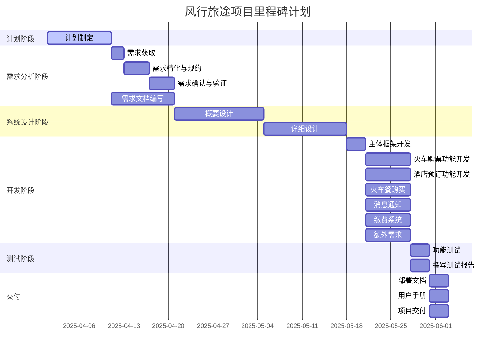
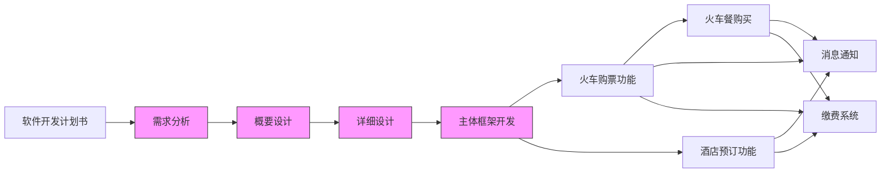

# 软件开发计划书

> 1. 《软件开发计划》(SDP)描述开发者实施软件开发工作的计划,本文档中“软件开发”一词涵盖了新开发、修改、重用、再工程、维护和由软件产品引起的其他所有的活动。
>
> 2. SDP是向需求方提供了解和监督软件开发过程、所使用的方法、每项活动的途径,项目的安排、组织及资源的一种手段。
>
> 3. 本计划的某些部分可视实际需要单独编制成册,例如,软件配置管理计划,软件质量保证计划和文档编制计划等。
> 4. 本课程及本实验不涉及、不强调、不关注的部分可省略，但不允许删除已有条目。
> 5. 最终文档请删除所有灰色字体和斜体等说明部分。

[TOC]

## 1 引言

### 1.1 标识

*本条应包含本文档适用的系统和软件的完整标识,(若适用)包括标识号、标题、缩略词语、版本号和发行号。*
标识号：BUAASE-2025-01
标题：风行旅途(Swift Journey)
缩略语：SJ
版本号：1.0.0
发行号：Build-0.0.1

### 1.2 系统概述

*本条应简述本文档适用的系统和软件的用途，它应描述系统和软件的一般特性；概述系统开发运行和维护的历史；标识项目的投资方、需方、用户、开发方和支持机构；标识当前和计划的运行现场；列出其他有关的文档。*

### 1.3 文档概述

*本条应概述本文档的用途和内容，并描述与其使用有关的保密性和私密性的要求。*

### 1.4 与其他计划之间的关系

*(若有)本条描述本计划和其他项目管理计划的关系。*

### 1.5 基线

*给出编写本项目开发计划的输人基线，如软件需求规格说明。*

## 2 引用文件

*本章应列出本文档引用的所有文档的编号、标题、修订版本和日期，本章也应标识不能通过正常的供货渠道获得的所有文档的来源。*

## 3 交付产品

### 3.1 程序

### 3.2 文档

### 3.3 服务

### 3.4 非移交产品

### 3.5 验收标准

### 3.6 最后交付期限

*列出本项目应交付的产品，包括软件产品和文档。其中，软件产品应指明哪些是要开发的,哪些是属于维护性质的；文档是指随软件产品交付给用户的技术文档，例如用户手册、安装手册等。*

## 4 所需工作概述

*本章根据需要分条对后续章描述的计划作出说明，(若适用)包括以下概述：*

- *对所要开发系统、软件的需求和约束；*
- *对项目文档编制的需求和约束；*
- *该项目在系统生命周期中所处的地位；*
- *所选用的计划/采购策略或对它们的需求和约束；*
- *项目进度安排及资源的需求和约束；*
- *其他的需求和约束，如：项目的安全性、保密性、私密性、方法、标准、硬件开发和软件开发的t相互依赖关系等。*

## 5 实施整个软件开发活动的计划

*本章分以下几条。不需要的活动的条款用“不适用”注明，如果对项目中不同的开发阶段或不同的软件需要不同的计划，这些不同之处应在此条加以注解。除以下规定的内容外，每条中还应标识可适用的风险和不确定因素,及处理它们的计划。*

### 5.1 软件开发过程

*本条应描述要采用的软件开发过程。计划应覆盖论及它的所有合同条款，确定已计划的开发阶段(适用的话)、目标和各阶段要执行的软件开发活动。*

本项目采用瀑布模型作为主要的软件开发方法。瀑布模型是一种线性顺序的软件开发过程，强调在进入下一阶段前完成前一阶段的全部任务，适用于本项目需求较为明确、阶段划分清晰、追求高稳定性的开发特性 

整个开发过程分为以下六个阶段，每个阶段都包含明确的目标、输出文档和质量控制措施： 

1. 需求分析阶段
目标：全面收集并明确系统的功能与非功能需求，确保所有用户需求在开发前得到充分识别与记录
主要活动：
    - 与相关部门及用户代表进行需求调研
    - 编写《软件需求规格说明书》，明确系统功能如：火车购票、酒店预订、火车订餐、消息通知、缴费等
    - 确定性能需求、安全要求、数据一致性和隐私保护措施
    - 审核和确认需求文档

2. 系统设计阶段
目标：基于需求文档，设计系统的整体架构和模块划分，规划数据库结构和接口细节，为编码阶段打好基础
主要活动：
    - 进行系统架构设计，划分前端、后端、数据库模块
    - 设计数据流程图、系统流程图、类图等
    - 完成数据库结构设计和主要接口设计

3. 编码实现阶段
目标：依据设计文档完成系统的各功能模块编码，实现各项功能
主要活动：
    - 按模块分工进行编码
    - 使用版本控制工具（如Git）统一管理
    - 进行单元测试，确保每个模块功能正确

4. 软件测试阶段
  目标：在系统集成后进行全面测试，确保软件系统的正确性、稳定性和安全性
  主要活动:
    - 进行集成测试、系统测试
    - 验证功能完整性、界面友好性、性能与响应时间
    - 重点测试数据一致性、隐私安全、并发购票场景等关键点
  
5. 系统部署与验收阶段
目标：将软件部署到正式环境，并完成客户验收
主要活动:
    - 进行系统部署与配置
    - 提供用户培训与使用文档
    - 协助用户进行最终验收

6. 软件维护阶段
   目标：对系统上线后的运行状态进行持续维护，保障系统稳定，及时响应用户反馈和需求
   主要活动：
    - 修复运行过程中出现的问题
    - 提供版本更新与功能优化
    - 保证系统的安全、稳定和可扩展性

### 5.2 软件开发总体状态

*本条应分以下若干条进行描述。*

#### 5.2.1 软件开发方法

*本条应描述或引用要使用的软件开发方法，包括为支持这些方法所使用的手工、自动工具和过程的描述。该方法应覆盖论及它的所有合同条款。如果这些方法在它们所适用的活动范围有更好的描述，可引用本计划的其他条。*

#### 5.2.2 软件产品标准

*本条应描述或引用在表达需求、设计、编码、测试用例、测试过程和测试结果方面要遵循的标准。标准应覆盖合同中论及它的所有条款。如果这些标准在标准所适用的活动范围有更好的描述，可引用本计划中的其他条。对要使用的各种编程语言都应提供编码标准，至少应包括：*

- *格式标准(如：缩进、空格、大小写和信息的排序)；*
- *首部注释标准，例如(要求，代码的名称/标识符，版本标识，修改历史，用途)需求和实现的设计决策，处理的注记(例如：使用的算法、假设、约束、限制和副作用)，数据注记(输入、输出、变量和数据结构等)；*
- *其他注释标准(例如要求的数量和预期的内容)；*
- *变量、参数、程序包、过程和文档等的命名约定；*
- *(若有)编程语言构造或功能的使用限制；*
- *代码聚合复杂性的制约。*

#### 5.2.3 可重用的软件产品

##### 5.2.3.1 吸纳可重用的软件产品

*本条应描述标识,评估和吸纳可重用软件产品要遵循的方法,包括搜寻这些产品的范围和进行评估的准则。描述应覆盖合同中论及它的所有条款。在制定或更新计划时对已选定的或候选的可重用的软件产品应加以标识和说明,(若适用)同时应给出与使用有关的优点,缺陷和限制。*

在“风行旅途”平台的开发过程中，为提高开发效率、降低成本并保证软件质量，将积极吸纳并复用成熟的第三方软件组件、库及平台服务。采用的主要方法包括:
  - 可复用软件识别方式：
    - 搜索开源社区（GitHub、Gitee）或第三方平台提供的成熟服务（如地图、短信通知、支付SDK）
    - 参考以往类似项目中的可复用代码或框架
  - 评估准则:
    - 软件的稳定性和兼容性；
    - 社区活跃度和维护情况；
    - 是否符合本项目的技术架构；
    - 授权许可的合规性；
    - 性能、安全性是否达标。
  - 已选定的可重用软件组件:

##### 5.2.3.2 开发可重用的软件产品

*本条应描述如何标识、评估和报告开发可重用软件产品的机会。描述应覆盖合同中论及它的所有条款。*
在本项目中，开发团队将有意识地设计并开发具备可重用性的软件模块，以支持未来公司相关项目的快速开发和部署
  - 可重用模块识别方式:
    - 对在多个业务场景中都有需求的功能进行抽象，如：用户认证模块、订单处理模块、消息推送模块
    - 对可能作为公司技术资产积累的底层框架或组件（如日志收集、异常处理框架）重点设计为通用组件
  - 可重用性设计策略:
    - 模块接口标准化，功能解耦，便于集成
    - 提供完整的文档与示例代码
    - 支持配置化与扩展性，避免硬编码
    - 使用版本控制，便于后续统一维护
  - 预期开发的可重用模块包括:

#### 5.2.4 处理关键性请求

*本条应分以下若干条描述为处理指定关键性需求应遵循的方法。描述应覆盖合同中论及它的所有条款。*

本项目在开发和运营过程中将严格遵循以下关键性需求，以保障系统的稳定、安全、和用户的隐私：

##### 5.2.4.1 安全性保证

##### 5.2.4.2 保密性保证

##### 5.2.4.3 私密性协议

##### 5.2.4.4 其他关键性需求标准

#### 5.2.5 计算机硬件资源利用

*本条应描述分配计算机硬件资源和监控其使用情况要遵循的方法。描述应覆盖合同中论及它的所有条款。*

#### 5.2.6 记录原理

*本条应描述记录原理所遵循的方法,该原理在支持机构对项目作出关键决策时是有用的。应对项目的”关键决策”一词作出解释,并陈述原理记录在什么地方。描述应覆盖合同中论及它的所有条款。*

在“风行旅途”平台开发过程中，所有关键决策将按照以下原理进行记录，以确保决策的透明性、可追溯性和项目目标的一致性。

关键决策的定义：
关键决策是指那些对项目进度、预算、资源分配、技术选型等有重大影响的决策。这些决策包括但不限于：
  - 技术选型和架构决策（例如，选择前端框架、数据库等）
  - 需求变更和功能增减的批准
  - 项目的时间、预算和资源分配调整
  - 风险应对策略和应急预案的制定

记录方法：
所有关键决策将通过以下方法进行记录：
  - 决策背景： 描述决策产生的背景和动机，阐明为何需要做出此决策
  - 决策参与者： 记录参与决策的人员，包括项目经理、技术负责人、产品经理等
  - 决策依据： 记录支持决策的依据，例如数据分析结果、团队讨论、市场调研等
  - 预期结果： 记录决策的预期目标和可能的影响
  - 决策结果： 记录最终的决策结果及其执行情况

记录存储：
  - 所有关键决策的记录将存储在CodeArts平台相关模块中，并且所有相关人员都可以访问这些记录。每次决策后，相关记录将及时更新并归档，以便未来的审查和跟踪

更新与审查：
  - 关键决策记录将在项目的每个阶段结束时进行审查，并根据项目进展情况进行更新，确保记录始终保持准确和完整

### 5.2.7 需方评审途径

*本条应描述为评审软件产品和活动,让需方或授权代表访问开发方和分承包方的一些设施要遵循的方法。描述应遵循合同中论及它的所有条款。*

## 6 实施详细软件开发活动的计划

*本章分条进行描述。不需要的活动用“不适用”注明,如果项目的不同的开发阶段或不同的软件需要不同的计划,则在本条应指出这些差异。每项活动的论述应包括应用于以下方面的途径(方法/过程/工具):*

- *所涉及的分析性任务或其他技术性任务;*
- *结果的记录；*
- *与交付有关的准备(如果有的话)。*

*论述还应标识存在的风险和不确定因素,及处理它们的计划。如果适用的方法在 5.2.1处描述了的话,可引用它。*

### 6.1 项目计划和监督

*本条分成若干分条描述项目计划和监督中要遵循的方法。各分条的计划应覆盖合同中论及它的所有条款。*

#### 6.1.1 软件开发计划（包括对该计划的更新）

#### 6.1.2 CSCI测试计划

#### 6.1.3 系统测试计划

#### 6.1.4 软件安装计划

#### 6.1.5 软件移交计划

#### 6.1.6 跟踪和更新计划，包括评审管理的时间间隔

### 6.2 建立软件开发环境

#### 6.2.1 软件工程环境

#### 6.2.2 软件测试环境

#### 6.2.3 软件开发库

#### 6.2.4 软件开发文档

#### 6.2.5 非交付文件

### 6.3 系统需求分析

#### 6.3.1 用户输入分析

在"风行旅途"系统中，用户将通过多种方式进行输入交互，主要包括以下几类：
1. 账户相关输入
  - 用户注册信息（用户名、密码、手机号、邮箱等）
  - 用户登录凭证
  - 个人资料更新
  - 实名认证信息（姓名、身份证号等）
2. 旅行计划输入
  - 出发地和目的地选择
  - 出行日期和时间选择
  - 座位类型偏好（硬座、软卧等）
  - 乘客信息（成人、儿童、老人等）
3. 酒店预订输入
  - 目的地城市
  - 入住和离店日期
  - 房型选择
  - 特殊需求（无烟房、靠窗等）
4. 餐饮订购输入
  - 列车车次和日期
  - 餐食类型选择
  - 数量和配送座位信息
5. 支付相关输入
  - 支付方式选择
  - 支付凭证信息
  - 发票信息
6. 查询类输入
  - 订单查询条件
  - 车票/酒店/餐饮可用性查询条件
  - 历史记录查询
7. 反馈类输入
  - 评价与评分
  - 问题与建议提交

#### 6.3.2 运行概念

"风行旅途"系统的运行概念基于以下几个核心原则：

1. 多终端接入
  - 网页端与移动应用端并行支持
  - 响应式设计以适应不同屏幕尺寸
  - 统一的用户体验与数据同步

2. 分层架构
  - 表现层：提供用户界面和交互
  - 业务逻辑层：处理核心业务流程
  - 数据访问层：负责数据存取和管理
  - 集成层：与外部系统对接

3. 实时处理机制
  - 订单实时处理和确认
  - 库存实时更新和锁定
  - 支付实时验证和确认

4. 异步通知系统
  - 订单状态变更通知
  - 出行提醒与建议
  - 紧急情况预警（如天气变化、列车延误）

5. 数据一致性保障
  - 分布式事务处理
  - 数据库备份与恢复机制
  - 日志记录与追踪

6. 安全保障机制
  - 多层次身份验证
  - 数据加密传输与存储
  - 访问权限控制

#### 6.3.3 系统需求

1. 功能需求
  - 用户管理功能
    - 注册与登录
    - 个人信息管理
    - 实名认证
    - 常用联系人管理
  - 火车票务功能
    - 车次查询与筛选
    - 座位选择与预留
    - 订票、改签与退票
    - 电子票据管理
  - 酒店预订功能
    - 酒店搜索与筛选
    - 房型查看与选择
    - 预订与取消
    - 酒店评价查看
  - 餐饮服务功能
    - 列车餐食菜单浏览
    - 餐食预订与支付
    - 特殊餐食需求标注
    - 送餐时间安排
  - 支付功能
    - 多种支付方式集成
    - 支付安全保障
    - 发票申请与管理
    - 订单退款处理
  - 通知功能
    - 短信/应用内提醒
    - 行程变更通知
    - 出行提醒服务
    - 优惠活动推送

3. 非功能需求
 
  - 性能需求
    - 系统响应时间：普通操作<2秒，支付操作<5秒
    - 并发用户支持：高峰期支持10,000+同时在线用户
    - 数据处理能力：每天处理500,000+交易订单
  - 可靠性需求
    - 系统可用性：99.9%以上
    - 数据备份：每小时增量备份，每日完整备份
    - 故障恢复时间：关键服务<30分钟
  - 安全需求
    - 用户数据保护：符合国家网络安全法规定
    - 支付安全：符合PCI DSS标准
    - 防攻击措施：DDoS防护、SQL注入防护等
  - 扩展性需求
    - 模块化设计，支持功能扩展
    - 系统架构支持水平扩展
    - API设计支持第三方集成
  - 易用性需求
    - 简洁直观的用户界面
    - 3步以内完成核心操作流程
    - 适合各年龄段用户使用
    - 多语言支持
  - 兼容性需求
    - 支持主流操作系统和浏览器
    - 移动端兼容Android 6.0+和iOS 10.0+
    - 适配不同屏幕分辨率

### 6.4 系统设计

分布式微服务架构

采用微服务架构将系统拆分为购票服务、酒店预订服务、餐饮服务、支付服务、用户服务和通知服务等多个独立模块
各服务可独立部署、扩展和维护，提高系统的可用性和可维护性
使用API网关统一管理服务访问，简化客户端调用

数据一致性保障

采用最终一致性模型处理跨服务事务
实现分布式事务管理，确保订票、支付等关键操作的数据一致性
使用消息队列实现服务间可靠通信，保证消息不丢失

高可用设计

核心服务采用集群部署，实现负载均衡和故障转移
实现服务熔断和降级机制，防止系统雪崩
关键数据多副本存储，确保数据安全

低延迟策略

采用CDN加速静态资源访问
实现多级缓存策略（本地缓存、分布式缓存）减少数据库访问
热点数据预加载机制，提高用户查询体验

隐私安全保护

全站HTTPS加密传输
用户数据脱敏存储，重要信息加密处理
完善的权限管理和访问控制机制
符合相关数据保护法规的隐私保护措施

扩展性设计

模块化设计便于功能扩展
接口标准化，支持第三方服务集成
使用配置中心实现动态配置管理

#### 6.4.1 系统设计决策

#### 6.4.2 系统体系结构设计

### 6.5 软件需求分析

### 6.6 软件设计

#### 6.6.1 CSCI级设计决策

#### 6.6.2 系统体系结构设计

#### 6.6.3 CSCI详细设计

### 6.7 软件实现和配置项测试

#### 6.7.1 软件实现

#### 6.7.2 配置项测试准备

#### 6.7.3 配置项测试执行

#### 6.7.4 修改和再测试

#### 6.7.5 配置项测试结果分析与记录

### 6.8 配置项集成和测试

#### 6.8.1 配置项集成和测试准备

#### 6.8.2 配置项集成和测试执行

#### 6.8.3 修改和再测试

#### 6.8.4 配置项集成和测试结果分析与记录

### 6.9 CSCI合格性测试

#### 6.9.1 CSCI合格性测试的独立性

#### 6.9.2 在目标计算机系统（或模拟的环境）上测试

#### 6.9.3 CSCI合格性测试准备

#### 6.9.4 CSCI合格性测试演练

#### 6.9.5 CSCI合格性测试执行

#### 6.9.6 修改和再测试

#### 6.9.7 CSCI合格性测试结果分析与记录

### 6.10 CSCI/HWCI集成和测试

#### 6.10.1 CSCI/HWCI集成和测试准备

#### 6.10.2 CSCI/HWCI集成和测试执行

#### 6.10.3 修改和再测试

#### 6.10.4 CSCI/HWCI集成和测试结果分析与记录

### 6.11 系统合格性测试

#### 6.11.1 系统合格性测试的独立性

#### 6.11.2 在目标计算机系统（或模拟的环境）上测试

#### 6.11.3 系统合格性测试准备

#### 6.11.4 系统合格性测试演练

#### 6.11.5 系统合格性测试执行

#### 6.11.6 修改和再测试

#### 6.11.7 系统合格性测试结果分析与记录

### 6.12 软件使用准备

#### 6.12.1 可执行软件的准备

#### 6.12.2 用户现场的版本说明准备

#### 6.12.3 用户手册的准备

#### 6.12.4 在用户现场安装

### 6.13 软件移交准备

#### 6.13.1 可执行软件的准备

#### 6.13.2 源文件准备

#### 6.13.3 支持现场的版本说明的准备

#### 6.13.4 “已完成”的CSCI设计和其他的软件支持信息的准备

#### 6.13.5 系统设计说明的更新

#### 6.13.6 支持手册的准备

#### 6.13.7 到指定支持现场的移交

### 6.14 软件配置管理

#### 6.14.1配置标识

#### 6.14.2 配置控制

#### 6.14.3 配置状态统计

#### 6.14.4 配置审核

#### 6.14.5 发行管理和交付

### 6.15 软件产品评估

#### 6.15.1 中间阶段的和最终的软件产品评估

#### 6.15.2 软件产品评估记录

#### 6.15.3 软件产品评估的独立性

### 6.16 软件质量保证

#### 6.16.1 软件质量保证评估

#### 6.16.2 软件质量保证记录、包括所记录的具体条目

#### 6.16.3 软件质量保证的独立性

### 6.17 问题解决过程（更正活动）

#### 6.17.1 问题/变更报告

*它包括要记录的具体条目(可选的条目包括:项目名称,提出者,问题编号,问题名称,受影响的软件元素或文档,发生日期,类别和优先级,描述,指派的该问题的分析者,指派日期,完成日期,分析时间,推荐的解决方案,影响,问题状态,解决方案的批准,随后的动作,更正者,更正日期,被更正的版本,更正时间,已实现的解决方案的描述)。*

#### 6.17.2 更正活动系统

### 6.18 联合评审（联合技术评审和联合管理评审）

#### 6.18.1 联合技术评审包括一组建议的评审

#### 6.18.2 联合管理评审包括一组建议的评审

### 6.19 文档编制

*本条应分成若干分条描述文档编制要遵循的方法。各分条的计划应覆盖合同中论及它的所有条款。应遵循本标准第5章文档编制过程中的有关文档编制计划的规定执行。*

### 6.20 其他软件开发活动

#### 6.20.1 风险管理，包括一直的风险和相应的对策

#### 6.20.2 软件管理指标，包括要使用的指标

#### 6.20.3 保密性和私密性

#### 6.20.4 承包方管理

#### 6.20.5 与软件独立验证与确认（IV&V）机构的接口

#### 6.20.6 和有关开发方的协调

#### 6.20.7 项目过程的改进

#### 6.20.8 计划中未提及的其他活动

## 7 进度表和活动网络图

### 1. 项目里程碑进度表（甘特图）

### 2. 活动网络图

## 8 项目组织和资源

### 8.1 项目组织

*本条应描述本项目要采用的组织结构,包括涉及的组织机构,机构之间的关系,执行所需活动的每个机构的权限和职责。*

### 8.2 项目资源

*本条应描述适用于本项目的资源。(若适用)应包括:*

- *人力资源,包括：*
  1. *估计此项目应投入的人力(人员/时间数);*
  2. *按职责(如:管理,软件工程,软件测试,软件配置管理,软件产品评估,软件质量保证和软件文档编制等)分解所投入的人力:*
  3. *履行每个职责人员的技术级别、地理位置和涉密程度的划分;*
  
- *开发人员要使用的设施,包括执行工作的地理位置、要使用的设施、保密区域和运用合同项目的设施的其他特性；*
  
- *为满足合同需要,需方应提高的设备、软件、服务、文档、资料及设施,给出一张何时需要上述各项的进度表;*
  
- *其他所需的资源,包括:获得资源的计划,需要的日期和每项资源的可用性。*

## 9 培训

### 9.1 项目的技术要求

*根据客户需求和项目策划结果,确定本项目的技术要求,包括管理技术和开发技术培训计划*

### 9.2 培训计划

*根据项目的技术要求和项目成员的情况,确定是否需要进行项目培训,并制订培训计划。如不需要培训，应说明理由。*

## 10 项目估算

### 10.1 估算规模

### 10.2 工作量估算

### 10.3 成本估算

### 10.4 关键计算机资源估算

### 10.5 管理预留

## 11 风险管理

*本章应分析可能存在的风险,所采取的对策和风险管理计划。*

## 12 支持条件

### 12.1 计算机系统支持

在项目开发和实施过程中，需要计算机系统提供以下支持：
- **硬件支持**：提供合适的计算机硬件，满足系统运行需求，包括服务器、工作站、网络设备等。
- **操作系统支持**：安装并维护相应的操作系统（如 Windows Server、Linux等），确保开发、测试、部署环境的稳定性。Windows操作系统要使用Windows10及以上版本。
- **网络支持**：提供稳定的网络环境，保证数据传输的畅通，满足高并发的需求。
- **软件工具支持**：使用必要的开发工具、数据库管理系统、版本控制工具（如 Git）等，确保开发团队高效协作。

### 12.2 需要需方承担的工作和提供的条件

在项目实施过程中，需方需承担的工作和提供的条件如下：
- **需求确认**：提供详细且准确的系统需求文档，并协助开发团队进行多轮需求分析和确认。
- **人员支持**：指派项目相关人员，协助开发团队沟通和解决问题。
- **资源提供**：确定硬件支持条件，提供测试数据、服务器、办公设备等必要的资源支持。
- **环境配置**：为系统的安装和部署提供所需的硬件环境、操作系统以及其他基础设施的支持。
- **验收支持**：在项目验收阶段，需方应参与验收工作，并根据项目合同验收标准提供验收反馈。

### 12.3 需要承包方承担的工作和提供的条件

在项目实施过程中，承包方需承担的工作和提供的条件如下：
- **项目管理**：负责整个项目的规划、设计、开发、测试、部署及维护等全过程的管理，并不断更新后续版本。
- **技术支持**：提供系统开发过程中的技术方案设计、技术实现和技术难题的解决。
- **开发环境配置**：为开发团队提供必要的开发环境、测试环境，并确保环境的稳定性。
- **代码与文档交付**：按时交付源代码、系统文档、操作手册及相关技术文档，确保项目可持续发展和维护。
- **培训与支持**：为需方提供必要的技术培训，帮助团队掌握系统的使用与维护，提供项目实施后的技术支持与系统维护服务。

## 13 注解

*本章应包含有助于理解本文档的一般信息(例如原理)。本章应包含为理解本和定义,所有缩略语和它们在文档中的含义的字母序列表。*

## 附录

*附录可用来提供那些为便于文档维护而单独出版的信息(例如图表、分类数据)。为便于处理附录可单独装订成册。附录应按字母顺序(A,B等)编排。*
